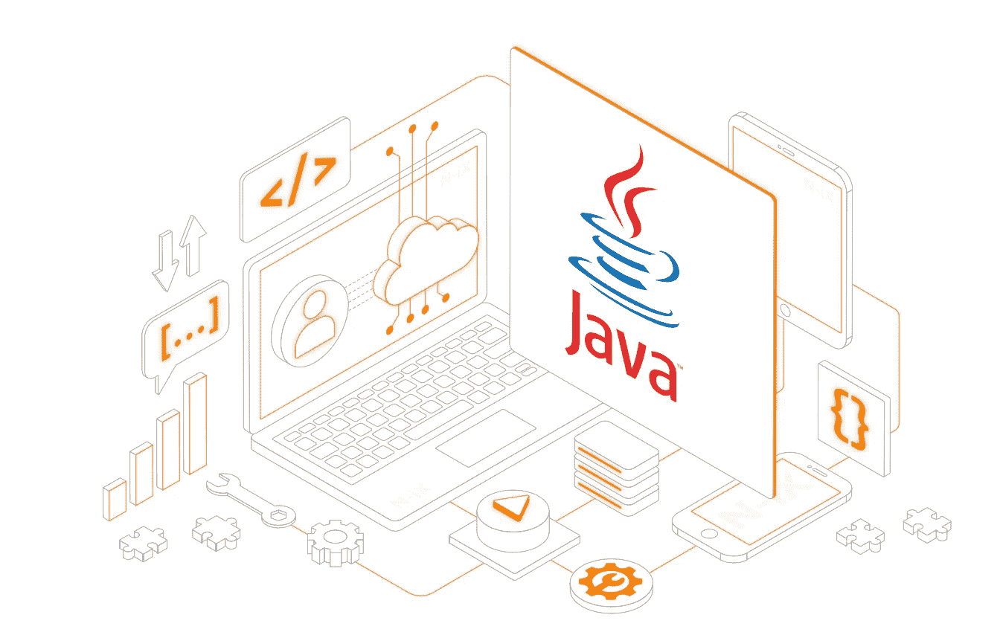

# 开发人员应该不惜一切代价避免的 Java 错误

> 原文：<https://medium.com/codex/java-mistakes-that-developers-should-avoid-at-all-costs-19fedb846301?source=collection_archive---------2----------------------->

在编程中犯错误表明还有进步的空间。对于 Java 程序员来说也是如此。它们也会出错，所以我们正在构建一个最关键的 Java 错误列表。

甲骨文创造了被称为 Java 的面向对象编程(OOP)语言。Java 是世界上使用最广泛的编程语言之一，用于开发在线应用程序、游戏、数据库驱动软件和 Android 应用程序。

像任何其他的[编程语言](https://content.techgig.com/how-the-computer-programming-has-evolved-over-the-years/articleshow/94839244.cms)一样，它仍然容易出现开发者错误。本文分析了 Java 开发人员经常犯的错误，并提出了一些预防措施。

## **1。拒绝当前库**

Java 开发人员忽略不计其数的 Java 库是错误的。从头开始创建之前，搜索可用的库；随着时间的推移，许多工具已经得到了改进，可以免费使用。一些图书馆，像 Joda-Time，现在已经被接受为标准。

## **2。内存泄漏**

尽管在使用 Java 时不用担心手动分配和清除内存是令人欣慰的，但 Java 开发新手仍然应该知道程序中是如何使用内存的。内存分配问题仍然可能出现。只要程序引用了不再需要的东西，它就不会被发布。在某种意义上，我们仍然可以称之为内存泄漏。永久对象引用是 Java 中内存泄漏的最常见原因，因为当存在对对象的引用时，垃圾收集器无法从堆中删除对象。

## **3。违反协议**

违反契约不一定会导致异常或破坏代码编译。然而，由于它可能会在没有任何风险迹象的情况下导致应用程序行为的改变，事情可能会变得更加复杂。不正确的代码可能会出现在产品发布中，并产生意想不到的后果，如应用程序性能差、数据报告不准确、UI 行为不正确、数据丢失等。

## **4。忽略异常**

Java 新手经常犯无法编写异常处理代码的错误。如果代码通常运行并且没有异常，它可能一开始看起来正常，但是如果出现异常，它可能会导致代码安静下来。

使用 Try-Catch-Finally 来管理您的异常，以防止犯此错误。

## **5。使用数组列表而不是链表**

因为数组列表更经常被使用和理解，所以它是一个简单的默认选项。但是，LinkedList 在许多情况下的性能远远优于 ArrayLists。

当应用程序涉及存储和访问数据时，ArrayList 通常更合适。当应用程序需要操作存储的数据时，首选 LinkedList。

更多此类内容，请访问:[https://bit.ly/3ijY5Gt](https://bit.ly/3ijY5Gt)