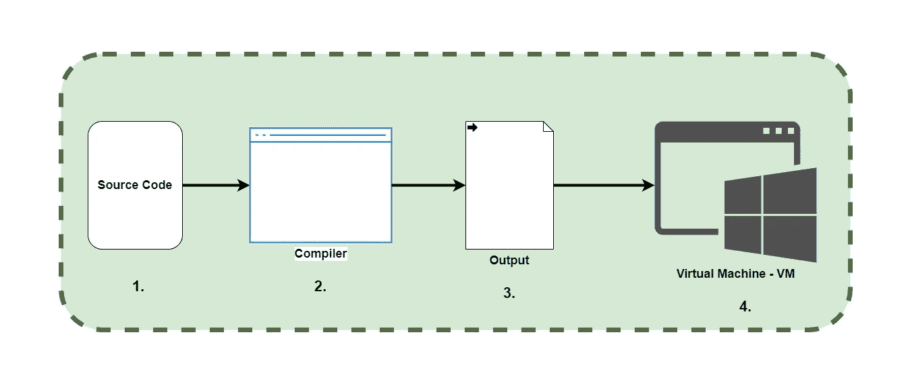
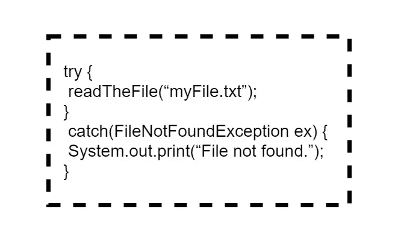
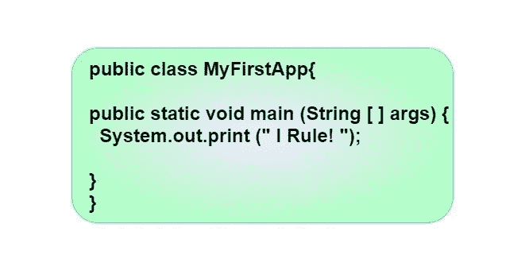
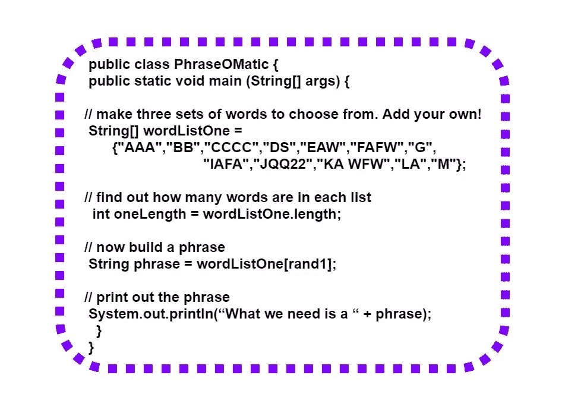

# 第一章

> 原文：<https://medium.com/codex/java-programming-language-ce99f55570d9?source=collection_archive---------34----------------------->

## Java 编程语言…

## ***什么是 Java？***

P 程序员使用 Java 语言及其友好的语法、**面向对象的**特性、内存管理、**平台无关、**最棒的是——可移植性的承诺。

*   **面向对象—** 编程中使用对象的语言。
*   **独立于平台—** 取决于设备的软件和硬件。

然而今天，Java 变得更时尚、更快、更强大。

## ***你会用 Java 做什么？***



**1。源代码—键入代码并保存为“Test.java”。**

**2。编译器—通过运行“javac”来编译“Test.java”。**

**3。Output —编译器生成的 Test.class 文件由字节码组成。**

**4。虚拟机——它将字节码翻译成底层平台并运行程序。**



*   如果有 try-catch 块。首先，它检查 try 块(读取文本文件)。之后，如果 try 块失败了，它就转到 catch 块，并在命令行中输出“File not found”。-

## ***Java 中的代码结构***

***—类-***

一个类有一个或多个方法，它们必须在类内部声明。

***—方法-***

应该执行的指令，它们基本上是一组语句。

## 剖析一个班级



*   void 没有返回值。
*   string[]args-必须为参数指定一个字符串数组。

## 用 main 方法编写类

运行 Java 程序意味着告诉 Java 虚拟机(JVM)加载 Java 类，然后开始执行它的 main()方法，直到 main 方法完成。

## 我想在我写的每一个类中都放上“main”吗？

然而，并不是只有一个 main 方法可以拥有并编写测试类，这些测试类拥有测试其他类的 main 方法。

在另一种语言中，它可以对整数进行布尔测试。但是在 Java 里，我能不能说这样的话，

```
int x = 1;
while (x){ }
```

不可以。布尔值和整数在 Java 中是不兼容的类型。

## 一个 Java 程序

例如:

