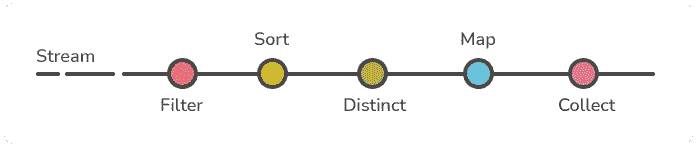

# Java 流自定义收集器

> 原文：<https://medium.com/codex/java-stream-custom-collector-376409c7af4?source=collection_archive---------2----------------------->


毫无疑问，*流*是添加到 Java 8 中的主要特性之一。如果您不知道什么是流，那么流就是支持对元素进行函数式操作的一系列对象，例如使用管道方法对集合进行 map-reduce 转换。你可以从甲骨文文档中获得更多信息。



在本文中，我们将关注如何利用收集器接口并创建我们自己的自定义实现。一开始看起来可能有点复杂，但是一旦你明白了，你就会发现它非常有用。

## 要求:

了解 Java 8、流和函数式编程。

## 什么时候用？

学习这个主题的最佳方式是通过示例，但首先，让我与您分享几个用例，然后我们可以一步一步地实现一个示例。

***聚合*** 是自定义收集器使用最多的场景之一。尽管在 Stream API 中有预定义的方法来进行现成的聚合，但是您可能需要使用自己的特定业务需求来进行一些更复杂的聚合，这是非常常见的。聚合的输出可以是一个对象，也可以是根据您的要求分组的对象列表。

***转换&丰富*** 是您可以考虑利用自定义收集器的另一个用例。当然，在集合框架中有很多其他的工具可以帮助你。我想你会发现收集器是浓缩和转化过程的强有力的解决方案。

您可能会说所有这些都可以通过 SQL 来完成，这是真的，但是您会发现自己处于这样的情况下，运行复杂且昂贵的聚合和丰富查询可以通过使用这种方法来轻松避免。

# 收集器接口

得益于[收集器接口](https://docs.oracle.com/javase/8/docs/api/java/util/stream/Collector.html)，所有这些都成为可能。这个接口是 Java 8 作为新的流 API 的一部分提供的。

```
Interface Collector<T,A,R> 
```

*   `T` —用于归约操作的流中输入元素的类型
*   `A` —归约运算的可变累加类型(通常隐藏为实现细节)
*   `R` -归约操作的结果类型

这个接口有 4 个主要方法，它们一起工作，将条目累积到一个可变的结果容器中。他们的职责如下:

*   `supplier()`:创建新的结果容器
*   `accumulator()`:将新的数据元素合并到结果容器中。
*   `combiner()`:将两个结果容器合二为一。
*   `finisher()`:对容器执行可选的最终变换

# 自定义收集器示例

## 聚合示例

假设您有一个用户事务列表，并且您想创建一个对象来包装该列表，并使用 stream 和您自己的定制收集器添加一些附加信息，如平均金额、最大金额和最近的事务日期。(为了简化，我们使用了 Lombok 库中的@data 和@ToString)

```
@Data
@ToString
**public class** Transaction {
    **private** Long **id**;
    **private** Long **userId**;
    **private** BigDecimal **amount** = BigDecimal.***ZERO***;
    **private** Date **dateTime**;
}
```

这是我们希望在输出中得到的聚合对象:

```
@Data
@ToString
**public class** TransactionAggregation {
    **private** BigDecimal **average** = BigDecimal.***ZERO***;
    **private** BigDecimal **total** = BigDecimal.***ZERO***;
    **private** BigDecimal **max** = BigDecimal.***ZERO***;
    **private** Date **lastTransactionDate**;
    **private** List<Transaction> **transactionList** = **new** ArrayList<>();
}
```

我们不能基于之前分享的知识开始创建自己的收集器接口实现。

```
**public class** TransactionAggregationCollector **implements** Collector<**Transaction**, **TransactionAggregation**, **TransactionAggregation**> {
// implementation can find 
}
```

如你所见，我们有`Transaction`类作为`T`，所以我们的实现将会期待一个事务对象流。对于`A`和`R`，我们使用`TransactionAggregation`，这意味着我们的中间和结果对象将使用这种类型。

```
@Override
**public** Supplier<TransactionAggregation> supplier() {
    **return** () -> **new** TransactionAggregation();
}
```

我们需要实现的第一个方法是 supplier 方法，这将有助于创建一个新的容器结果。在我们的例子中，它是一个新的`TransactionAggregation`对象。

> **注意:**()->lambda 表达式帮助我们实现供应商函数接口，这是供应商方法的返回类型。更多信息请参见[λ](https://docs.oracle.com/javase/tutorial/java/javaOO/lambdaexpressions.html)和[功能接口](https://docs.oracle.com/javase/8/docs/api/java/util/function/package-summary.html)概念。

```
@Override
**public** BiConsumer<TransactionAggregation, Transaction> accumulator() {  
        *// ta is same* TransactionAggregation object from supplier
        *// t is each transaction item from the stream* **return** (ta, t) -> {*// Add transaction to result transaction list* ta.getTransactionList().add(t);

        *// Get the Max* **if**( ta.getMax().compareTo(t.getAmount()) == -1 )
            ta.setMax(t.getAmount());

        *// Find the latest Transaction Date* **if**( ta.getLastTransactionDate() == **null** ){
            ta.setLastTransactionDate(t.getDateTime());
        } **else if**( ta.getLastTransactionDate().compareTo(t.getDateTime()) < 0 ){
            ta.setLastTransactionDate(t.getDateTime());
        }

        *// Calculate Total amount* ta.setTotal( t.getAmount().add(ta.getTotal()) ); // Calculate Average 
       ta.setAverage(ta.getTotal()
  .divide(new BigDecimal(ta.getTransactionList().size()))); };
}
```

累加器方法有助于我们进行聚合。只要流中有元素，实现就会重复运行。

> [双消费](https://docs.oracle.com/javase/8/docs/api/java/util/function/BiConsumer.html)为功能界面；它接受两个参数，不返回任何内容。

```
@Override
**public** BinaryOperator<TransactionAggregation> combiner() {
    **return** (ta1, ta2) -> {

        **if**( ta1.getMax().compareTo(ta2.getMax()) == -1 )
            ta1.setMax(ta2.getMax());

        ta1.setAverage( ta1.getAverage()
                .add(ta2.getAverage())
                .divide(**new** BigDecimal(2)) );

        ta1.setTotal( ta1.getTotal().add(ta2.getTotal()) );

       **if**( ta1.getLastTransactionDate().compareTo(ta2.getLastTransactionDate()) < 0 )
            ta1.setLastTransactionDate(ts2.getLastTransactionDate());

        **return** ta1;
    };
}
```

如果您熟悉 Stream API，您很可能听说过或使用过 parallelStream()。它帮助您在并行线程中处理流。但是最后需要结合各个线程的结果。`combiner()`方法将用于将两个线程的两个结果合并成一个对象。因此，如您所见，该实现实际上包含了组合到 TransactionAggregation 对象的逻辑。

> [BinaryOperator](https://docs.oracle.com/javase/8/docs/api/java/util/function/BinaryOperator.html) 表示对两个相同类型的操作数进行运算，产生与操作数相同类型的结果。对于操作数和结果都是同一类型的情况，这是对`[BiFunction](https://docs.oracle.com/javase/8/docs/api/java/util/function/BiFunction.html)`的专门化。

```
@Override
**public** Function<TransactionAggregation, TransactionAggregation> finisher() {
    **return** (transactionAggregation) ->{
        **return** transactionAggregation;
    };
}
```

`finisher()`是返回最终结果的方法，它将在流管道的末端传递给调用者。

> [函数](https://docs.oracle.com/javase/8/docs/api/java/util/function/Function.html)表示接受一个参数并产生一个结果的函数。

```
@Override
**public** Set<Characteristics> characteristics() {
    **return** Collections.*emptySet*();
}
```

使用这种方法，您可以提供收集器的特征。在我们的例子中，我们返回的是一个空集。

> 表示`Collector`属性的特征，可用于优化归约实现。

`[**CONCURRENT**](https://docs.oracle.com/javase/8/docs/api/java/util/stream/Collector.Characteristics.html#CONCURRENT)`表示这个收集器是*并发*的，意味着结果容器可以支持多个线程用同一个结果容器并发调用累加器函数。

`[**IDENTITY_FINISH**](https://docs.oracle.com/javase/8/docs/api/java/util/stream/Collector.Characteristics.html#IDENTITY_FINISH)`表示整理器功能是同一性功能，可以省略。

`[**UNORDERED**](https://docs.oracle.com/javase/8/docs/api/java/util/stream/Collector.Characteristics.html#UNORDERED)`表示收集操作不保证输入元素的相遇顺序。

```
TransactionAggregation transactionAggregation = transactionList.stream().collect(**new TransactionAggregationCollector()**);
```

正如您所看到的，使用 collector 非常简单，您只需要从事务列表中创建一个流，并使用自定义 collector 对象作为输入来调用 collect 方法。

# 结论

如你所见，整个过程非常简单。当您开始使用时，您会注意到这个选项在不同的用例中是多么有用。

您可以在 [Github](https://github.com/farzinpashaee/medium/tree/main/Java%20Stream%20Custom%20Collector) 中找到示例源代码。