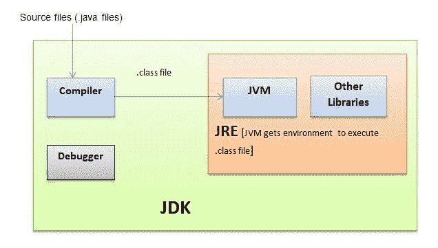
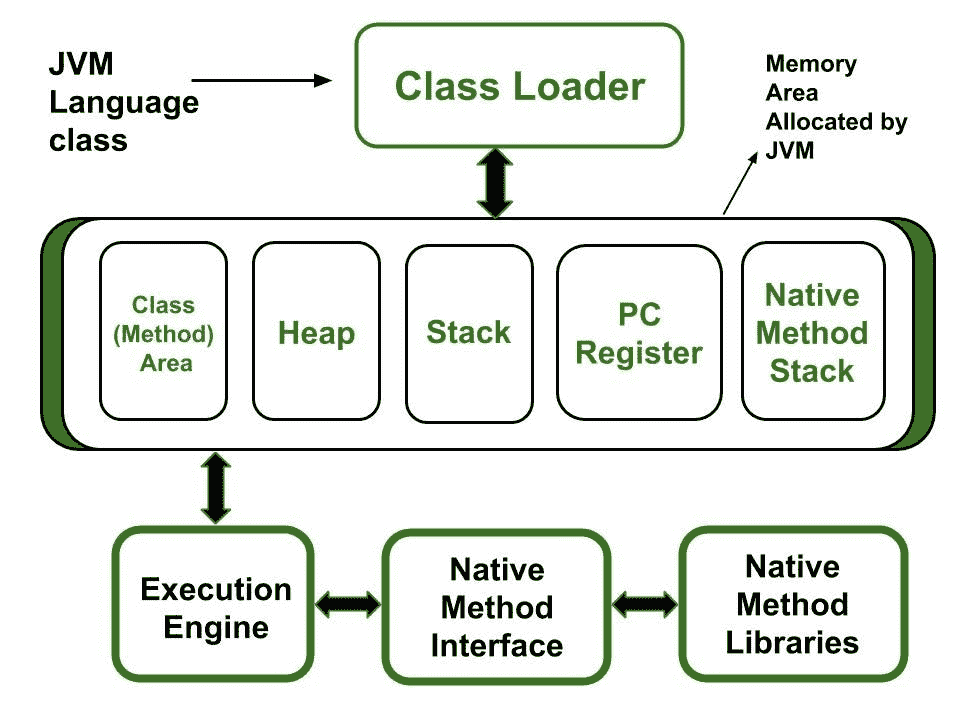

# JAVA 虚拟机

> 原文：<https://medium.com/codex/java-virtual-machine-e3098cb18b7b?source=collection_archive---------20----------------------->

虚拟并不在现实中，所以它是一个对用户来说看起来真实的环境的模拟。

虚拟机是提供与物理计算机相同功能的计算机体系结构。专用硬件、软件或两者的组合可用于它们的实现中。

Java 虚拟机是一种允许计算机运行 Java 应用程序以及其他已经编译成 Java 字节码的语言的虚拟机。

在虚拟机中，我们可以将其描述为两个部分；

**1。SVM —基于系统的虚拟机**

SVM 包含真正的硬件，它创建了一个允许大量用户或实例同时运行的环境。因为有好几个环境，每一个都自成体系。

例如:VMWare，Xen。

**2。AVM —基于应用的虚拟机**

与 SVM 不同，这些虚拟机中没有物理硬件。相反，它有实际用途。该应用程序有助于创建一个允许其他应用程序运行的平台。这个平台接受一些输入，并把它们转换成各种输出或一种每个人都能理解的语言。基于方法的虚拟机是这一过程的结果。

例如:- JVM，PVM

这个基于应用程序的虚拟机包括 JVM。它是解释事情应该如何做的规范。

我们不能直接从互联网上获得这个 JVM，因为它在现实世界中并不存在，但是它带有 JAVA 运行时环境(JRE ),我们可以很容易地从互联网上获得。当我们在计算机上安装 JRE 时，它会安装必要的代码来设置 JVM。

平台独立性是 JAVA 的一个特性，然而平台依赖性是 JRE 的一个特性。

当我们启动一个 JAVA 程序时，JVM 读取类文件，并将它们转换成操作系统能够理解的语言。

**创建 JVM**

当我们启动一个程序时，它会在计算机上创建一个 JVM 实例，当我们退出应用程序时，这个 JVM 实例就会死去。

当我们同时执行两个或多个应用程序时，每个应用程序都有自己的 Java 虚拟机(JVM)。

一旦创建了 JVM 实例，它就创建一个非恶魔线程。每个 Java 应用程序中都有一个公共的静态 main 方法。这个先前构建的 JVM 实例继续使用这个主函数执行 Java 应用程序。我们现在有了一个能够创建非恶魔线程的恶魔线程。

**销毁 JVM 实例的方法**

如果程序中没有非恶魔线程，这意味着我们已经杀死了所有产生的非恶魔线程。之后，JVM 实例将自行到期。

调用系统退出机制。

**JDK — Java 开发套件**

JVM 是 Java 运行时环境(JRE)的一个组件。这个 JVM 中有三个关键组件。

*   类别载入器—载入
*   存储区—商店
*   执行引擎—执行

记忆有 5 个主要部分:

方法区域——在 JVM 中加载时，这将加载类信息。

堆区域——在 JVM 中加载之后，这里是收集所有对象数据的地方..

堆栈—它维护方法信息以及线程中的局部变量。

PC 寄存器—如果执行了非本机方法，这将保存有关线程中下一次执行的信息。

本机方法区域—这允许将本机方法存储在线程中。

**JVM 数据类型**

Java 中的类型分为两类；

*   原始类型

Ex-:布尔型、字节型、字符型、短整型、长型、浮点型和双精度型

*   参考类型

Ex-:类，指定对象和所有其他对象的类型。

**字号**

在 JVM 中，字长为 32 位。JVM 中只有几种原始数据类型:byte (8 位)、short (16 位)、int (32 位)、long (64 位)、float (32 位)、double (64 位)和 char (32 位)(16 位)。

**级装载机**

类加载器负责在运行时将 Java 类动态加载到 JVM 中。它们也包含在 JRE (Java 运行时环境)中。结果，由于有了类装入器，JVM 不需要知道底层文件或文件系统就可以运行 Java 程序。

java 初始化一个类有 4 种方法

使用新关键字-为每个变量赋值。

使用现有对象的克隆方法—复制现有对象。

使用反射 API (getInstance()方法)—完成设置后，变量将被赋予一个初始值。

IO。ObjectInputStream()并可以获取一个对象—为输入流中的非瞬态变量赋值。

【java 如何通过构造函数实例化父类

编译这段代码时，JVM 为每个构造函数生成一个 init()函数。构造函数内部发生的事情决定(取决于)init()过程内部发生的事情。如果构造函数(子类)不包含任何内容，init 方法有权调用父类(人类)的默认构造函数。

**这个 init 函数可能包含三种不同类型的代码。**

*   调用一些其他的构造函数 init 方法
*   初始化实例变量。
*   具有特定实现的字节码

**JVM 参数/ JAVA 类路径**

JVM 参数是在应用程序启动时传递给 Java 虚拟机的标志。在 Linux 或 Mac 机器上，它们可以通过 whd.conf 文件中的 JAVA_OPTS 设置来提供。

**输出—打印/Application.java 中的内容**

如果我们通过将 Application.java 放在“b”目录中，然后将 Application.java 放在“a”目录中来改变类路径，我们将得到期望的结果。

**结论**

如果类路径中有两个相同的类，JVM 会考虑第一个。类路径中的第一个类是 JVM 将要运行的类。当我们得到 JVM 参数时，这种情况就改变了；在这种情况下，JVM 采用类路径上的最后一个类。