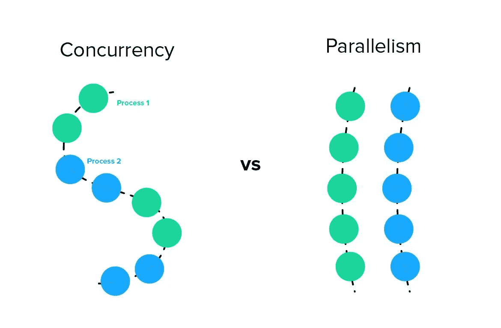
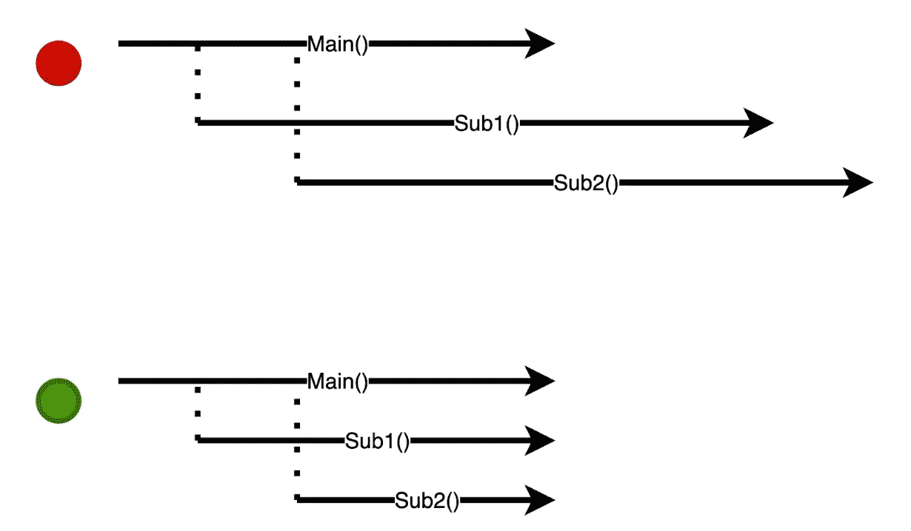
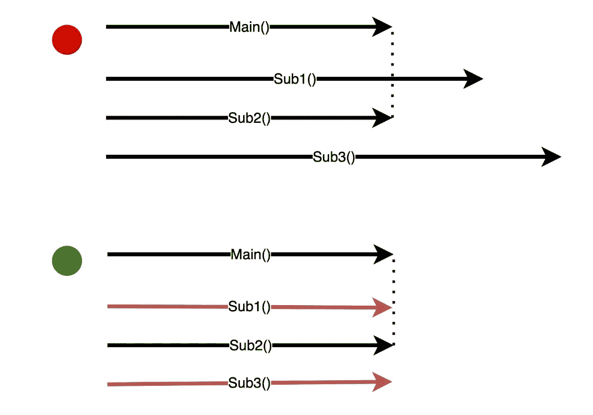
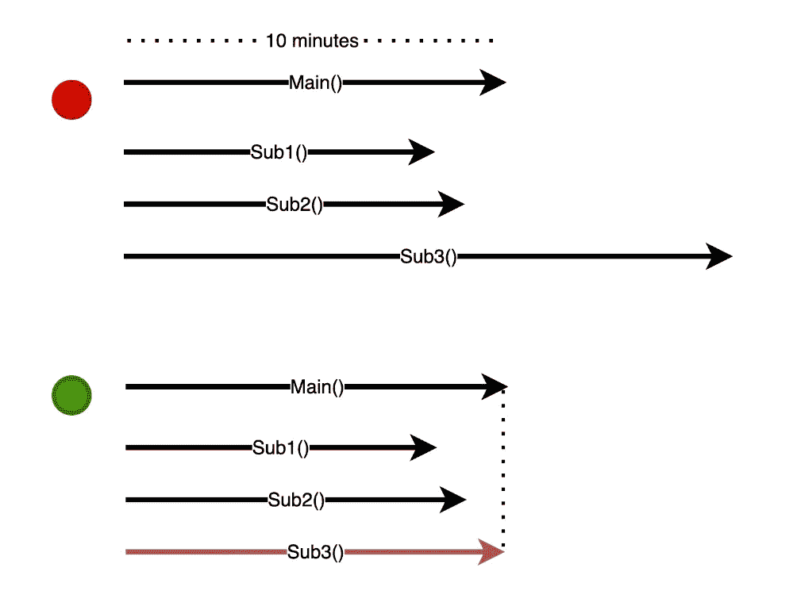

# Java 虚拟线程

> 原文：<https://medium.com/codex/java-virtual-threads-9fad6c362890?source=collection_archive---------0----------------------->

虚拟线程是令我兴奋的东西。这是该语言中一个期待已久的特性，过去我们已经尝试过几次来实现它，但最终，它还是出现了，并且已经合并到 Java 19 中。这意味着它将作为一个预览功能被包括在内，一旦 JDK 19 出来，我们就可以使用它。

当我读到这个的时候，我不得不浏览大量的帖子和视频。虚拟(绿色)线程的大部分内容是由非 java 开发人员编写的，这是为什么呢？绿色线程对 Java 世界来说是相当新的东西，大多数 Java 应用程序使用常规(平台)线程，很少接触到这个概念。Java 是最流行的语言之一，也是其中唯一一种在没有第三方库帮助的情况下不支持任何形式的 async/await 的语言(我们很快会谈到这些)。

在 Java 的早期版本中，当设计多线程 API 时，Sun Microsystems 面临着一个两难的问题:我们应该使用用户模式线程还是将 Java 线程与 OS 线程一一对应？当时的所有基准测试都表明，用户模式线程非常糟糕，增加了内存消耗，却没有带来多少回报。然而，这是 20 年前的基准，当时的情况完全不同。我们没有这么高的负载要求，Java 语言也还不太成熟。现在情况不同了，我们尝试了一些在语言中引入用户模式线程的方法。例如纤维。

不幸的是，因为它们是作为一个单独的类实现的，所以很难将整个代码库移植到它上面，最终，它们消失了，再也没有融入到语言中。

# 项目织机


有几个 Java 项目有非常具体的任务要完成。例如瓦尔哈拉、巴拿马、琥珀，当然还有织布机。Loom 的目标是彻底改革该语言的并发模型。他们的目标是引入虚拟线程、结构化并发和一些其他更小的东西(目前)。

# 关于 Java 并发模型的几句话

JVM 中实现线程的方式被认为是最好的方式之一，即使是非 Java 开发人员也是如此。我们有优秀的线程调试，你可以得到线程转储，断点，内存检查，等等。您甚至可以使用 JFR API 为您的线程定义自定义指标。

Thread 类是 Java 让你访问 OS 线程 API 的方式。该类中执行的大多数操作都是系统调用。在生产中，我们很少直接使用线程，我们将 Java 并发包与线程池、锁以及其他好东西一起使用。Java 有很好的多线程内置工具。

# 并发性和**并行性**



在我们继续有趣的东西之前，我们必须把这个弄清楚。并发性和并行性是两个经常混淆在一起的东西，让人们感到困惑。

**并行**是指**两个或多个任务同时执行**。这只有在 CPU 支持的情况下才有可能。我们需要多个内核来实现并行。然而，现代 CPU 总是多核的，单核 CPU 大多已经过时，不再广泛使用，因为它们的性能远远超过了多核 CPU。这是因为现代应用被设计为利用多个内核，并且它们总是需要同时做一些事情。

并发意味着同时管理**任务**。例如，JavaScript 是单线程语言，所有必须同时发生的事情都是并发发生的。一个线程管理代码产生的所有任务。JS 使用 async/await 来做到这一点，我们稍后将讨论实现并发的其他方法。

从操作系统的角度来看，CPU 必须处理多个进程的线程。线程的数量总是高于内核的数量，这意味着 CPU 必须执行**上下文切换**。简单解释一下，每个线程都有一个优先级，可以是空闲的、工作的或等待 CPU 周期的。CPU 必须遍历所有非空闲的线程，并根据优先级分配其有限的资源。此外，它必须确保具有相同优先级的所有线程获得相同数量的 CPU 时间，否则，一些应用程序可能会冻结。每次内核被分配给不同的线程时，当前运行的线程必须被冻结，其[寄存器状态被保存](https://stackoverflow.com/questions/3920284/how-are-registers-shared-among-threads#:~:text=Registers%20are%20used%20by%20the,specific%20to%20the%20first%20thread)。最重要的是，它必须跟踪一些空闲线程是否还没有被唤醒。正如你所看到的，这是一个非常复杂和昂贵的操作，我们作为开发者应该尽量减少线程的数量。在理想的情况下，线程数量应该接近 CPU 核心数量，这样我们就能够最小化 CPU 上下文切换。

# 现代 Java 服务器并发问题

云空间越来越大，随之而来的是负载和资源需求。大部分企业服务器(负载最大的)都是用 Java 写的，所以就到了 Java 来解决负载问题。到目前为止，从它仍然是最受服务器欢迎的语言这一事实来看，它做得很好，但这并不意味着它是完美的。

我们处理请求的通常方式是为它们分配一个平台线程，这就是“每请求线程模型”。当我们获取数据或进行处理时，客户端请求一些东西，这个线程被占用，不能被其他任何人使用。服务器启动并分配预定义数量的线程(例如 Tomcat 为 200)。它们被放在一个线程池中，等待请求。它们的初始状态称为“暂停”，在这种状态下，它们不会占用 CPU 资源。

这很容易编写、理解和调试，但是如果客户端请求执行阻塞调用的东西呢？阻塞调用是等待第三方调用完成的操作，例如，SQL 查询、对不同服务的请求，或者只是对操作系统的 IO 操作。当阻塞调用发生时，**线程必须等待**。当它等待时，线程是不可用的，CPU 必须管理它，因为它不是空闲的。这增加了上下文切换。服务器限制线程数，更高的线程数可能会增加吞吐量，但会大大降低请求处理的速度。这是一个我们必须牢记和把握的微妙平衡。人们经常问，“为什么不产生 10k 线程，同时处理 10k 请求”，尽管这是可能的，但操作系统不会阻止您，甚至可以通过适当的配置产生 100 万个线程，有基准显示，在流行的 CPU 上，在 3–4k 线程后，80%的 CPU 利用率纯粹用于上下文切换，请记住，操作系统还需要 CPU 来运行和管理其他进程。

为了解决我们的可伸缩性问题，我们通常只是扩展和产生服务器的多个节点。这是可行的，如果我们向云供应商支付足够的费用，我们现在可以处理尽可能多的请求，但是使用云技术，一个主要的驱动因素是降低运营成本。有时我们负担不起额外的支出，最终我们得到的是一个缓慢且几乎不可用的系统。

# 并发模型

并发救援！让我们来谈谈其他语言中采用的几种并发模型

## 复试

回调是一个简单而强大的概念。它们是作为参数传递给其他函数或过程的对象。父函数将回调传递给子函数，然后子函数可以使用回调来通知父函数某些事件，例如，“我已经完成了我的任务”。这是在单线程上实现并发的一种方式。回调形成一个堆栈跟踪，可以使调试更容易。当嵌套是一层或两层时，它们是很好的，但是当你需要构建一个更复杂的回调链时，它们很快就会失去控制。目前，它们大多被用作其他并发模型的构建模块，被认为是一种糟糕的实践和遗产。

## 异步/等待和承诺

顾名思义，这种模式是基于承诺的。承诺代表着最终的计算(或失败)。一个函数可以返回一个承诺，例如，一个 HTTP 请求的结果，然后调用者函数可以将它们的逻辑链接到它。这就是大多数流行语言实现并发的方式。Java 也有许诺，但它们被称为[](https://docs.oracle.com/javase/7/docs/api/java/util/concurrent/Future.html#:~:text=Interface%20Future&text=A%20Future%20represents%20the%20result,the%20result%20of%20the%20computation)**，然而，只有[**CompletableFuture**](https://docs.oracle.com/javase/8/docs/api/java/util/concurrent/CompletableFuture.html)具有许诺的完整特性列表。Java 中的大多数操作都是阻塞式的，不管怎样，期货占据了线程。**

****Async/await 是一个承诺之上的语法糖**。它节省了您为链接、订阅和管理承诺而编写的繁琐的样板文件。通常，您可以将一个函数标记为 *async* 并且它的结果在内部被包装在一个承诺中。**

**async/await 的一个大问题是[臭名昭著的有色函数问题](https://journal.stuffwithstuff.com/2015/02/01/what-color-is-your-function)。在函数上使用 async 本质上使它成为非阻塞的，但是阻塞的函数(没有 async 前缀)不能调用它们，除非它们使用 await。你可能会问，“那又怎样？我只会让一切都异步，从不使用阻塞函数”..当然，但是你需要一个第三方库，它会阻塞，然后一切都变得一团糟。此外，语言中可能有些东西天生就是阻塞的，你迟早会被迫处理函数颜色。需要注意的是，在一些语言中，比如 C#中，情况并非如此，你可以使用不带函数颜色的 async/await。**

## **协同程序(延续+例程)**

**当我们谈论协程时，我们并不是指科特林的协程，他们只是盗用了这个术语。**

****延续**是一种特殊的函数调用。如果函数 A 调用函数 B，这是 A 做的最后一件事，那么我们可以说 B 是 A 的延续。**

****套路**(又名。子例程)是可重用的代码片段，通常在执行过程中被多次调用。想象它们是一组不可变的指令，有输入和输出，你可以随时调用。**

**结合这些术语，我们得到协程。它们本质上是由运行时管理的可挂起任务，它们形成了链调用的树状结构。**

**协程有几个关键属性:**

*   **他们可以在任何时候被**暂停和恢复****
*   **它们是一种数据结构，可以**记住它的状态和堆栈跟踪****
*   **它们可以**将控制权让给其他协程**(子例程)**
*   **它们必须有 isDone()、yield()和 run()函数**

**这里有一个 JS 中的协程的例子，对不起所有铁杆 Java 读者:(**

**JavaScript 有一个让步机制。有了它，你就可以制造出所谓的发电机。为了支持这一点，他们在语言中实现了协程。**

**这是我们简单的发电机。' * '将函数标记为生成器，然后函数可以使用 yield。`yield`关键字用于暂停和恢复发生器功能(与暂停/运行相同)。**

**现在，如果我们执行下面的代码，它从生成器获取数字，直到它停止产生它们。**

**我们得到了**

**注意控制是如何在两个代码块之间**产生**的，首先生成器打印数字，然后循环打印它。此外，我们在生成器的开始定义了 temp 变量，在此之后，来回产生的 **temp 的值仍然被保存并正确打印**。这个生成器实现了被称为协程所需的一切。它可以暂停、恢复并保持其状态。所有这些都由 JS 解释器处理。这很棒，我们实现了并发性，而没有引入任何特殊的词，如 async 和 await，**我们没有彩色函数，但仍然在单线程上操作**。**

# **虚拟线程**

**Loom 的开发人员有许多事情要考虑，并且有多种方法来实现虚拟线程。我很高兴他们选择了共同的道路。**线程类将保持不变，并将使用相同的 API** 。这使得迁移无缝，切换到绿色线程只是一个标志。然而，这要付出很大的代价。他们必须检查语言的每一个 API，如套接字和 I/O，并使它不阻塞，以防它在虚拟线程中运行。这是一个影响 JDK 核心 API 的巨大变化。此外，它必须向后兼容，并且不能破坏现有的逻辑。难怪这花了 5 年多的时间才完成。**

**为了切换到虚拟线程，我们不需要学习新的东西，我们只需要放弃一些东西。**

*   **永远不要共享虚拟线程，它们很便宜而且毫无意义**
*   ****停止使用线程局部变量**。它们将会工作，但是如果你产生数百万个线程，你将会有内存问题。根据 Ron Pressler 的说法:“*线程局部变量不应该暴露给最终用户，而应该作为内部实现细节保留下来*”。**

**几乎详尽地列出了虚拟线程相对于平台线程的优势**

*   ****上下文切换变得有效自由**。它们由 JVM 管理，这意味着 JVM 将在线程之间执行上下文切换。**
*   ****尾音/呼叫优化。**他们在 JEP 中提到尾调用优化是在线程上完成的。这可以为堆栈节省大量内存，但这仍是一项正在进行的工作**
*   ****便宜的起/停。**当我们停止操作系统线程时，我们必须发出一个系统调用来终止线程，然后释放它所占用的内存。当启动操作系统线程时，我们再次进行系统调用。启动和终止一个绿色线程只是删除对象，然后让 GC 删除它。**
*   ****硬性上限。如前所述，操作系统可以处理如此多的线程。即使硬件有所改进，我们仍然跟不上需求。目前，您可以生成数千万个虚拟线程(这对大多数情况来说应该足够了)****
*   ****执行事务的线程与执行视频处理的线程表现非常不同。**这很容易被忽视。本质上，我要说的是，操作系统和 CPU 必须针对一般情况进行优化。他们必须能够处理应用程序请求的所有类型的任务，因此他们不能针对特定的使用情形进行优化。JVM 可以针对处理请求的具体任务优化它的线程。**
*   ****可调整大小的堆栈。**虚拟线程驻留在 RAM 中。它们的栈和元数据也在那里。平台线程必须分配一个固定的堆栈大小(Java 是 1MB ),并且这个堆栈不能调整大小。这意味着如果你超过了堆栈溢出，如果你不使用它，就会浪费内存。此外，引导一个虚拟线程所需的最小内存约为 200–300 字节。**

# **使用虚拟线程**

**考虑以下情况**

**在这里，我们尝试创建 100 万个常规线程，线程所做的只是休眠 1 秒钟，然后死亡。显然，这段代码会导致一个内存不足的错误，在我的机器上，我可以在内存不足之前产生 40k 个线程。**

**现在让我们尝试产生虚拟的。要创建一个新的虚拟线程，我们必须使用*thread . startvirtualthread(runnable)。***

**这段代码运行得很好，我能够在我的机器上产生超过 2000 万个这样的线程。这是意料之中的，因为用户态线程只不过是 JVM 管理的内存中的一个对象。**

**好了，让我们深入探讨一下，通常当我们使用线程时，我们会将它们与线程池一起使用。我们将定义一段需要执行的阻塞代码**

**我们打印运行代码的平台(载体)线程，然后我们进行 2 秒钟的 HTTP 调用，然后我们再次打印载体线程。很简单。**

**现在让我们并行运行它**

**我们用 5 个线程创建固定大小的线程池，然后提交 10 个任务，这些任务将运行前面描述的 *someWork* 方法。你注意到别的了吗？线程池在 try-with-resources 块中！这是 Java 19 的新增功能，尝试使用资源等待所有线程完成，我们在使用线程池时不再需要使用*关闭*和*终止*。不管怎样，上面的代码给出了下面的输出**

**注意每个任务是如何被同一个线程执行的。(例如 *Task4* 由*线程[#24，pool-1-thread-4，5，main]* 执行并完成)**

**这表明当发出阻塞调用时，线程正在等待，并在 2 秒钟后恢复。**

**现在让我们把它转换成用户模式线程。代码是一样的，我们只需要使用*executors . newvirtualthreadpertaskmexecutor()*，它会在每次向它提交任务时创建一个新的绿色线程。**

**这一次我们得到了以下输出**

**注意现在任务是如何被两个线程执行的，第一个线程在阻塞调用之前执行代码，第二个线程在阻塞调用之后执行代码。例如， *Task5* 首先由*ForkJoinPool-1-worker-5*执行，然后由 *ForkJoinPool-1-worker-1 执行。*这表明我们没有阻塞载体线程。另外，请注意，我们现在正在使用 fork-join 池。这个池的大小等于核心的数量，由 JVM 管理。它也用于类似并行流的东西。**

**这与我们之前给出的 JavaScript 示例非常相似。线程相互让出控制权，状态被保留，然后恢复，这是一个真正的协程。最好的部分是，它与常规的阻塞代码相同。**

## **服务器发送的事件**

**我想把它作为用户模式线程的一个很酷的用例。如果你不熟悉 SSE [这个](https://developer.mozilla.org/en-US/docs/Web/API/Server-sent_events/Using_server-sent_events)是一个很好的更详细的解释。本质上，我们打开一个 HTTP 连接，从不关闭它，然后服务器可以不断地将数据推送到客户端。它非常轻量级，比 WebSockets 便宜很多。问题是，要实现它，我们需要一个线程持续运行并向流发送事件，如果线程死了，我们就断开连接。您已经知道在这里使用平台线程不是一个好主意。使用虚拟线程，我们可以在 spring boot 中做到这一点**

**SseEmitter 是 Spring MVC 的一个特殊类，它实现了 SSE 协议。我们所做的是创建一个无限循环(显然不是生产代码)并每隔 500 毫秒向客户端发送新数据。那么任何数量的客户端都可以订阅它**

```
curl localhost:8080/api/v1/test/sse
```

**你会不断收到类似这样的事件**

**完整的源代码可以在[这里](https://github.com/bstoilov/LoomPresentationCode/blob/master/src/main/java/com/loom/web/TestController.java#L29)找到。**

# **何时不使用虚拟线程**

**必须管理虚拟线程有其性能损失。对于负载较小的应用程序，线程可能会优于虚拟线程，原因很简单，当活动客户端很少时，上下文切换很低。此外，例如，如果您的应用程序是 CPU 密集型的，并且执行大量的数学计算，那么使用绿色线程是没有意义的，因为无论如何它们在计算时都必须占用操作系统线程。Loom 不会让你的应用程序更快，它只会增加它的吞吐量，如果吞吐量不是问题，那么坚持使用平台线程。[这个](https://www.morling.dev/blog/loom-and-thread-fairness/)博客做了很好的分析，展示了 Loom 是如何利用线程的，但是如果你读了它，请记住作者抨击了 Loom 一开始就不应该做的事情(比如公平线程调度)。**

****找出你的瓶颈**。如果您使用连接池为 50 的 Postgres，那么产生 50 个以上的线程(平台或非平台)不会有任何区别。**

**作为参考，你可以查看[利特尔法则](https://en.wikipedia.org/wiki/Little%27s_law)和这篇[关于选择最佳线程数的伟大文章](https://kanbanzone.com/littles-law/)**

# **结构化并发**

****

**结构化并发指的是我们处理线程生命周期的方式。目前，我们没有办法停止一个不再需要运行的线程，因为它的结果已经过时了。我们只能发送**中断信号，该信号最终将被消耗，线程停止**。这可能会浪费 RAM 和 CPU 周期。**

**让我们考虑以下情况**

## **所有的任务都必须成功，如果一项失败了，继续下去就没有意义了**

****

## **至少有一项任务必须成功，如果一项任务成功了，就没有必要等待其他任务了**

****

## **截止日期。如果执行时间超过一定时间，我们希望终止一切**

****

**我用红色标记了在达到某个状态后需要立即停止的线程。有了 Loom，我们可以做到这一点，目前除了他们将引入的特殊线程池，我们没有其他方法，只能手动停止线程，但这个 [JEP](https://openjdk.java.net/jeps/428) 承诺将带来更多的实用程序来管理这一点。**

**这些看起来像是小的优化，实际上对于小的应用程序或低负载的服务器来说是微不足道的。当您每天需要处理数百万个请求时，这些事情很重要。在某些情况下，它们可能会改变游戏规则，并大幅提高您的吞吐量。**

# **如果您正在使用 reactor 框架，是否应该考虑切换到 Loom**

****

**反应器框架非常擅长处理应用程序的吞吐量问题。他们所做的基本上是创建抽象任务(类似于协程)并将所有东西包装在其中。然后反应器运行时管理这些任务。听起来非常类似于虚拟线程，但是有几个主要问题**

*   **语言本身不支持它，这导致了非常复杂的代码(Flux/Mono)**
*   **我们之前谈到的优秀的 Java 线程调试被完全忽略了，取而代之的是一个集中式的错误处理器，它几乎没有给**任何关于发生了什么的信息**。我们不得不主要依靠原木**
*   **一旦你采用了反应堆风格，就很难回到过去(T5)，你可能不得不从头开始重写一切**
*   **[**Brian Goetz 声明织机将杀死 webflux**](https://www.youtube.com/watch?v=9si7gK94gLo&t=1156s) 。我不是说你应该盲目地相信他，但至少听听他要说什么**

**我不喜欢反应器(我也不喜欢演员模型，但它至少表现更好，更容易理解)。我是阻塞代码和每请求线程模型的超级粉丝。它们是可读的，并且充分利用了 Java 语言的优势。这些框架带走了这一点，你需要一个真正好的理由来使用它们。**

# **最后的话**

**我知道这是一个巨大的话题，有很多事情要处理。我希望它是有用的。如果我没有解释清楚，请随时评论和挑战我。我还会链接下面所有的资源和进一步的阅读材料，如果需要的话，你可以做你的研究。Loom 仍然处于预发布版本，事情可能会发生变化，但有一点是肯定的，我们将在 JDK 19 获得虚拟线程，正式发布日期，在我写这篇文章的时候，是 2022 年 9 月。不幸的是，Java 19 不是 LTS，如果你在那些只使用 LTS 版本的公司工作，你将不得不等待应该在 2023 年 9 月发布的 Java 21。**

# **链接**

*   **[Java 路线图](https://www.oracle.com/java/technologies/java-se-support-roadmap.html)**
*   **织机 [JEP](https://openjdk.java.net/jeps/425)**
*   **虚拟线程上的精彩[视频](https://www.youtube.com/watch?v=UVoGE0GZZPI&ab_channel=Java)**
*   **结构化并发 [JEP](https://openjdk.java.net/jeps/428)**
*   **[演示中使用的源代码](https://github.com/bstoilov/LoomPresentationCode)**
*   **罗恩·普莱斯勒[的几个演讲视频 1](https://www.youtube.com/watch?v=EO9oMiL1fFo&t=1s&ab_channel=ChariotSolutions) 、[视频 2](https://www.youtube.com/watch?v=KG24inClY2M&t=107s&ab_channel=nipafx) 、[视频 3](https://www.youtube.com/watch?v=cAHW96omBAc&ab_channel=CarlosObreg%C3%B3n)**
*   **StackOverflow [讨论](https://stackoverflow.com/questions/72116652/what-exactly-makes-java-virtual-threads-better)**
*   **[用虚拟线程锁定](https://blogs.oracle.com/javamagazine/post/java-loom-virtual-threads-platform-threads)**
*   **[幻灯片](https://docs.google.com/presentation/d/1qR0zTbeMThOnK3zEstUiWmeb7QPNU5r9eK0GcbbDjcg/edit?usp=sharing)基于这篇文章的 Loom talk，不用问我就可以随意使用:)**
*   **罗恩·普雷斯勒最近的演讲**