# Java 的编号系统

> 原文：<https://medium.com/codex/javas-numbering-system-edge-cases-4edffd63f70a?source=collection_archive---------16----------------------->

你有没有考虑过计算机如何解读我们提供给它们的信息？

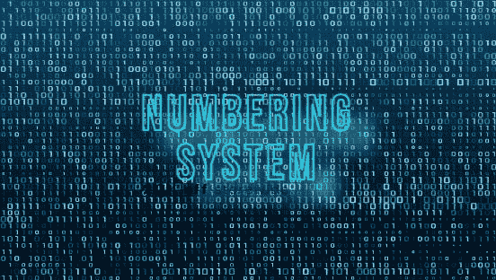

让我们开始游戏吧！

我们提交的信息被转换成电脉冲。每个脉冲被分配一个唯一的代码。之后，代码被转换成 ASCII 数字语言，因为机器知道那种语言。我们输入的每个字符、数字或符号都被转换成机器可以识别的数值(二进制值)。

在机器语言中，有四种不同的编号系统。

1.  二进制数系

2.八进位数制

3.十进数制

4.十六进制数系统

*   **二进制数字系统-**

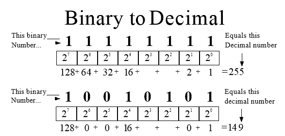

目前，它支持两个可能的值:“0”和“1”。作为一个结果，它的基础是 2。前缀“0b”用于将二进制格式转换为整数格式。每个数字称为一个“位”，而一个 8 位的块称为一个“字节”

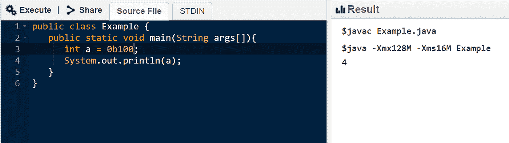

代码的输入和输出

*   **八进制数字系统-**

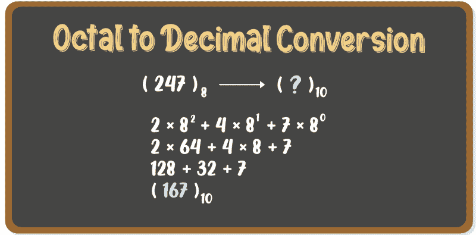

这里接受“0–7”值。因此，其主要焦点值为 8。将八进制格式转换为整数格式时，“0”通常用作前缀。

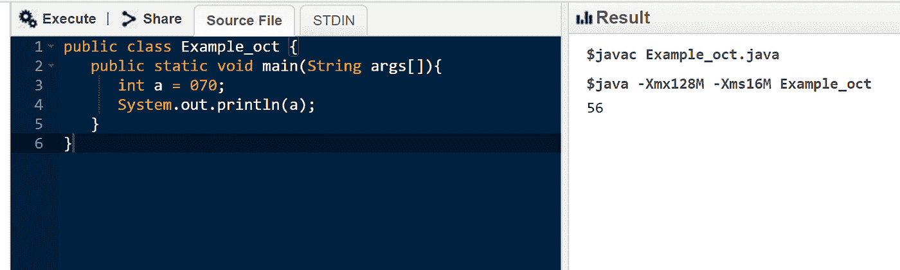

*   **十进制数字系统-**

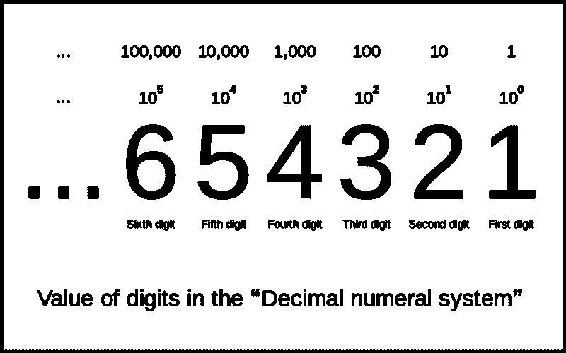

假设十进制系统，允许“0–9”值。因此，它的初始点是 10。这是我们使用的默认十进制值。我们用来转换二进制或八进制值的前缀被用来将它们转换成用户可以理解的十进制数。

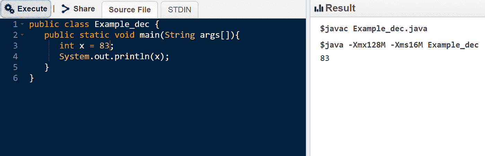

*   **十六进制数字系统-**

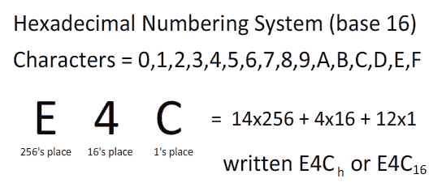

在十六进制计数系统中，它使用“0–9”和“A-F”作为有效值。因此，它的基数是 16。字母“A-F”指的是“10–15”十进制数值。前缀“0x”正用于将十六进制转换为整数形式。

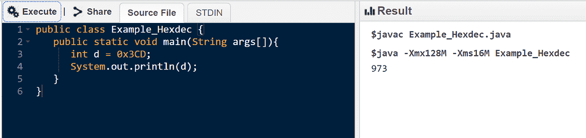

*这些编号方法支持计算机分析我们输入的信息！*

我们来看看 Java 的数值数据类型是如何存储值的！

Java 的数字数据类型使用十进制。数字数据类型分为两类:

*   整数类型包括字节、短整型、整型和长整型
*   浮点类型包括 float 和 double。

下表包含 Java 数值数据类型，这些数据类型将值存储为 2 的补码，例如-: base 2。每种类型都有一个大小，并且只允许该范围内的值。

让我们评估一下，如果值超出了这些数据类型的范围，会发生什么情况。是否会出现编译时间错误，或者是否能够成功编译？看看会发生什么！

看看下面的代码。变量 x 和 y 具有字节数据类型的有效值，也就是说，它们在字节数据类型的范围内。字母“z”呢？它会记录值 131(如果有规律的加，125+6)，但 131 不在字节范围内；它比 127 多，完全正确吗？

**那么，接下来会发生什么？**

**Ex-:输入**

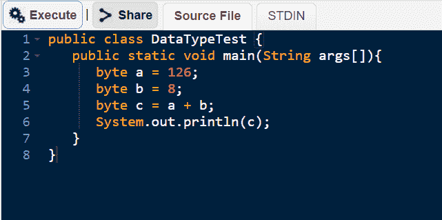

**输出**

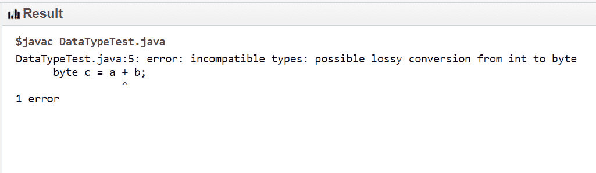

输出时会显示一条错误消息。因为计算机使用循环编号系统。所以机器无法理解正确的结果。

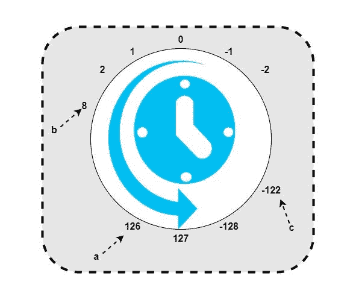

当我们将 a 和 b 相加得到 127 时，它取-128 的值并循环，如上图所示。作为 a 和 b 相加的结果，答案是 c，其值为-125。

> 125 + 1 = 126
> 
> 126 + 1 = 127
> 
> -128 + 1 = -127
> 
> -127 + 6 = -122
> 
> **126 + 9 = -122**

莫名其妙？？？

*   不会，很简单；它实际上是一个循环，如果是一个字节，从 0–127 开始，到-128–0 结束。
*   因此，每个数值数据类型，如 int、double、long 等。，受此影响。它们都有自己的范围，但是一旦达到了极限，数字系统就会再次循环。

***好了，希望你们都明白了一切！！！***

# 祝你职业生涯好运！！！