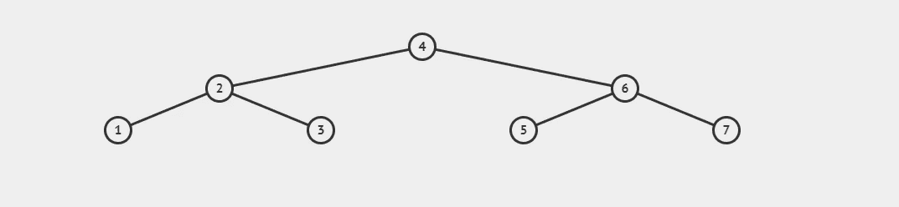

# JavaScript 数据结构和算法(搜索算法，第 1 部分)

> 原文：<https://medium.com/codex/javascript-algorithms-and-data-structures-search-algorithms-part-1-8270911d5f84?source=collection_archive---------4----------------------->

[亚历山大·奈特](https://unsplash.com/@agk42?utm_source=medium&utm_medium=referral)在 [Unsplash](https://unsplash.com?utm_source=medium&utm_medium=referral) 上拍照

你好！今天，我想回顾一下我所学到的搜索算法，以及每一种算法在计算机编程中的重要性。我从来都不擅长写序言，所以事不宜迟，让我们开始吧。

可以肯定地说，我们在浏览网页时都使用过某种搜索引擎。无论是 Google，Bing，DuckDuckGo 等。作为个人和社会，我们已经体验了他们的搜索算法的好处。但是搜索引擎如何在网络上进行这些优化搜索呢？它们是如何决定结果如何排序的？答案比基本算法更复杂，尽管这些算法仍然存在于这些搜索引擎巨兽的核心。

# 线性搜索

正如我提到的，Google 的搜索算法不仅仅是简单的 lookup()方法，但仍然在最基本的层面上使用。我可以自信地说，这第一个算法不是谷歌执行搜索的方式。 ***线性搜索*** 算法搜索一个已排序的结构，如一个数组或一个二叉查找树，以找到所需值的匹配。例如，如果我将一个排序数组声明为[0，1，2，3，4，5，6]，并对值 6 进行线性搜索，我们的搜索算法将从[0]开始搜索，然后访问数组中的每个索引，将每个索引的值与我们的目标值进行比较，直到找到匹配项。

线性搜索可以说是最基本的搜索算法。但是像所有其他算法一样，在将它作为一个解决方案来实现时，也存在权衡。考虑到其时间复杂性，这种搜索算法在使用具有 1，000，000 个索引的数组来搜索值的情况下不是很好。你看，这个搜索算法潜在的时间复杂度是 O(n)，或者线性时间复杂度。这个算法的时间复杂度与数据结构的大小直接相关(一个有一个索引的数组可以在 O(1)时间内运行一次搜索，两个索引在 0(2 + n)时间内运行，简化为 O(n)，以此类推)。不幸的是，这也意味着具有 1，000，000 个索引的数组将在 O(300，000 + n)时间内，或者简化为 O(n)时间内，对索引 300，000 处的值执行线性搜索。我们不必担心必须在大量数据中进行线性搜索；事实上，还有更好的解决方案。

# 二进位检索

***二进制搜索*** ，以它们被编程搜索的树命名，按顺序搜索数组，假定它们是排序的。使用排序数组构建二叉查找树时，二进制搜索效果最好，因为我们可以有效地创建它们。首先，根节点被定义为一个排序数组的中值。回到前面的数组[1，2，3，4，5，6，7]，这个可以用来构建二叉树，对于理解和编写搜索算法来说更容易理解。你觉得这个眼熟吗？

由 https://visualgo.net 提供的简单的二叉查找树

这个中间键的值与搜索的值进行比较，看它是大于还是小于目标值。基于这种比较，二分搜索法算法将在中值的左侧(如果小于中值)或右侧(如果大于中值)搜索数组的值。到目前为止，我希望您还记得二叉查找树中的 lookup()方法就是以这种方式工作的。排序数组的中值可以与二叉查找树的根节点进行比较，两者的 lookup()都需要对数据结构进行排序。和树遍历一样，二分搜索法必须访问序列中的每个值，直到找到匹配为止。在节点值为[1，2，3，5，10，15，25，30，40，45，50]的二叉查找树中，我们将使用 15 作为树的根节点来构建二叉查找树，在左侧添加比搜索值小的键值，在右侧添加比搜索值大的键值。如果我们正在搜索一个值为 45 的节点，算法将按照这个顺序遍历:根、左子节点、右子节点。为此遍历的节点的数组表示如下所示:[15，25，40]。

lookup()，在二叉查找树中实现。

暂时就这样吧！在下一篇文章中，我将介绍另外两种搜索算法:广度优先搜索和深度优先搜索，以及它们是如何在树和图中实现的。一定要去 https://visualgo.net 的[看看强大的数据结构及其算法的可视化，以及后者的一步一步的分解。这可能是我学习时用过的最有用的学习辅助工具。](https://visualgo.net)

下次见！感谢阅读！

> 数据结构示例图片归功于 https://visualgo.net[的出色团队。](https://visualgo.net.)