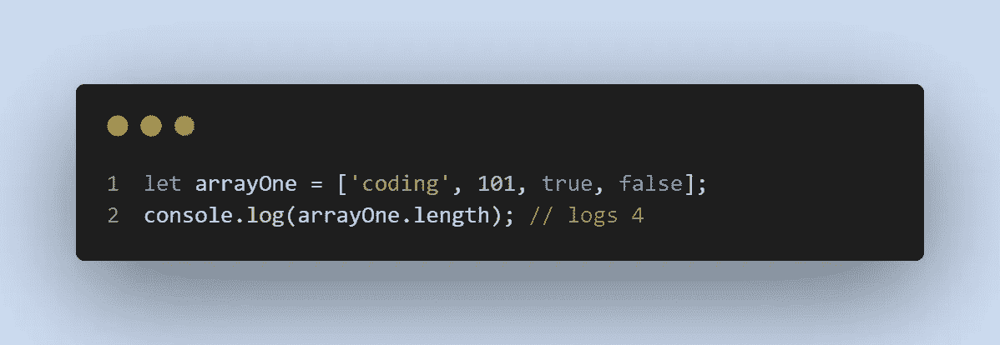

# 面向编程新手的 JavaScript 数组

> 原文：<https://medium.com/codex/javascript-arrays-for-programming-newbies-ec269ec0bbaa?source=collection_archive---------19----------------------->

# JavaScript 数组简介

数组是由固定数量的元素集合组成的数据结构，这些元素以值或变量的形式存在。在 JavaScript 中，通过索引来访问元素，索引从索引 0 开始(零索引)。

可以存储在数组中的数据类型包括:

字符串或*字*——即`‘John’, ‘bus’, ‘Mars’, ‘purple’`等。

数字—即`5, 10, 543, 9.75, 100` 等。

布尔—即`true` 和`false`

数组中的项目是有序的，这意味着它们有编号的位置以便识别和访问。

这篇文章解释了如何创建数组，访问/更新元素，在数组中使用`let`和`const`，确定数组的长度，在数组中添加/移除项，高级方法，JavaScript 函数和数组，以及嵌套数组。

# *让*和 const

开始学习 JavaScript ES6 的一个关键教训是`let`和`const`是声明变量的首选方式。虽然`var`风格有效，但它是一种主要在 ES5 中用于声明变量的方法。

*由* `let` *声明的变量可以被重新分配，而由* `const` *声明的变量不能被重新分配。*

尽管如此，`const`和`let`声明变量中的元素都可以更新(它们是可变的)。在 JavaScript 中创建和操作数组时，声明变量的两种方法非常重要。

# 创建数组

一个*数组文字*是使用方括号创建数组的最常见方式之一。`[]`。

在上面的代码快照中，数组已被保存到变量`arrayOne.`中。数组有四个定义它的属性:

*   变量`arrayOne`由方括号`[].`表示
*   `arrayOne`里面的内容被称为*元素*。
*   数组中表示了四个元素。
*   这些元素分别表示三种数据类型: *string、number 和 booleans (true 和 false)，*。

# 访问和更新数组中的元素

## 访问数组元素

如前所述，JavaScript 数组是零索引的。这意味着`arrayOne`(‘编码’)中的第一个元素在索引`0`处，而数组中的最后一个元素(布尔值`false`)在索引值处，该值等于数组长度值减一。

元素索引

但是，未能将索引位置放在方括号中会导致语法错误，如下所示:

句法误差

## 更新元素

在 JavaScript 中，可以通过多种方式更新数组中的元素。能够访问数组中的元素使程序员能够根据需要更新它的值。

例如:

更新

上面的代码将索引`0`和`1`处的元素值分别从`‘coding’`和`101`更新为`‘javaScript’`和`2021`。因此，当`arrayOne`登录到控制台时，两个索引的值将被更新。

# 内置数组方法和。length()属性

JavaScript 中有各种内置的数组操作方法。常见的方法有`.push()`、`.pop()`、`.shift()`、`.unshift()`、`.splice()`、`.slice()`、`.indexOf()`等。JavaScript 中额外的内置数组方法可以在这个 [MDN 教程](https://developer.mozilla.org/en-US/docs/Web/JavaScript/Reference/Global_Objects/Array)中找到。根据它们的用途，所有这些方法或者增加或者减少特定数组的长度。

属性返回一个数组的长度。例如，使用我们的`arrayOne`，用点符号链接 length 属性将数组中元素的数量记录到控制台中。

数组长度

现在，内置数组方法对`arrayOne`的应用将相应地更新它的长度。这些方法的用法如下:

`.push`方法允许**将一个元素的**加到一个数组 的 ***末端。在下面的快照中，四个元素被添加到了`arrayOne`数组的末尾，长度增加到了 8。***

推

在数组中使用时， `.pop()`方法 ***删除数组的最后一项。***

`.shift()`内置方法用于移除数组的第一个元素。

。shift()

`.unshift()`内置方法用于在数组的开头添加一个。

。未移位()

的。slice()方法工作起来很有趣。根据 [MDN 文档](https://developer.mozilla.org/en-US/docs/Web/JavaScript/Reference/Global_Objects/Array/slice)，该方法有三个属性:

1.  它返回一个数组中被选中的元素作为 ***一个新的数组*** 。
2.  使用参数指定开始和最后的元素——但是**省略了数组中的结束参数**。
3.  `.slice()`方法——这很重要——**不修改**原始数组。

。切片()

`.indexOf()`方法用于在数组中搜索所提供的(元素)并返回其索引位置。使用`.indexOf`方法时，有一些重要的方面需要考虑。

*   搜索从一个特定的位置开始，在没有指定其他开始位置的情况下，索引为 0，在数组结束的位置停止。

*   在数组中没有找到元素的情况下，`.indexOf`方法返回`-1`。

*   如果一个元素在数组中存在多次，则。indexOf()方法返回第一个匹配项的位置。例如，在下面的代码中，数组中第二个相似元素的索引位置通过将其指定为数组中的第二个元素来访问。

当同一数组中有第三个相似元素时，指定从第二个元素之后的索引位置开始搜索。

# 循环遍历数组

在 JavaScript 中，可以使用不同类型的循环来完成数组循环。对于本文，For 循环用于在数组中循环指定的次数。

使用原始数组，通过定义迭代器变量`i`来实现使用 for 循环遍历列表。迭代器变量适用于整个数组长度。条件 `i++` 表示每循环一次后，`i`的值将增加 1。想了解更多关于 For 循环的内容，请参考[这篇 CodeAcademy JavaScript 教程。](https://www.codecademy.com/courses/introduction-to-javascript/lessons/loops/exercises/for-loop)

在下面的 for 循环代码中，在`for`循环的块内，`arrayOne` 中的每个元素都与字符串`'I am learning '`连接在一起。记录到控制台的输出显示了添加到提供字符串的数组中的每个元素。

# 结论

数组是我最喜欢的数据结构。由于其顺序(线性)数据存储模型，涉及阵列的操作得到了简化。此外，数组的线性数据存储模型使其易于使用，特别是在需要访问其元素时。在这种情况下，元素索引值对于根据需要访问和更新它们非常有用。