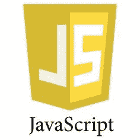
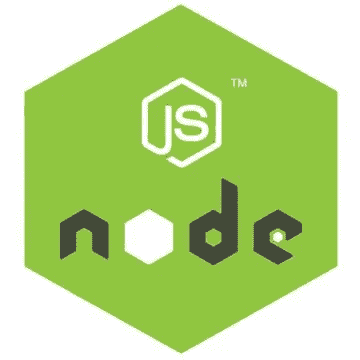

# Java Script 语言

> 原文：<https://medium.com/codex/javascript-c3e8412b6742?source=collection_archive---------7----------------------->

第 01 章- **什么是 JavaScript？**



Java Script 语言

JavaScript 是一种动态的、跨平台的、面向对象的脚本语言。它可以用来使 web 应用程序更具交互性，使用复杂的动画、弹出窗口等。还有更高级的服务器端版本，比如 Node.js，这些代码可以看作是 C、C#或者任何其他服务器端语言代码。这使您可以向应用程序添加比下载文件和库更多的功能。

JavaScript 最初被称为 **LiveScript** ，但是 Netscape 将其名称改为 JavaScript。该语言的通用核心已经嵌入到 Netscape、Internet Explorer 和其他浏览器中。

它包含更多的标准对象库，如**数组、**和**数学**以及一组核心语言元素，如运算符、控制结构和语句。核心 JavaScript 可以扩展为**客户端 JavaScript** 和**服务器端 JavaScript** 。

## 客户端 JavaScript (CSJS)

CSJS 是 JavaScript 的扩展版本，也是该语言最常见的形式。这使得网页和客户端浏览器的管理和强化成为可能。CSJS 的主要任务是验证输入，管理用户界面/UX 元素，动画，样式，计算部分，弹出窗口是在你不希望页面经常刷新的时候完成的。该脚本应包含在由浏览器解释的 **HTML** 文档中。这不是静态的 HTML，但可以包括与用户交互的程序，动态创建 HTML 内容。

这提供了许多优势。例如，我们可以使用 JavaScript 来检查用户在表单字段中输入的电子邮件地址或密码。JavaScript 代码在用户提交表单时执行，只有当所有条目都有效时，它才会被提交给 web 服务器。

## 服务器端 JavaScript (SSJS)

SSJS 也是 JavaScript 的扩展版本，支持对数据库、服务器和其他文件系统的后端访问。它运行在本地资源上，比如 C#、Java。但是它的语法是基于 JavaScript 的。



**节点。JS**

**节点。JS** 就是最好的例子。带节点。JS 我们在服务器端写 JavaScript 来编程，那些代码可以看成是普通的 C#，C，或者其他任何服务器端语言代码。与服务器端代码一样，我们仍然可以将 JavaScript 发送到客户端，但两者之间有一个巨大的差异，因为根据计算权限的条款，CSSJ 代码仅限于客户端的机器资源。例如，客户端 JavaScript 不能访问客户端**的硬盘**。但是使用服务器端，客户端可以访问硬盘没有任何问题。

SSJS 的优势是能够根据客户的需求高度定制响应，以及对数据存储的访问权限。

## JavaScript 的优势

*   *更少的服务器交互—* 在将页面发送到服务器之前验证用户输入。
*   *即时反馈给访问者—* 不必等到重新加载页面。
*   *更丰富的界面—* 可以给网页添加更多的元素。

## JavaScript 的局限性

*   由于计算权限的原因，客户端 JavaScript 不允许读取或写入文件。
*   不能用于网络应用，因为没有任何支持。
*   它没有任何多线程或多重处理能力。

## JavaScript 开发工具

有许多 Java 编写工具。我们也可以使用简单的文本编辑器，比如记事本或 Notepad++。

*   *WebStorm* —为 JavaScript、TypeScript、 **HTML** 、CSS 提供全面的**支持**。
*   *微软 FrontPage* —提供大量 JavaScript 工具来帮助创建交互式网站。
*   *Macromedia Dreamweaver MX—*提供了几个方便的预构建 JavaScript 组件，与数据库集成良好，并符合 XHTML 和 XML 等新标准。
*   *Macromedia HomeSite 5 —* 用于有效管理个人网站。

## 参考

```
[https://developer.mozilla.org/en-US/docs/Web/JavaScript](https://developer.mozilla.org/en-US/docs/Web/JavaScript)
```