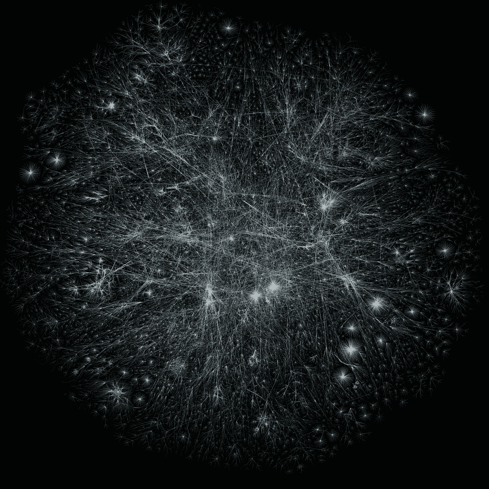
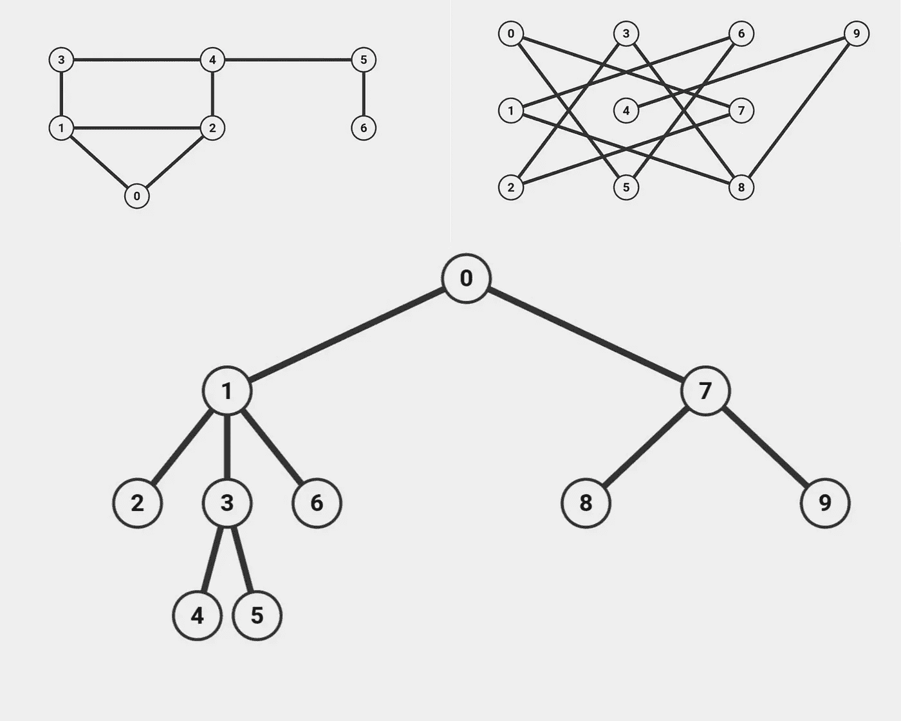
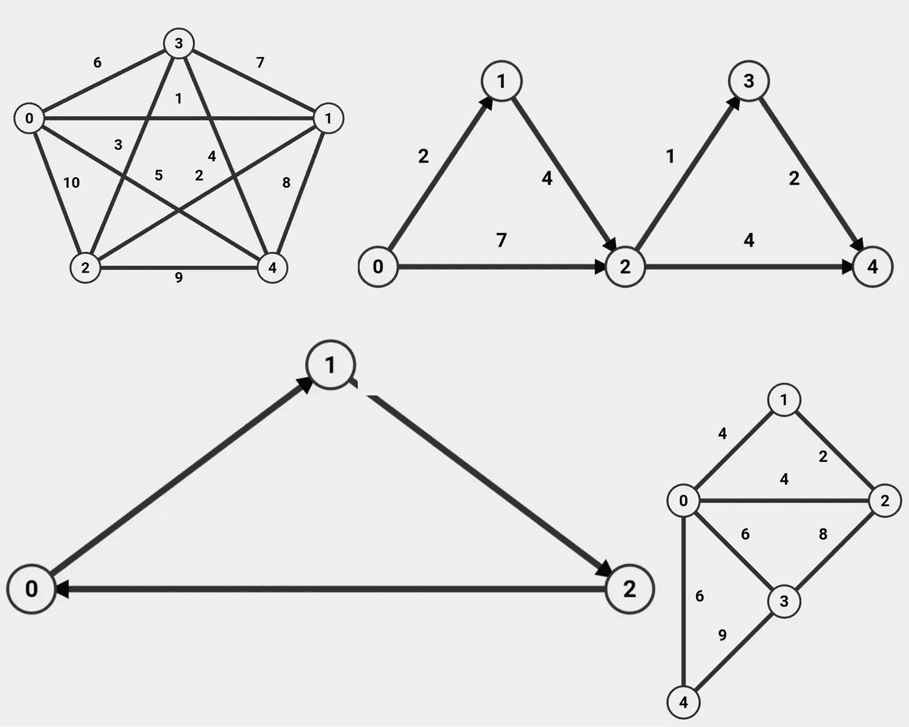
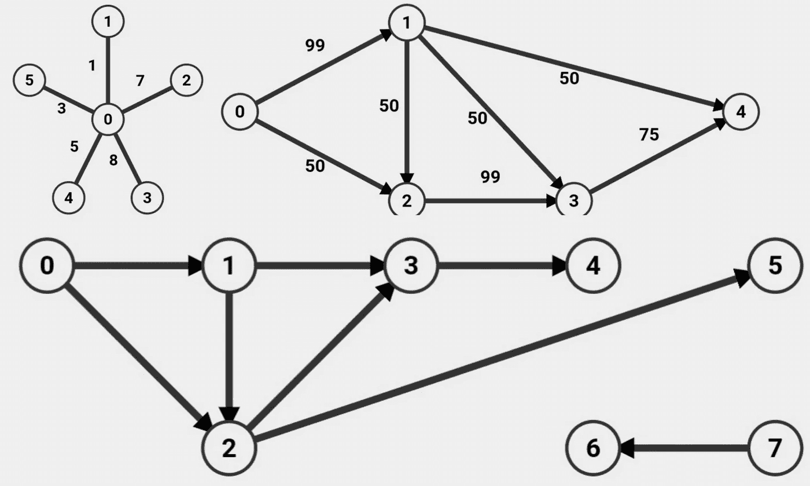

# JavaScript 数据结构和算法(图表)

> 原文：<https://medium.com/codex/javascript-data-structures-and-algorithms-graphs-67cc1d9bfcc7?source=collection_archive---------6----------------------->

你好！今天我将复习*图表*。这些数据结构是 web 上使用最广泛的，因为一个图形可以组织无数种形式的值，甚至可以由它们组成数据结构。事实上，万维网本身可以用图形来表示。让我们直接开始吧！

互联网地图项目(https://opte.org/internet)的万维网可视化

## 图表

图是一种广泛使用的数据结构，由一系列通过*边连接的*节点*或*顶点*组成。虽然它们的一般结构是统一的，但是根据它们的顶点是如何连接的，数据在图中移动的方向等等，图可以被构造成多种形式。*

不同图的一个定义特征可以在连接一个顶点和另一个顶点的边中找到。边可以指向一个方向的相邻节点，这意味着数据可以从一个节点移动到另一个节点。图中的边甚至可以包含一个值或*权重*，它可以描述与其关联顶点的关系，包括数据可以在两个顶点之间移动的方向。边都指向一个方向的图称为*有向图*。如果图是*无向的，可以在两个节点之间来回移动数据的边。*下面是一些无向图的常见示例:

无向图的不同例子(来自 https://visualgo.net)

如您所见，潜在的图形形状多种多样。这看起来有点吓人，如果你被吓到了，看看下面的例子。树也是一种图形。它们也由节点组成，并由边连接。特别是上面的示例树是无向的，这意味着数据可以在任意两个相邻节点之间双向传递。当然，树木也可以被引导；通常，这发生在数据从*父*节点开始向下遍历到其子节点的情况下。

边不限于在有限的序列中创建一个*路径*。边可以创建一条路径，最终回到它开始的节点，这就是所谓的*循环(出现循环的*图是*循环的*，而没有出现*循环的*图是*非循环的)。*

边也可以包含一个值，称为它的*权重*，它将在两个相邻节点之间有一些相关的连接(即地图上 A 点和 B 点之间的英里数，或者两个地铁站之间的行程时间)。边包含这些值的图是*加权*图。当一个图是*未加权的，*它的边在图中的每条边上都有一个值 1 或某个常数相等的值。

图的例子，包括加权的和不加权的，循环的和不循环的，有向的和无向的。(来自 https://visualgo.net)

上面的例子展示了上述图表的几个例子。左上图具有不同的边值，使其成为一个加权图。图的边也没有指定数据移动的方向，所以也可以说这个图是无向的。当然，通向自身的边的路径使得这个图是循环的——一个有向无环加权图。我将把它作为识别其他三种图形类型的小练习留给您。

让我们再看几个例子:

您可能会遇到像下图这样的情况，其中您的图可能包含与一对顶点关联的边，但不连接到图的其余结构。这种独立的子图是同一图的*连通部分*。此图的顶点分组如下:{0，1，2，3，4，5}{6，7}。

## 履行

当构建一个图时，主要的焦点应该是，给定一组数据，定义我们的顶点和边。假设一个顶点可以有一个至少为 1 的*度*，或者*T5 数量的连接边(如果有的话)，我们可以将这些连接组织成一个*邻接表。*下面的数字数组包含一个图形的顶点，这些顶点与表示相邻顶点的数值数组成对出现。上例中的邻接表如下所示:*

{0: [1,2], 1: [0,2,3], 2: [0,1,4], 3:[4], 4: [], 5: [], 6: [], 7: [6]}

这个列表中的关键点是与连接顶点列表配对的顶点，作为它们的值(值为 0 的顶点连接到顶点 1 和 2，1 连接到 0，2 和 3，甚至在*自循环*中回到自身，等等。).要给这些顶点添加边，我们只需将给定的相邻顶点值推入一个空列表中。下面的实现展示了如何使用邻接表来创建图的顶点和边:

一个无向无权重非循环图的实现，在一对顶点之间定义了两个方向的边(创建于 https://carbon.now.sh)

## 定义边缘

除了这个方法，graph 类还定义了一个方法 *addEdges()* ，它接收值 *node1* 和 *node2* 。这些参数被推动指向一个关联顶点，作为从一个关联顶点指向另一个关联顶点的方式。然而，上面的示例是无向的，这意味着需要一条边来将数据从节点 1 移动到节点 2 (1- > 2)以及连接*节点 2* 到*节点 1*【2->1)的边，因此后者也必须被推到前者，从而建立第二个方向，该边可以在它的关联节点之间移动数据。顶点计数器增加 2，以指示两个顶点之间的两个连接。

这就是图形概述的第一部分！下一次我将更深入地研究图的实现，包括移除顶点和图的搜索算法。感谢阅读，下次再见！

# 引用的消息来源

> 威斯康辛州切斯维克；h . burch(1999 年 4 月)。“绘制互联网地图”。IEEE 计算机。32 (4).
> 
> 海西扎克。“对象与数组。Zac Heisey 认为对象和数组都是“中等的”*介质*，介质，2019 年 4 月 25 日，[https://Medium . com/@ Zac _ heisey/objects-vs-arrays-42601 ff 79421。](/@zac_heisey/objects-vs-arrays-42601ff79421.)
> 
> 裴，余思敏。JavaScript 数据结构和算法。第一版。，Apress，2019 年，第 279 页。
> 
> 梅希亚艾德里安。"面向初学者的 JavaScript 图形数据结构|阿德里安·梅希亚博客."*阿德里安·梅希亚博客*，亚当·梅希亚，2020 年 12 月 15 日[https://adrianmeijia . com/data-structures-for-初学者-graphs-time-complexity-tutorial/。](https://adrianmejia.com/data-structures-for-beginners-graphs-time-complexity-tutorial/.)