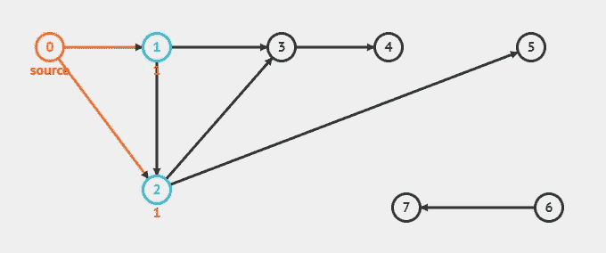
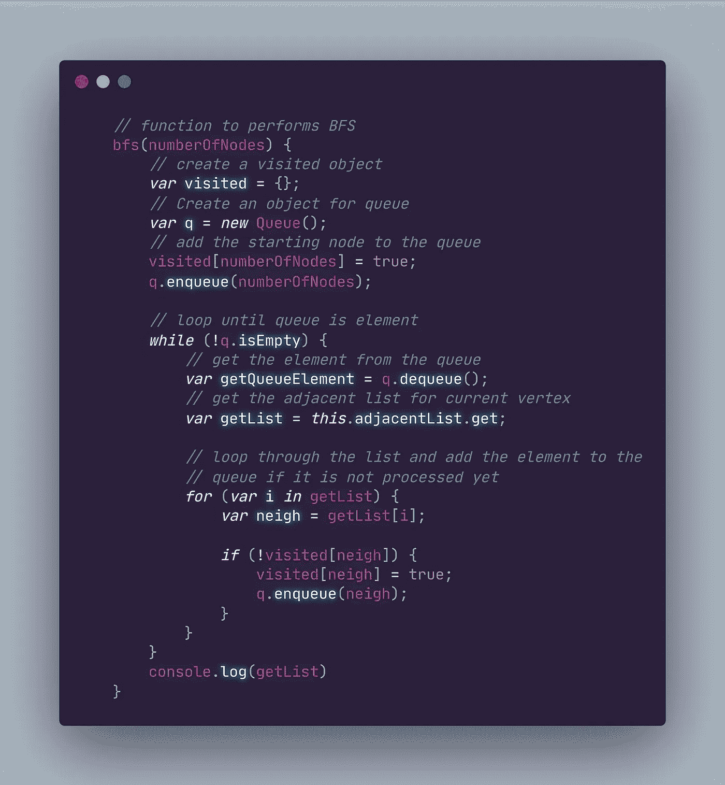
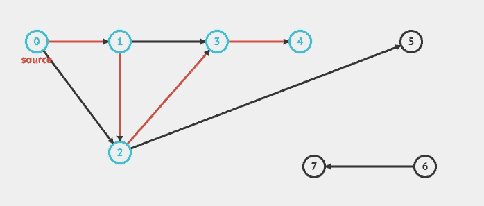
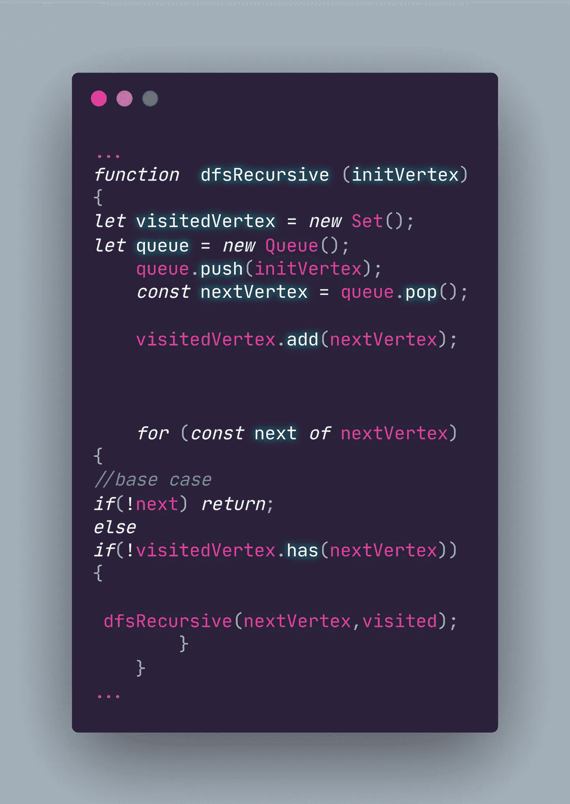

# JavaScript 数据结构和算法(图表，第 2 部分)

> 原文：<https://medium.com/codex/javascript-data-structures-and-algorithms-graphs-part-2-533534289b23?source=collection_archive---------11----------------------->

Justin W 在 [Unsplash](https://unsplash.com?utm_source=medium&utm_medium=referral) 上的照片

你好！这是我分解图形数据结构的延续。上次我们讨论了一些常用的不同图形类型(循环/非循环、有向/无向、加权/未加权)及其在 Javascript 中的实现。你可以在这里看到这篇文章[的第一部分。今天，我将介绍广度优先搜索和深度优先搜索，以及它们的一些实际应用。让我们开始吧！](/@be00f566a88f/67cc1d9bfcc7?sk=)

## 图中的广度优先搜索和深度优先搜索

因为图可以是有向的或无向的，所以可以遍历它们来寻找顶点。像树(可以认为是图的一种类型)一样，我们可以通过使用 [*广度优先搜索*和*深度优先搜索*](/codex/javascript-data-structures-and-algorithms-search-algorithms-part-2-6f7c577b32e9) *在图中运行搜索算法。*它们的实现略有不同，但在结构上完全相同。例如，当执行 BFS 时，图形将在遍历到下一个顶点之前检查一个顶点的邻居，类似于树在遍历到下一个级别以访问它们的子级之前将访问一个级别上的所有子级。

有向无权重图中广度优先搜索的可视化，显示当前顶点(橙色)访问其最近的相邻节点(蓝色)。(创建于 https://visualgo.net)

在上面的例子中，从 0 开始，BFS 将访问顶点 1 和 2，然后遍历顶点 1 并访问其相邻的顶点。

# 履行

如果我们要实现 BFS，我们必须做的第一件事是定义一个入口点。我们不像对待一棵树那样受限于指定的根，但是我们仍然需要定义一个初始点。在上面的例子中，如果我们将 0 指定为底部图形中的入口点，BFS 将首先访问与其共享一条边的任何顶点(0，1，3，5)。

我们还需要将一个队列变量初始化为一个空对象，我们将遍历的顶点和一个已经访问过的顶点列表推入该对象。我们的队列将从每个插入的键中提取相邻顶点的列表，并检查每个匹配。这类似于 BFS 访问父节点的子节点来寻找匹配。在访问每个邻居后，我们的 BFS 方法将遍历邻接表中的下一个键。下面是一个针对无向图的广度优先搜索方法的实现:

广度优先搜索在许多大规模 web 应用中使用。这种方法的一个用途是测量地图上两点之间的英里距离，假设该图具有加权边来指示顶点之间的英里数。如果我们正在构建一个搜索引擎，我们还可以衡量与搜索查询结果列表的相关性。或者你可能想提供一个推荐的朋友列表，BFS 会根据相似度来衡量用户与推荐用户的关系，比如共同的朋友、家庭关系、共同兴趣等。如果目标顶点在其图形的入口点附近，则 BFS 是最佳方法。

# 深度优先搜索

像 BFS 一样，图和树数据结构之间深度优先搜索实现的相似之处非常少。像二分搜索法树一样，我们可以通过在访问一个顶点的任何兄弟节点之前访问它的子节点来遍历一个图。这意味着在转移到其他节点之前，DFS 会沿着一个分支向下遍历到它的最深层。DFS 用于在移动到下一个相邻顶点之前访问路径中的每个顶点。在下面的示例中，值为 0 的顶点是入口点，按照顺序，DFS 会沿着一条由连接的顶点组成的路径遍历，直到不再可能，然后再沿着下一条路径移动。从 0 开始，DFS 将向下遍历到其值为 1 的相邻顶点(以及其相邻节点)，然后继续移动到其值为 2 的另一个相邻顶点。

深度优先搜索的可视化，其中在移动到连接到源的任何其他路径之前，遍历相邻节点的单个路径(红色)被访问(蓝色)。(创建于[https://visualgo.net)](https://visualgo.net).)

我们可以通过创建一个堆栈或队列来保存遍历顺序，从而实现深度优先的搜索方法。我们可以将它与一个列表结合起来，就像一个包含我们已经遍历过的节点的集合。如果你看看下面，这个 DFS 的例子弹出遍历序列中的下一个顶点，并存储到一个变量中( *nextVertex* )。当顶点被推入堆栈时，已经被访问过的顶点被推入 *exploredVertex* 集合。

DFS 的一种实现，使用一个堆栈将遍历中的下一个顶点排入队列，并使用一个 Set 将所有访问过的顶点推入。

一旦路径被尽可能深入地遍历，DFS 就会检查尚未被访问过的路径的其他相邻边。换句话说，如果它不在已访问节点的集合中，那么将遍历序列中的下一条边。这也确保了 DFS 算法不会多次访问一个顶点。以这种方式遍历，通过*深度探索，*可以用作搜索图中值的存在或根据路径边的权重找到从一个顶点到另一个顶点的最短路径，或搜索图中循环的存在的解决方案。

与二叉查找树一样，DFS 可以在图中递归实现，因为遍历需要回溯已经访问过的顶点，以继续下一个可能的路径。我们需要一个基础案例来实现递归方法；结束递归回调的最低可能值。下面的例子展示了这个基础案例以及我们的递归回调。

深度优先搜索，使用递归方法实现。

我们的递归函数接收已定义队列中的下一个顶点以及已访问顶点的列表。一旦到达路径中的基本情况，DFS 将回溯到起始点，并对下一个相邻路径重复该过程。

感谢您的阅读！下一次我将介绍更多的图算法，包括 Dijkstra 算法和拓扑排序，以及本文中讨论的算法的时间复杂性。下次见！

# 引用的消息来源

> 威斯康辛州切斯维克；h . burch(1999 年 4 月)。“绘制互联网地图”。IEEE 计算机。32 (4).
> 
> 海西扎克。“对象与数组。Zac Heisey 认为对象和数组都是“中等的”*介质*，介质，2019 年 4 月 25 日，[https://Medium . com/@ Zac _ heisey/objects-vs-arrays-42601 ff 79421。](/@zac_heisey/objects-vs-arrays-42601ff79421.)
> 
> 裴，余思敏。JavaScript 数据结构和算法。第一版。，Apress，2019 年，第 279 页。
> 
> 梅希亚艾德里安。"面向初学者的 JavaScript 图形数据结构|阿德里安·梅希亚博客."*阿德里安·梅希亚博客*，亚当·梅希亚，2020 年 12 月 15 日，l https://adrianmeijia . com/data-structures-for-初学者-graphs-time-complexity-tutorial/。
> 
> "图表遍历|零到精通学院." *ZTM 学院|零到精通学院*，Zero To Mastery，2021，[https://Academy . Zero tomastery . io/courses/master-the-coding-interview-data-structures-algorithms/lections/12670913。](https://academy.zerotomastery.io/courses/master-the-coding-interview-data-structures-algorithms/lectures/12670913.)
> 
> " Javascript 中深度优先的搜索遍历." *RxJS，Ggplot2，Python 数据持久化，Caffe2，PyBrain，Python 数据访问，H2O，Colab，Theano，Flutter，KNime，Mean。Js，Weka，Solidity* ，[https://www . tutorialspoint . com/Depth-first-search-traversal-in-Javascript。](https://www.tutorialspoint.com/Depth-first-search-traversal-in-Javascript.)2021 年 6 月 15 日访问。