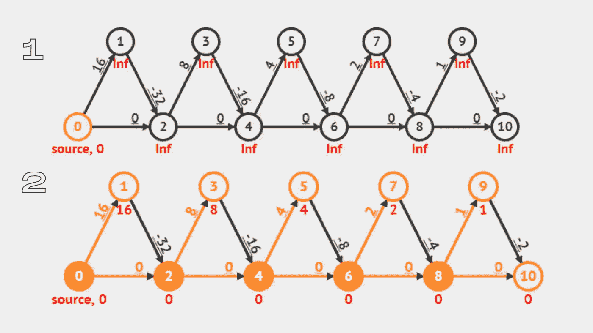

# JavaScript 数据结构和算法(图表，第 3 部分)

> 原文：<https://medium.com/codex/javascript-data-structures-and-algorithms-graphs-part-3-507c91eff33e?source=collection_archive---------11----------------------->

丁满·斯图德勒在 [Unsplash](https://unsplash.com?utm_source=medium&utm_medium=referral) 上的照片

你好！如果您正在阅读这篇文章，并且还没有阅读关于图形数据结构的本系列文章的第 1 部分和第 2 部分，可以先阅读这些文章。你可以在这里找到第一部分[和第二部分](/codex/javascript-data-structures-and-algorithms-graphs-67cc1d9bfcc7)[这里](/codex/javascript-data-structures-and-algorithms-graphs-part-2-533534289b23)。

上次我分解了图的搜索算法，以及它们的实现。我们讨论了使用队列从一个顶点遍历到另一个顶点，在 DFS 的情况下，保存一个访问过的顶点的列表(在我们的例子中我们使用了一个集合),以便沿着一条路径回溯。今天，我将介绍您在处理图形时可能会遇到的其他算法，尤其是那些源自深度优先和广度优先搜索算法的算法。事不宜迟，让我们开始吧！

## Dijkstra 算法

现在我们知道，图中的边可以是有向的或无向的，也可以是加权的或未加权的。也许有一天，我们最终会编写一个 GPS 应用程序来计算地图上两个给定点之间的最短路径。这类问题可以通过在我们的图形代码中实现 *Dijkstra 的算法*来解决。Dijkstra 的算法通过逐层测量到相邻节点的距离来寻找图中顶点之间的最短距离。

Dijkstra 的算法是通过集成广度优先搜索的变体来实现的，其中，随着从顶点到顶点的遍历，当我们的算法从原点遍历时，在更新它们的权重值之前，我们在无穷远处初始化每个边的权重。像 BFS 一样，我们保留了一个队列来保存我们的算法将要遍历的顶点，以及已经访问过的顶点的列表。

Dijkstra 算法，用于查找图形中顶点的最短路径。(创建于 https:/carbon.now.sh)

在上面的例子中，在遍历之前，将相对于原点的所有顶点的距离变量初始化为无穷大，以及将存储相对于原点到顶点的最小距离的变量。然后原点的距离从无穷大更新到 0，然后我们的算法遍历到每个相邻的顶点。这些顶点相对于原点的距离随着每个顶点被访问而更新。同时，一个存储最小距离的变量和一个存储离原点距离最小的顶点的变量被分配到内存中。这意味着一个顶点的距离等于原点和给定顶点之间的距离之和。然后返回到顶点的最短路径。

## 拓扑排序

*拓扑排序*主要在我们希望节点按定义的顺序处理时实现。举例来说，如果我们需要一个依赖列表来在其他包之前导入一些包，我们可以使用拓扑排序。该算法在执行 DFS 时创建遍历节点的线性表示。事实上，实现拓扑排序算法就像用栈实现的深度优先搜索，以保持遍历图的顶点的特定顺序。

一种拓扑排序算法，使用深度优先搜索遍历图的顶点，并记录堆栈中顶点的顺序。(创建于 https://carbon.now.sh

上面的例子还包含一个帮助器函数，它将把一个访问过的顶点添加到堆栈中。*拓扑排序*函数将保存一个相似的堆栈以及一组遍历的顶点。该函数还将调用递归助手函数来遍历 DFS 中尚未访问过的所有可用路径。

拓扑排序的可视化，每个距离初始化为无穷大(1)，遍历后每个距离更新(2)。(来自 https://visualgo.net)

在上面的例子中，我们已经在我们的帮助函数中初始化了*距离*变量。当我们执行深度优先搜索算法时，每个顶点相对于原点的距离随着每个顶点被访问而更新。这是通过跟踪具有最小距离的顶点以及最小距离值本身来实现的。如果找到更小的距离，这些值(最小距离处的顶点和该距离)将被更新。在遍历结束时，我们将得到每个顶点到原点的距离，到原点距离最小的顶点，以及该距离的值。

感谢阅读！图遍历有时会令人困惑，但坚持是关键(只是不要累垮自己)。我的下一篇文章将是我关于图形的迷你系列的最后一篇，在这里，我将回顾我们的算法，并分析每个实现的好处和权衡，包括每个实现的时间/空间复杂性。下次见！

## 引用的消息来源

> 裴，余思敏。 *JavaScript 数据结构和算法*。第一版。，Apress，2019，第 17 章:图表(第 293–301 页)。
> 
> "使用 Javascript DFS 的拓扑排序." *RxJS，Ggplot2，Python 数据持久化，Caffe2，PyBrain，Python 数据访问，H2O，Colab，Theano，Flutter，KNime，Mean。Js，Weka，Solidity* ，[https://www . tutorialspoint . com/topology-sorting-using-Javascript-DFS。【2021 年 6 月 20 日访问。](https://www.tutorialspoint.com/Topological-sorting-using-Javascript-DFS.)