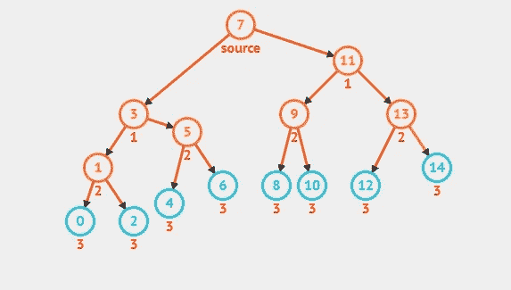

# JavaScript 数据结构和算法(搜索算法，第 2 部分)

> 原文：<https://medium.com/codex/javascript-data-structures-and-algorithms-search-algorithms-part-2-6f7c577b32e9?source=collection_archive---------11----------------------->

安德鲁·伍尔夫在 [Unsplash](https://unsplash.com?utm_source=medium&utm_medium=referral) 上的照片

你好！我希望你们都享受阵亡将士纪念日周末。我利用这个长周末继续这个关于搜索算法的系列文章。上次，我们讨论了二进制搜索，以及这些算法如何遍历二叉查找树节点来找到指定的叶子。关于树的遍历，我介绍了处理树时常用的顺序、后顺序和前顺序遍历方法。可以说，今天我想深入探讨两种广泛使用的树搜索方法:*广度优先搜索*和*深度优先搜索、*以及一种方法优于另一种方法的用例。让我们开始吧。

穿着二叉查找树的 BFS。在遍历到下一个高度级别(1、2、3)之前，给定级别(数字)的所有节点都会检查其邻居(子节点)。(创建于 https://visualgo.net)

# **广度优先搜索**

广度优先搜索或 BFS 是一种搜索算法，它从二叉查找树的根节点开始，逐层遍历每个相邻节点，或者更确切地说，遍历每个子节点。BFS 在前进到下一个深度级别之前访问一个级别中的每个相邻节点。在我的上一篇文章中，我展示了二叉查找树的 lookup()方法如何在遍历所有右孩子之前遍历所有左孩子。在这种情况下，将从左到右检查比根低一级的根级的所有子级，然后是下一级的子级，依此类推，直到我们找到我们的搜索值，或者我们到达树的最低级，其中节点没有子级，并且没有找到该值。我们以前在运行 lookup()算法时见过这种方法，其中被搜索的一半树由根的值与搜索值的比较来确定。

运行 BFS 时，我们可以实现两个节点遍历选项中的一个。如果一个给定的搜索值大于一个树的根节点，那么我们可以使用后序遍历来找到与前者相等的节点值(记住这个的搜索顺序是*左，右，根*)。如果小于根，我们可以用按序遍历(顺序:*根，左，右*)。至于整个搜索算法，我们也有选择。我们可以用一个强力解决方案来解决这个问题，在这个方案中，我们通过迭代地将节点值添加到一个列表中来定义遍历顺序，使用一个队列来存储顺序，以检查我们的搜索值。另一个更广泛使用和最佳的方法是通过*递归*，使用一个回调函数(稍后会详细介绍)，从而将问题分解成更小的子问题，在渲染时聚集在一起。

广度优先搜索的迭代方法，遍历顺序由队列管理，每个被访问的节点的值存储在一个列表中。(创建于 [https://carbon.now.sh)](https://carbon.now.sh))

在上面的例子中，BFS 是通过在深入到下一层之前遍历当前层的每个节点来执行的。给定每层的嵌套循环，这在最坏的情况下给 BFS 带来线性时间复杂度 O(n)。就内存而言，如果我们需要遍历一棵深度大于宽度的树，BFS 可能是一个更好的解决方案。在这种情况下，它的遍历会比 DFS 短。例如，假设您需要找到离给定位置最近的快餐店(更多关于 BFS/DFS 的信息，图表即将推出)。假设你手边有谷歌地图，谷歌地图通过检查每一个街区的距离来检查最近的餐馆会更好，而不是一直到一条街的尽头，然后再移动到任何相邻的街道。在这种最好的情况下，BFS 可以在 O(n)时间内运行其操作。更宽的树意味着需要分配更多的内存来遍历树的每一层。

# **深度优先搜索**

深度优先搜索(或 DFS)是一种搜索算法，它从根节点开始，在单个分支中遍历尽可能多的深度，从左分支开始，然后是最近祖先父节点的最近未检查的右子节点的右子节点。如果我们在一棵树中寻找一个宽度大于深度的值，或者如果一棵树有许多层的高度，或者如果我们正在检查一个值的存在，那么 DFS 就是这类问题的最佳解决方案。给定适当的场景，DFS 可以通过三种方式之一实现。使用 DFS，我们实际上可以从最左边的节点(将是最低的值)开始检查平衡二叉查找树中的排序值，这将我带到三个 DFS 遍历中的第一个:*按序遍历*。简单来说，就是我在本段开头提到的具体实现。按序遍历访问的节点顺序是左子节点、根节点、右子节点。在访问最近的根节点之前，所有左边的节点都被耗尽，这意味着最左边的子节点是第一个被访问的节点。在最左边的孩子之后，访问最近的父母。最后，访问最近的右侧子节点。以下面的树为例:

一个二叉查找树(在 https://visualgo.net[创建)](https://visualgo.net))

在上面的树上使用有序遍历时，所访问节点的数组表示如下:[4，5，6，7，15，23，50，71]。

第二种遍历算法是*前序遍历。在这个算法中，我们按照这个顺序访问树的节点:根，左，右。使用前序遍历，在遍历到左边的子节点之前先访问根节点，然后再访问右边的子节点。如果我们回头看看上面的示例树，该树的前序遍历的数组表示将被排序:[15，6，4，5，7，50，23，71]。*

最后，我们还可以用*后序遍历遍历树的节点。*这个方法首先访问左边的孩子，然后是右边的孩子，最后是最近的父根。后序遍历的数组表示如下:[5，4，7，6，23，71，50，15]。

读者朋友们，今天就到这里吧！下一次我将回顾使用递归实现 BFS 和 DFS，以及如何在函数中实现递归来解决编码问题。享受你的长周末，记得练习，练习，再练习。下次见！