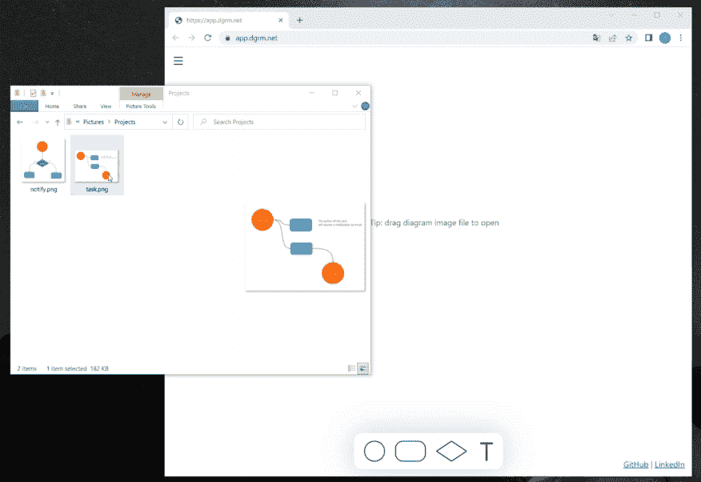
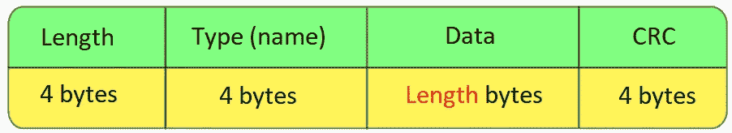

# 从 PNG 图像呈现图表的 JavaScript 图表编辑器(开源)

> 原文：<https://medium.com/codex/javascript-diagram-editor-that-renders-diagrams-from-png-images-open-source-d1de0f053088?source=collection_archive---------20----------------------->



图一。dgrm.net 可以从 PNG 图像打开图表

[dgrm.net](https://dgrm.net/)|[GitHub](https://github.com/AlexeyBoiko/DgrmJS)

[< <上一篇](/codex/javascript-svg-diagram-editor-which-weighs-6-5-less-than-bootstrap-open-source-library-b753feaaf835)

dgrm.net——是一个图表编辑器，着眼于转换成知识地图工具。

独特的功能:

*   禁欲主义，
*   在手机上工作，
*   开源。

在开发过程中，有趣的时刻出现了。今天我们将谈论从 PNG 读取数据。附上您的项目中使用的源代码。

# 为什么从 PNG 图像打开图表？

开发人员制作的用户界面因怪异而臭名昭著。也许使用图像作为项目文件的想法就是如此。至少方法是原创的。

所有编辑器都使用自己的项目文件。但这是不方便的:

*   没有预览，
*   发送图像时，还必须发送来源。

有图更方便，需要的话可以编辑。

查看图 1，我们可以假设正在使用隐写术或图像识别。它实际上要简单得多，而且没有漏洞 PNG 格式支持存储附加信息，比如时间戳、作者姓名或任何其他信息。

dgrm.net 将带有图表数据的 JSON 写入 png 文件。

# PNG 块

下面是 PNG 规范:“[便携式网络图形(PNG)规范](https://www.w3.org/TR/PNG/)”。

突出显示:

*   png 文件由称为块的块组成，
*   您可以将自己的块添加到文件中。



图二。一个 PNG 块的结构

对于自定义数据，您可以考虑任何块名(例如“dgRm”):

*   名称长度严格为 4 个拉丁字母；
*   字母大小写很重要。对于自定义块，将所有字母小写，第三个大写。

因此，要在 PNG 文件中存储 JSON 字符串，您需要向文件中添加自己的块。

# 在浏览器中用 JavaScript 读/写 PNG 块

## 读一大块

块彼此跟随，通过枚举来搜索所需的块。

块搜索算法(清单 1):

1.  取第一个块的名称
2.  如果名称与搜索项不匹配
    -获取块的长度(前 4 个字节见图 2)
    -知道块的长度，将光标移动到下一个块的开头
3.  重复 1 和 2，直到我们找到想要的块或“IEND”(文件结尾)。

```
/**
 * [@param](http://twitter.com/param) {ArrayBuffer} pngData
 * [@param](http://twitter.com/param) {number} chunkNameUint32 chunk name as Uint32
 * [@returns](http://twitter.com/returns) {DataView | null} chunk data
 */
function chunkGet(pngData, chunkNameUint32) {
    const dataView = new DataView(pngData, 8);
        // 8 byte — png signature

    let chunkPosition = 0;
    let chunkUint = dataView.getUint32(4);
    let chunkLenght;
    while (chunkUint !== 1229278788) { // last chunk ‘IEND’
        chunkLenght = dataView.getUint32(chunkPosition);
        if (chunkUint === chunkNameUint32) {
            return new DataView(pngData, chunkPosition + 16, 
                chunkLenght);
        }
        chunkPosition = chunkPosition + 12 + chunkLenght;
        chunkUint = dataView.getUint32(chunkPosition + 4);
    }
    return null;
}
```

*清单 1。组块查找功能*

> Q **uick 参考:** JavaScript 处理二进制数据的方式很有趣。
> 
> ArrayBuffer 对象用于表示一个通用的、固定长度的原始二进制数据缓冲区。…
> 你不能直接操作一个数组缓冲区的内容
> [developer.mozilla.org](https://developer.mozilla.org/en-US/docs/Web/JavaScript/Reference/Global_Objects/ArrayBuffer)
> 
> 要读取数据，您可以将其包装在一个[数据视图](https://developer.mozilla.org/en-US/docs/Web/JavaScript/Reference/Global_Objects/DataView)中。DataView 允许您以数字形式读取任何位置的数据(使用 getInt8()、getUint32()方法等)。).

# 写一大块

要写一个块，你需要在链中插入一个新的块。如果具有给定名称的块已经存在，则必须替换它。

参见 [GitHub 上的实现 chunkSet 函数](https://github.com/AlexeyBoiko/DgrmJS/blob/main/src/diagram-extensions/infrastructure/png-chunk-utils.js)。

# 源代码

处理 PNG 块的函数位于一个文件中。该文件没有依赖项，所以您可以简单地将它复制到您的项目中。

[png-chunk-utils.js](https://github.com/AlexeyBoiko/DgrmJS/blob/main/src/diagram-extensions/infrastructure/png-chunk-utils.js)

使用示例:

```
// Write a chunk, new blob output
const newPngBlob = await pngChunkSet(
    // png-image
    pngBlob,
    // chunk name
    'dgRm',
    // chunk value: string as a bytes
    new TextEncoder().encode('...'));

// read a chuk
const dgrmChunkVal = await pngChunkGet(newPngBlob, 'dgRm');
const str = new TextDecoder().decode(dgrmChunkVal);
```

*清单 2。调用函数来读写 PNG 块*

# 如何支持该项目

*   开始使用，告诉我们你的想法。
    任何方式:评论，私信，在 [GitHub](https://github.com/AlexeyBoiko/DgrmJS) 上。我什么都读，我有一份提案清单。
*   告诉你的朋友。
*   在 [GitHub](https://github.com/AlexeyBoiko/DgrmJS) 上放星星。