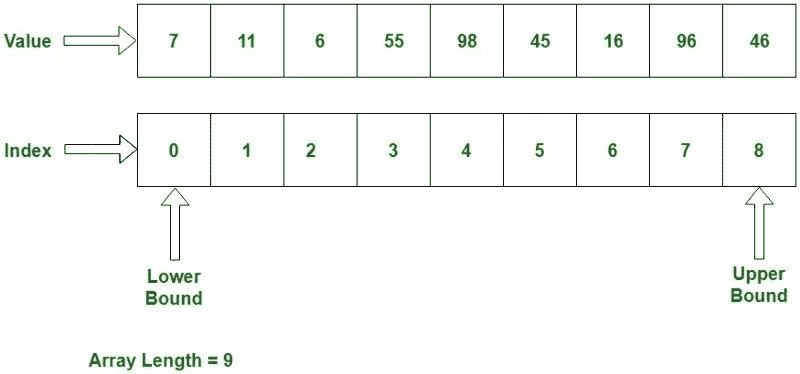

# 阵列一次到位！

> 原文：<https://medium.com/codex/javascript-diaries-arrays-in-one-sitting-618740fdb70b?source=collection_archive---------11----------------------->

难道你不想有一个军队的士兵为你服务，作为他们唯一的主人吗？嗯，如果你知道如何控制数组，它们可以成为无所不能的军队的忠诚士兵，帮助你征服编程时的高要求任务。

梦境时间插图

当你想存储一个列表时，数组可以为你提供帮助，但是——与对象不同——数组(你的军队)使你能够通过数字访问它的元素(你忠实的士兵),如下图所示。

图片由 GeeksforGeeks 提供

存在一系列数组方法，每种方法都有不同的技能，在处理各种项目的复杂部分时，它们会非常方便。如果您掌握了 javascript 中的数组，那么在处理像 React 这样的 javascript 框架中的复杂项目时，您肯定会占上风。

也就是说，我打算简单地介绍一下每一个，而不是深入细节，因为在一个上下文中使用每一个数组方法并亲自测试它们在不同项目中的适用性/限制肯定更好。

我认为首先对它们进行分类是个好主意，因为这样的话，你可能会注意到一些**问题**，比如在开始更大的项目之前，这些方法中的哪些是可变的。请记住，是否改变原始数组的决定在代码的顺利运行中起着关键作用。一个好的程序员知道概念的核心，并且从不盲目地写代码。

当你开始消化中心思想时，大规模的项目对你来说将是小菜一碟，所以下面的列表就像一个快速指南，每种方法都插在特定的保护伞下。如果您希望在此过程中探索一些复杂的示例，我还会为每个方法添加一个链接(只需点击相关的方法)。

# bitesize = >中的 JavaScript 数组

**类别 1 = >变异/改变原阵**

***a-在原有的基础上增加项目:***

*   [。按下](https://www.javascripttutorial.net/javascript-array-push/)(一个新项目被添加到数组的末尾。)
*   [。unshift](https://www.javascripttutorial.net/javascript-array-unshift/) (在数组的开头添加一个新项目。)

***b-从原数组中删除项目:***

*   [。弹出](https://www.javascripttutorial.net/javascript-array-pop/)(从末尾删除一项。)
*   [。移位](https://www.javascripttutorial.net/javascript-array-shift/)(从头删除一项。)
*   [。拼接](https://www.javascripttutorial.net/javascript-array-splice/)(从数组的任意位置删除一个项目)

***c-本类中其他有用的数组:***

*   [。反转](https://linuxhint.com/reverse-array-javascript/)(反转数组中项目的顺序)
*   [。排序](https://www.javascripttutorial.net/javascript-array-sort/)(允许您对数组中的项目进行排序)
*   [。填充](https://dmitripavlutin.com/javascript-fill-array/)(用值填充特定项目)

**类别 2 = >生成新数组**

***a-通过原物构建的一个:***

*   [。映射](https://www.javascripttutorial.net/javascript-array-map/)(循环/转换数组时使用)

***b 过滤使用情况:***

*   [。过滤器](https://www.javascripttutorial.net/javascript-array-filter/)(创建元素的子集)

***原数组的 c 部分:***

*   [。切片](https://www.javascripttutorial.net/javascript-array-slice/)(复制所有元素)

***d-将原件添加给其他人:***

*   [。串联](https://www.javascripttutorial.net/javascript-array-concat/)(合并数组)

***e-展平原数组:***

*   [。flat](https://www.javascripttutorial.net/es-next/javascript-array-flat/) (子数组的所有项目连接到新数组)
*   [。flatmap](https://www.javascripttutorial.net/es-next/javascript-array-flatmap/) (混合了`map()`方法和 flat())

**类别 3= >指数问题**

***a-符合值:***

*   [。](https://www.javascripttutorial.net/javascript-array-indexof/)的索引(查找元件的位置)

***b-符合一个测试条件:***

*   [。findIndex](https://www.javascripttutorial.net/es6/javascript-array-findindex/) (查找测试函数中的第一个元素)

**类别 4= >元素的数组**

***a-基于一个测试条件:***

*   [。查找](https://www.javascripttutorial.net/es6/javascript-array-find/)(搜索测试中的第一个元素)

**类别 5= >检查数组是否有项目**

***a-通过一个值:***

*   [。包含](https://www.javascripttutorial.net/es-next/javascript-array-includes/)(检查数组是否有特定元素)

***b-基于一个测试条件:***

*   [。some](https://www.javascripttutorial.net/javascript-array-some/) (控制一个[数组](https://www.javascripttutorial.net/javascript-array/)是否至少有一个元素符合预期)
*   [。每个](https://www.javascripttutorial.net/javascript-every/)(检查每个项目是否满足特定条件。

**类别 6= >一个新字符串**

***a-行中带分隔符的字符串:***

*   [。join](https://www.javascripttutorial.net/javascript-array-join/) (连接所有项目并从数组中生成一个新字符串)

**类别 7= >转换为数值**

***a-累加:***

*   [。reduce](https://www.javascripttutorial.net/javascript-array-reduce/) (把一个数组缩减成一个值/就像滚雪球一样——这是一个非常强大的方法。在某种程度上，这就像是万能的。)

梦的影像时间

**类别 8= >循环**

***a-在每个元素上运行一个函数:***

*   [。forEach](https://www.javascripttutorial.net/javascript-array-foreach/)

总而言之，如果你打算成为一名优秀的程序员，数组是非常重要的。这个话题不能跳过。一旦你知道数组本质上是如何工作的，你就可以很容易地解决代码面试的挑战，从头开始创建令人羡慕的项目。上面提到的是大部分热门的符合其类别排列的；然而，如果您对查看数组方法的完整列表感兴趣，这里的[是链接。](https://www.w3schools.com/jsref/jsref_obj_array.asp)

***“先解决问题。然后，写代码。”—约翰·约翰逊***