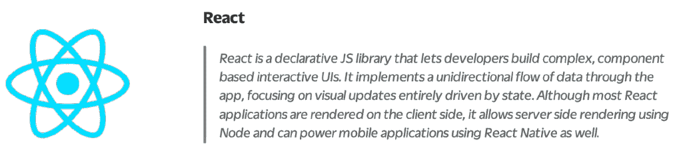
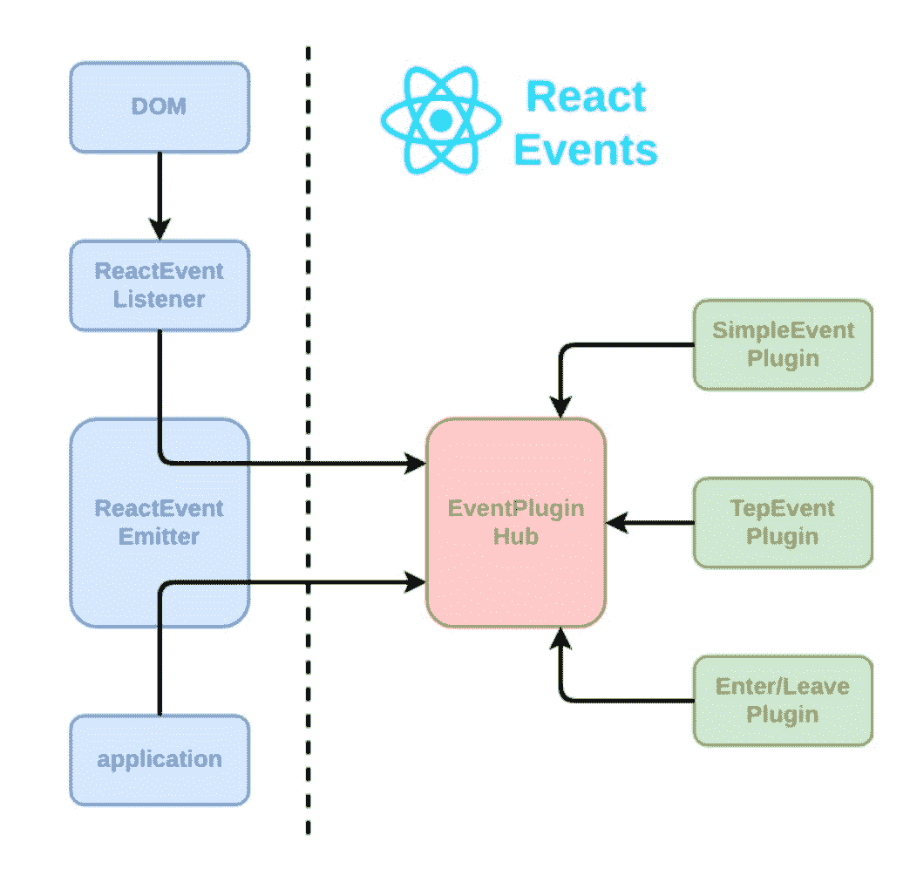
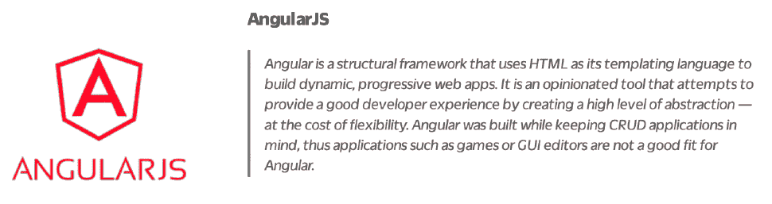
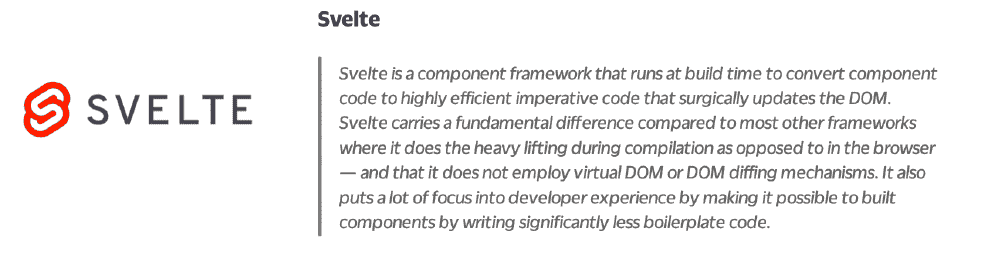

# Javascript 事件处理—深入探讨

> 原文：<https://medium.com/codex/javascript-event-handling-deep-dive-aef60127abb?source=collection_archive---------9----------------------->


> *中等乡亲，请添加对嵌套列表的支持。*
> 
> *真诚的技术作家*

# 目录

*   介绍
*   概观
*   深潜
*   资源

# 介绍

**目标**

本文采用公正的方法来研究各种 UI 工具中的事件处理。内容基于官方文件— ***而非*** 的意见。

**目的**

目的是理解这些工具是如何解决相同的“*问题*”。

**这篇文章不是什么**

本文不评估利弊，也不推荐一种工具优于另一种。

# 概观

Javascript 世界正以极快的速度发展。在很长一段时间里，一个网页都是由一个单一的脚本文件组成的，这个脚本文件处理所有的事情——从在页面上启用交互性到调用服务和呈现内容。这种模式有明显的缺点。整体架构难以长期扩展和维护。特别是在有几个工程师贡献代码的企业级别，单一的架构往往会变得一团糟，难以调试。

Javascript 的固有特性允许工程师对这种模式进行创新，并想出巧妙的方法来解决缺点。现在有很多前端库和框架，每一个都有自己的超能力和解决问题的方式。因此，现代开发人员在选择一个系统来构建他们的应用程序时，选择余地很大。

尽管可供开发人员使用的工具列表已经非常详尽，但是没有多少能够经受住时间和战争的考验。在本文中，我们将调查那些(相当)毫发无损的人，试图了解他们是如何处理事件的。

# 深潜

本节将深入探讨几个流行的、公开可用的 UI 库和框架，研究它们是如何处理事件的。让我们从最受欢迎的开始。



## 在 React 中处理事件

React 中的事件处理围绕[reactbrowsereventmitter](https://github.com/facebook/react/blob/b87aabdfe1b7461e7331abb3601d9e6bb27544bc/packages/react-dom/src/events/ReactBrowserEventEmitter.js)展开。源代码中的第一个注释很好地解释了它是如何工作的。

`ReactBrowserEventEmitter`事件处理总结:



## 让我们深入研究并逐一分析:

> *→* 顶级委托用于捕获大多数原生浏览器事件。这可能只发生在主线程中，由`ReactDOMEventListener`负责，它是注入的，因此可以支持可插拔事件源。这是发生在主线程中的唯一工作。

React 使用事件委托来处理应用程序中的大多数交互事件。这意味着当一个带有`onClick`处理程序的`button`被渲染时

```
<button onClick={() => console.log('button was clicked')}>Click here</button>
```

React 没有将事件监听器附加到`button`节点。取而代之的是，它获取一个对应用程序呈现的文档根的引用，并且[在那里安装](https://github.com/facebook/react/blob/8a8d973d3cc5623676a84f87af66ef9259c3937c/packages/react-dom/src/client/ReactDOMComponent.js#L225)一个事件监听器。React 对每个事件类型使用一个事件监听器来调用虚拟 DOM 中所有提交的处理程序。每当 DOM 事件被触发时，这些顶级侦听器通过 React 源代码启动实际的事件调度——它为每个处理程序重新调度事件。这可以在 [EventPluginHub](https://github.com/facebook/react/blob/b87aabdfe1b7461e7331abb3601d9e6bb27544bc/packages/events/EventPluginHub.js) 的源代码中看到。

> →我们对事件进行标准化和重复数据删除，以解决浏览器的问题。这可以在工作线程中完成。

**React 使事件类型正常化**，这样每个浏览器，不管它的底层引擎是旧的还是新的，都将拥有一致的事件参数。这意味着，在所有浏览器、设备和操作系统中，一个`click`事件会有这样的参数

*   **布尔型** altKey
*   **布尔型**元键
*   **布尔型** ctrlKey
*   **布尔型**shift 键
*   **布尔型** getModifierState(key)
*   **数字**按钮
*   **数字**按钮
*   **编号** clientX
*   **号**号主顾
*   **编号** pageX
*   **编号**佩吉
*   **号**屏幕
*   **编号** screenX
*   **多事件目标**相关目标

📖**延伸阅读**:React 中支持的事件，阅读[本](https://reactjs.org/docs/events.html#supported-events)。

> →将这些原生事件(带有用于捕获它的相关顶级类型)转发给`EventPluginHub`，它将依次询问插件是否要提取任何合成事件。

React 考虑每个事件的性质，并将它们分类到不同的桶中。它有专门的插件来管理每个桶中的事件。**然后，这些插件中的每一个依次负责提取和处理该桶中的各种事件类型**。例如，`SimpleEventPlugin`将处理在普通浏览器中实现的事件，如鼠标和按键事件([源](https://share.cocalc.com/share/a04c90b3eaea18961287b4f6b5c13a7df2d3f0f1/react/wstein/node_modules/react/lib/SimpleEventPlugin.js?viewer=share))，而`ChangeEventPlugin`将处理`onChange`事件([源](https://share.cocalc.com/share/a04c90b3eaea18961287b4f6b5c13a7df2d3f0f1/react/wstein/react-with-addons.js?viewer=share))。将所有插件统一到一个地方并将事件重定向到每个插件的最后一个部分是`EventPluginHub`。

这为我们理解 React 如何看待事件打开了大门。React 引入了`SyntheticEvents`的概念，React 将其定义为“*通过规范化浏览器怪癖*实现 DOM Level 3 Events API”。基本上，它是一个**包装器，用相同的接口包装浏览器的本地事件对象**——并且它在所有浏览器上的工作都是一样的。

对于 React v16 和更早版本，合成事件利用轮询机制。这种机制确保了在多个处理程序中使用同一个对象实例，但是在每次调用之前都会用新的属性对其进行重置，然后将其释放。

> →然后`EventPluginHub`将通过用“dispatches ”(一系列关注该事件的监听器和 id)注释来处理每个事件。

**在 React 生态系统中，对于任何一种事件类型**，都会在文档根附加一个事件监听器。由于每个事件类型很可能有多个处理程序， **React 将累积事件及其处理程序** ( [源](https://github.com/facebook/react/blob/b87aabdfe1b7461e7331abb3601d9e6bb27544bc/packages/events/EventPropagators.js#L90))。然后，它将进行相关的分派，包括事件处理程序及其对应的纤程节点。纤程节点是虚拟 DOM 树中的节点。纤程节点是使用 React 的协调算法计算的，这是它驱动页面更新的“diffing”算法。

📖**延伸阅读** : [反应纤维架构](https://blog.logrocket.com/deep-dive-into-react-fiber-internals/)

📖**延伸阅读** : [反应和解理念](https://reactjs.org/docs/reconciliation.html)

> →然后`EventPluginHub`分派事件。

谜题的最后一部分— **插件中心检查积累的信息并分派事件**，从而调用提交的事件处理程序([源](https://github.com/facebook/react/blob/b87aabdfe1b7461e7331abb3601d9e6bb27544bc/packages/events/EventPluginUtils.js#L77))。

**简单演示**

下面是 React → [Link](https://codesandbox.io/s/thirsty-wildflower-57x4m?file=/src/App.js) 中一个简单的点击处理程序演示实现。


## 在 Vue 中处理事件

在 Vue 中，创建一个包含执行 javascript 的`script`标签和包装所有标记(DOM 和定制元素)的`template`标签的`.vue`文件。这是一个 Vue 组件的自包含实例，它也可以包含一个`style`标签来存放 CSS。

> →简单的 DOM 事件处理

Vue 允许开发人员使用`v-on:<event-name>`或简而言之`@<event-name`指令将事件绑定到元素，并将应用程序的状态存储在`data` prop 中。**所有的事件处理程序都类似的存储在同一个对象**的 `**methods**` **道具中。**

```
// App.vue<template>
    <div id="app">
        <HelloWorld :msg="msg" />
        <button [@click](http://twitter.com/click)="greet('World', $event)">
            click here
        </button>
    </div>
</template><script>
    import HelloWorld from "./components/HelloWorld";export default {
        name: "App",
        components: { HelloWorld },
        data: function () {
            return { msg: "Vue" };
        },
        methods: {
            greet: function (message, $event) { this.msg = message; }
        }
    }
</script>
```

应用程序将加载消息“Hello Vue”。点击按钮时，处理程序会将消息设置为 World，并显示“Hello World”消息→ [REPL](https://codesandbox.io/s/vue-demo-dom-event-handler-wxces?file=/src/App.vue) 。通过从处理程序引用传入一个对象并访问事件处理程序，可以访问原始 DOM 事件。

> →事件修饰符

虽然可以通过简单地传递 DOM 事件对象来访问处理程序中的 DOM 事件对象，但是 Vue 允许通过附加“修饰符”来扩展事件处理，从而改善了开发人员的体验。这样， **Vue 将为您处理这些修饰符，而不是开发人员在他们的处理程序**中显式调用这些修饰符。通过使用点分隔的模式，可以附加多个修改器。支持的修饰符的完整列表如下:

*   `.stop`
*   `.prevent`
*   `.capture`
*   `.self`
*   `.once`
*   `.passive`

因此，一个简单的例子应该是这样的

```
/* this will trigger the handler method only once */<button v-on:click.stop.once="clickHandler">Click me</button>
```

链接→ [REPL](https://codesandbox.io/s/vue-demo-event-modifiers-gbqmo?file=/src/App.vue)

> →关键修饰符

**Vue 有一个特性，可以像普通事件处理程序一样附加键盘事件**。它支持一个别名列表，通常附带键盘事件，如`enter`和`tab`键。别名的完整列表如下所示:

*   `.enter`
*   `.tab`
*   `.delete`(捕捉“删除”和“退格”键)
*   `.esc`
*   `.up`
*   `.down`
*   `.left`
*   `.right`
*   `.space`

下面是一个简单的例子

```
<!-- only call `vm.submit()` when the `key` is `Enter` --><input v-on:keyup.enter="submit"
```

> *→自定义事件*

Vue 处理定制事件的发布和订阅。这里需要注意的是，每个应该监听事件的组件都应该维护一个自定义事件的显式列表。一个简单的例子是这样的

与组件和道具不同，事件名称永远不会在 JavaScript 中用作变量或属性名，所以没有理由使用 camelCase 或 PascalCase。此外，DOM 模板中的`v-on`事件监听器会自动转换成小写(由于 HTML 不区分大小写)，所以`v-on:myEvent`会变成`v-on:myevent`——使得`myEvent`无法监听。Vue JS 作为一个框架推荐使用 kebab-case 作为事件名称。



Angular 是专注于构建单页面应用程序(spa)的第一代固执己见的框架之一。尽管最近它经历了重大的重新发明，但与目前开发人员可用的更现代的工具(本文将讨论其中一些)相比，它在几个方面仍然存在不足。然而，看看框架如何绑定和处理事件仍然是有价值的。

## 在 Angular (4.x 和更高版本)中处理事件

Angular 有一个非常特殊的语法来绑定和处理事件。该语法由等号左边括号内的目标事件名和右边带引号的模板语句([源](https://angular.io/guide/event-binding))组成。

DOM 事件绑定和处理的一个简单示例如下

```
<button (click)="onSave()">Save</button>
```

**当事件被绑定时，Angular 为目标事件**配置一个事件处理程序——它也可以用于自定义事件。当组件或指令*引发*事件时，处理程序执行*模板语句*。然后，模板语句响应事件。

**在 Angular 中，可以将一个$event 对象传递给处理事件**的函数。`$event`对象的形状由`target event`决定。如果事件是本地 DOM 元素事件，那么`$event`对象是一个 [DOM 事件对象](https://developer.mozilla.org/en-US/docs/Web/Events)。让我们看一个简单的例子([来源](https://angular.io/guide/event-binding-concepts))

```
<input
    [value]="currentItem.name"
    (input)="currentItem.name=$event.target.val"
/>
```

这里发生了几件事:

1.  代码绑定到`<input>`元素的`input`事件，这允许代码监听变化。
2.  当用户进行更改时，组件会引发`input`事件。
3.  绑定在包含 DOM 事件对象`$event`的上下文中执行语句。
4.  Angular 通过遵循路径`$event.target.vaue`检索更改的文本，并更新`name`属性。

如果事件属于一个指令或组件，`$event`具有该指令或组件产生的形状。

链接→ [REPL](https://stackblitz.com/angular/pegebmnalav?file=src%2Fapp%2Fapp.component.ts)



## 苗条地处理事件

在 Svelte 中，您创建一个`.svelte`文件，该文件包含一个组件实例及其 CSS、JS 和 HTML，以及任何需要的定制元素。

> *→简单的 DOM 事件处理*

单击处理程序的简单演示如下所示:

```
<script>
    let name = 'world';
    function update() { name = 'Svelte'; }
</script><span on:click={update}>Hello { name }</span>
```

这将在加载时打印`Hello World`，但是当用户点击`h1`->-[REPL](https://svelte.dev/repl/af38f740da8c4733817a26328ba7d061?version=3.31.0)时，将更新并打印`Hello Svelte`。这是 DOM 事件如`click`、`mousemove`等在 Svelte 中实现的一般模式(它也支持内联处理程序)。

> *→事件修改器*

**系统允许开发者给事件**添加管道分隔的*修饰符*，如`preventDefault`和`stopPropagation`。handler 函数可以接受一个也可以访问这些修饰符的`event`参数，但是 Svelte 通过提供这些快捷键改善了开发人员的体验。示例如下所示:

```
<script>
    function handleClick() { alert('This alert will trigger only once!'); }
</script><button on:click|once={ handleClick }>Click here</button>
```

因此，图案看起来像`on:<event-name>|modifier1|modifier2|...` → [REPL](https://svelte.dev/repl/a5d264f4ace9462faf39b2a592e97295?version=3.31.0) 。修改器的完整列表如下([来源](https://svelte.dev/tutorial/event-modifiers)):

*   `preventDefault` -在运行处理程序之前调用`event.preventDefault()`。对于客户端表单处理非常有用
*   `stopPropagation` -调用`event.stopPropagation()`，防止事件到达下一个元素
*   `passive` -改进触摸/滚轮事件的滚动性能(Svelte 会在安全的地方自动添加)
*   `nonpassive` -明确设置`passive: false`
*   `capture` -在*捕获*阶段而不是*冒泡*阶段( [MDN 文档](https://developer.mozilla.org/en-US/docs/Learn/JavaScript/Building_blocks/Events#event_bubbling_and_capture))触发处理程序
*   `once` -第一次运行后移除处理器
*   `self` -只有当`event.target`是元素本身时才触发处理程序

> *→调度事件*

**在 Svelte 中，父组件可以使用名为`createEventDispatcher`的函数根据子组件**发送的数据更新状态。函数允许子组件以用户定义的键发出数据对象。然后父组件可以随心所欲地处理它- > [REPL](https://svelte.dev/repl/2212634b19314d2c9e157dffd73edd8f?version=3.31.0) (打开控制台查看分派的数据对象)。

> *→事件转发*

对组件事件的警告是它不会*冒泡*。因此，**如果一个父组件需要监听一个由深层嵌套组件发出的事件，所有的中间组件将不得不*转发*那个事件**。当我们遍历苗条的 DOM 时，通过在每个包装组件上添加自定义数据键来实现事件转发。最后，需要处理事件的父组件为它实现一个处理程序→ [REPL](https://svelte.dev/repl/49b1b14aef8f4bff8fab771394ae876c?version=3.32.3) (打开控制台看演示)。

> *→动作*

苗条事件处理的最后一部分是`actions`的实现。**动作是元素级函数，对添加自定义事件处理程序**很有用。与转换函数类似，动作函数接收`node`和一些可选参数，并返回一个动作对象。那个对象可以有一个`destroy`函数，当元素被卸载时被调用→ [REPL](https://svelte.dev/repl/79f3cd81b76d42909ec69e042c74abd5?version=3.31.0) (借用自 Svelte 官方资源)。

📖**延伸阅读** : [苗条官方教程](https://svelte.dev/tutorial/basics)

📖**延伸阅读** : [在你的头脑中编译苗条](https://lihautan.com/compile-svelte-in-your-head-part-1/#adding-event-listeners)


## 在 jQuery 中处理事件

使用 jQuery 的主要好处是它使得 DOM 遍历和操作非常方便。因为大多数由用户发起的浏览器事件都是为了提供 UI 反馈，所以这个特性很方便。在引擎盖下，jQuery 使用了一个强大的“选择器”引擎，名为 [Sizzle](https://github.com/jquery/sizzle) 。Sizzle 是一个纯粹的 JS-CSS 选择器引擎，设计用于任何主机库中。

让我们看看 jQuery 如何绑定和处理事件的编程模型和类别。所提供的“源代码”链接是 API 的官方文档，并且包含关于它们如何工作的附加信息:

> *→浏览器事件*

来源:[浏览器事件](https://api.jquery.com/category/events/browser-events/)

jQuery 可以处理下列现成的浏览器事件。

*   `.error()`:将事件处理程序绑定到“error”JS 事件( [source](https://api.jquery.com/error/) )
*   `.resize()`:将事件处理程序绑定到“resize”JS 事件，或者触发元素上的( [source](https://api.jquery.com/resize/) )
*   `.scroll()`:将事件处理程序绑定到“scroll”JS 事件，或者在元素上触发事件([来源](https://api.jquery.com/scroll/)

> *→文件装载*

来源:[文件加载](https://api.jquery.com/category/events/document-loading/)

jQuery 提供了一系列现成的 API 来处理与初始页面加载相关的事件。

*   `jQuery.holdReady()`:暂停或释放 jQuery 就绪事件的执行([源](https://api.jquery.com/jQuery.holdReady/))。
*   `jQuery.ready()`:一个类似承诺的对象，在文档准备好的时候解析([源](https://api.jquery.com/jQuery.ready/))。
*   `load()`:将事件处理程序绑定到“load”JS 事件( [source](https://api.jquery.com/load-event/) )。
*   `ready()`:指定 DOM 满载时执行的函数( [source](https://api.jquery.com/ready/) )。
*   `unload()`:绑定一个事件处理程序到“unload”JS 事件( [source](https://api.jquery.com/unload/) )。

> *→表单事件*

来源:[表单事件](https://api.jquery.com/category/events/form-events/)

jQuery 提供了一系列现成的 API 来处理常见的表单事件

*   `.blur()`:将事件处理程序绑定到“模糊”JS 事件，或者在元素上触发该事件([源](https://api.jquery.com/blur/))
*   `.change()`:将事件处理程序绑定到“change”JS 事件，或者在元素上触发该事件( [source](https://api.jquery.com/change/)
*   `.focus()`:将一个事件处理程序绑定到“焦点”JS 事件，或者在一个元素上触发该事件([源](https://api.jquery.com/focus/))
*   `.focusin()`:将事件处理程序绑定到“focus in”JS 事件( [source](https://api.jquery.com/focusin/) )
*   `.focusout()`:将事件处理程序绑定到“focus out”JS 事件( [source](https://api.jquery.com/focusout/) )
*   `.select()`:将事件处理程序绑定到“select”JS 事件，或者在元素上触发该事件( [source](https://api.jquery.com/select/) )
*   `.submit()`:将事件处理程序绑定到“submit”JS 事件，或者在元素上触发该事件( [source](https://api.jquery.com/submit/) )

> *→键盘事件*

来源:[键盘事件](https://api.jquery.com/category/events/keyboard-events/)

以下是 jQuery 提供的用于处理键盘事件的现成 API

*   `.keydown()`:将事件处理程序绑定到“keydown”JS 事件，或者在元素上触发该事件( [source](https://api.jquery.com/keydown/) )
*   `.keypress()`:将事件处理程序绑定到“keypress”JS 事件，或者在元素上触发该事件( [source](https://api.jquery.com/keypress/) )
*   `.keyup()`:将一个事件处理程序绑定到“keyup”JS 事件，或者在一个元素上触发该事件([源](https://api.jquery.com/keyup/))

> *→鼠标事件*

来源:[鼠标事件](https://api.jquery.com/category/events/mouse-events/)

就事件处理而言，这就是 jQuery 开始大放异彩的地方。它提供了一大套现成的鼠标事件绑定器供开发人员使用。

*   `.click()`:将事件处理程序绑定到“click”JS 事件，或者在元素上触发该事件( [source](https://api.jquery.com/click/) )
*   `.dblclick()`:将事件处理程序绑定到“dblclick”JS 事件，或者在元素上触发该事件( [source](https://api.jquery.com/dblclick/)
*   `.contextmenu()`:将事件处理程序绑定到“context menu”JS 事件，或者在元素上触发该事件( [source](https://api.jquery.com/contextmenu/) )
*   `.mousemove()`:将事件处理程序绑定到“mousemove”JS 事件，或者在元素上触发该事件( [source](https://api.jquery.com/mousemove/) )
*   `.mouseout()`:将事件处理程序绑定到“mouseout”JS 事件，或者在元素上触发该事件( [source](https://api.jquery.com/mouseout/) )
*   `.mouseover()`:将事件处理程序绑定到“mouse over”JS 事件，或者在元素上触发该事件( [source](https://api.jquery.com/mouseover/) )
*   `.mouseup()`:将事件处理程序绑定到“mouseup”JS 事件，或者在元素上触发该事件( [source](https://api.jquery.com/mouseup/) )
*   `.toggle()`:将事件处理程序绑定到“toggle”JS 事件，或者在元素上触发该事件( [source](https://api.jquery.com/toggle-event/) )
*   `.hover()`:将事件处理程序绑定到“hover”JS 事件，或者在元素上触发该事件( [source](https://api.jquery.com/hover/) )
*   `.mousedown()`:将事件处理程序绑定到“mousedown”JS 事件，或者在元素上触发该事件( [source](https://api.jquery.com/mousedown/) )
*   `.mouseenter()`:将事件处理程序绑定到“mouse enter”JS 事件，或者在元素上触发该事件( [source](https://api.jquery.com/mouseenter/) )
*   `.mouseleave()`:将事件处理程序绑定到“mouseleave”JS 事件，或者在元素上触发该事件( [source](https://api.jquery.com/mouseleave/) )

> *→事件对象*

来源:[事件对象](https://api.jquery.com/category/events/event-object/)，[内部事件处理函数](https://learn.jquery.com/events/inside-event-handling-function/)

jQuery 中的事件处理程序接受事件对象作为第一个参数。该对象可以访问各种属性和修饰符。以下是一些比较常见的问题:

*   `event.currentTarget()`:事件处理冒泡阶段的当前 DOM 元素([源](https://api.jquery.com/event.currentTarget/))
*   `event.target()`:发起事件的 DOM 元素( [source](https://api.jquery.com/event.target/) )
*   `event.data()`:当当前正在执行的处理程序被绑定时，传递给处理程序的可选数据对象([源](https://api.jquery.com/event.data/))
*   `event.preventDefault()`:如果调用该方法，将不会触发事件的默认动作( [source](https://api.jquery.com/event.preventDefault/) )
*   `event.stopPropagation()`:防止事件在 DOM 树中冒泡，防止任何父处理程序被通知该事件([源](https://api.jquery.com/event.stopPropagation/))

📕**注**:以下信息与比`1.6.4`更高版本的 jQuery 相关

> *→事件处理程序附件 API*

来源:`[.on()](https://api.jquery.com/on/)`[事件处理程序附件 API](https://api.jquery.com/on/)

jQuery 的现代版本提供了一个包罗万象的 API 来处理事件——T2。该 API 旨在用一个简单的动作绑定上面列出的几乎所有事件。根据官方文档，从 jQuery - 1.7 版本开始，这是绑定事件的推荐方式([根据官方文档](https://learn.jquery.com/events/handling-events/))。下面是一些语法示例:

```
// Markup to be used for all examples that follow
<div class='outer'>
    <span class='inner'>Any content</span>
</div>// Exhibit A: the simple click handler, targeting the inner span
$('.outer .inner').on('click', function(event) {
    console.log(event);
    alert( 'inner span was clicked!!' );
});// Exhibit B: attaching separate handlers to different event types
$('.outer .inner').on({
    mouseenter: function() {
        console.log( 'hovered over a span' );
    },
    mouseleave: function() {
        console.log( 'mouse left a span' );    
    },
    click: function() {
        console.log( 'clicked a span' );    
    }
});// Exhibit C: attaching the same handler to different event types
$('.outer .inner').on('click', function() {
    console.log( 'The span was either clicked or hovered on' );
});// Exhibit D: Event delegation --> binding events to elements that don't exist yet
$('.outer .inner').on('click', '<selector-of-element-that-dont-exist-yet>', function() {
    console.log( 'The element was clicked' );
});
```

> *→其他事件处理程序附件 API*

来源:[事件处理程序附件](https://api.jquery.com/category/events/event-handler-attachment/)

`.on()` API 可以说是 jQuery 提供的最流行的 API。除此之外，jQuery 还有其他现成的接口，提供了一套有用的功能。以下是最常见的问题列表:

*   `one()`:为元素附加一个事件处理程序。每个事件类型的每个元素最多执行一次处理程序([源](https://api.jquery.com/one/)
*   `off()`:移除事件处理程序([源](https://api.jquery.com/off/))
*   `trigger()`:执行给定事件类型([源](https://api.jquery.com/trigger/))的匹配元素所附带的所有处理程序和行为

# 资源

*   [前端 JS 框架列表](https://github.com/collections/front-end-javascript-frameworks)

**做出反应**

*   [reactbrowsereventmitter](https://github.com/facebook/react/blob/b87aabdfe1b7461e7331abb3601d9e6bb27544bc/packages/react-dom/src/events/ReactBrowserEventEmitter.js)
*   [反应堆组件](https://github.com/facebook/react/blob/8a8d973d3cc5623676a84f87af66ef9259c3937c/packages/react-dom/src/client/ReactDOMComponent.js)
*   [合成事件](https://reactjs.org/docs/events.html#supported-events)
*   [EventPluginHub](https://github.com/facebook/react/blob/b87aabdfe1b7461e7331abb3601d9e6bb27544bc/packages/events/EventPluginHub.js)
*   [简单事件插件](https://share.cocalc.com/share/a04c90b3eaea18961287b4f6b5c13a7df2d3f0f1/react/wstein/node_modules/react/lib/SimpleEventPlugin.js?viewer=share)
*   [ChangeEventPlugin](https://share.cocalc.com/share/a04c90b3eaea18961287b4f6b5c13a7df2d3f0f1/react/wstein/react-with-addons.js?viewer=share)
*   [事件传播器](https://github.com/facebook/react/blob/b87aabdfe1b7461e7331abb3601d9e6bb27544bc/packages/events/EventPropagators.js)
*   [事件插件](https://github.com/facebook/react/blob/b87aabdfe1b7461e7331abb3601d9e6bb27544bc/packages/events/EventPluginUtils.js)
*   [对账算法](https://reactjs.org/docs/reconciliation.html)
*   [反应光纤架构](https://blog.logrocket.com/deep-dive-into-react-fiber-internals/)

**苗条的**

*   [苗条官方教程](https://svelte.dev/tutorial/basics)
*   [在你的头脑中编译苗条](https://lihautan.com/compile-svelte-in-your-head-part-1/#adding-event-listeners)

**Vue**

*   [事件处理](https://vuejs.org/v2/guide/events.html)
*   [事件修改器](https://vuejs.org/v2/guide/events.html#Event-Modifiers)
*   [键盘事件](https://vuejs.org/v2/guide/events.html#Key-Modifiers)
*   [自定义事件](https://vuejs.org/v2/guide/components-custom-events.html)

**有角度的**

*   [事件处理](https://angular.io/guide/event-binding)
*   [事件绑定概念](https://angular.io/guide/event-binding-concepts)

**jQuery**

*   [咝咝声](https://github.com/jquery/sizzle)
*   [浏览器事件](https://api.jquery.com/category/events/browser-events/)
*   [文件加载](https://api.jquery.com/category/events/document-loading/)
*   [表单事件](https://api.jquery.com/category/events/form-events/)
*   [键盘事件](https://api.jquery.com/category/events/keyboard-events/)
*   [鼠标事件](https://api.jquery.com/category/events/mouse-events/)
*   [事件对象](https://api.jquery.com/category/events/event-object/)
*   [内部事件处理函数](https://learn.jquery.com/events/inside-event-handling-function/)

*原发布于*[*https://nasidulislam . hashnode . dev*](https://nasidulislam.hashnode.dev/js-event-handling-deep-dive)*。*