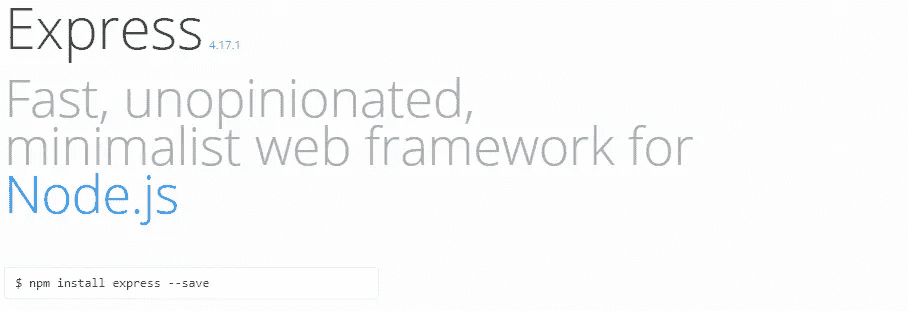
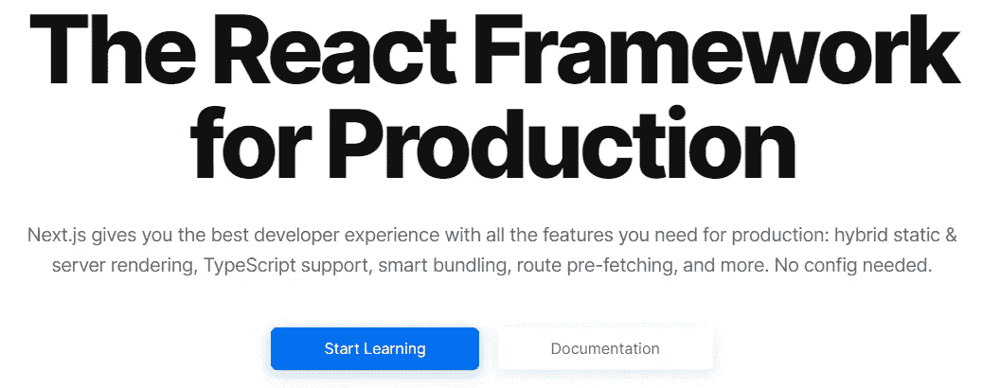
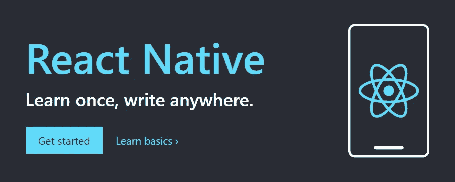
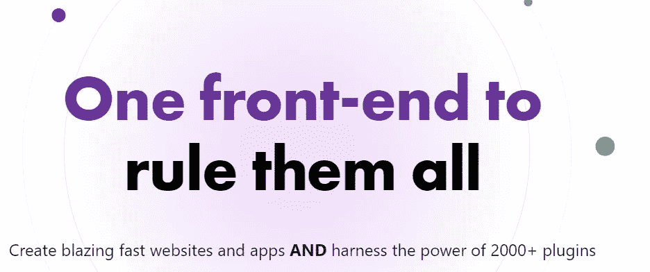

# 你应该学习的 JavaScript 框架

> 原文：<https://medium.com/codex/javascript-frameworks-to-use-in-2021-a0af83dbd0b7?source=collection_archive---------4----------------------->

## [法典](http://medium.com/codex)

## *为您的所有项目*

照片由 [XPS](https://unsplash.com/@xps?utm_source=unsplash&utm_medium=referral&utm_content=creditCopyText) 在 [Unsplash](https://unsplash.com/?utm_source=unsplash&utm_medium=referral&utm_content=creditCopyText) 上拍摄

# 介绍

如今，几乎每个项目都使用框架。它们可以帮助你完成简单的任务，也可以帮助你完成最复杂的任务。用例范围从移动应用到网络应用和渐进式网络应用，甚至桌面应用。

这些框架不是最新的，或者可能不会达到最大的速度或开发者体验，但社区是巨大的，并且有更大的公司支持，所以他们会坚持一段时间。

框架比一些库或包实现了更多的东西，然而，这些术语总是可以互换使用。他们的目标是更快地实现一个完整的应用程序，并为您设置路由等基本任务。

# ExpressJS

Express 是一个基于 NodeJS 的框架，用于创建网站和 API。它是一个最小的框架，为路由和中间件提供支持。因为极简主义的方法和巨大的社区，你可以为几乎所有的在线项目使用这个框架。用 GraphQL 从简单的网站到复杂的 API。

官方网站图片

# NextJS

下一个是一个基于 React 的框架，用于创建服务器渲染的 web 应用程序。它提供了一个很好的开发者体验和一个非常简单的开始。

官方网站图片

Next 使用 JAMstack 原则，是一个“无服务器”框架。它有许多用于构建复杂应用程序的特性，并有一个使用 Vercel 的优秀社区和部署平台。

# 反应自然

如果您想使用 JavaScript 创建移动应用程序，那么 [React Native](https://reactnative.dev/) 可能是您的最佳选择。它是一个使用 React 和 JavaScript 或 TypeScript 代码构建应用程序的框架。

官方网站图片

它有许多功能和组件，直接使用您正在开发的平台的原生元素。如果你使用 Expo，你可以非常快速地创建移动应用程序，如果你也使用外部包，你可以在很短的时间内创建复杂的和本地感觉的应用程序。

# 电子

多亏了[电子](https://www.electronjs.org/)团队，用 JavaScript 构建桌面应用也是可能的。你正在使用的许多应用程序都可以用这个框架来制作。比如 Twitch、Visual Studio Code、Slack 都是用电子制作的。

官方网站图片

它允许用户使用 HTML、CSS 和 JavaScript 创建应用程序，无需打开浏览器就可以在桌面上启动。它还提供了使用原生菜单和选项的解决方案，创建了感觉最好的应用程序。

# 盖茨比

Gatsby 是另一个基于 React 的框架，用于创建无服务器网页。它的优势是像营销网站和其他静态页面的静态网页。它提供了一种独特的使用 GraphQL 的开发者体验，并尽力提供最好的体验。

图片来自官方网站

Gatsby 团队提供了大量的官方插件，您可以使用它们来创建静态站点。他们甚至有一个他们推广的商店。

然而，目前，NextJS 正在成为焦点，因为自从他们最近的重大更新以来，它提供了静态页面服务。但是盖茨比提供的开发者体验是 Next 无法超越*的。*

# 结论

如今你可以用 JavaScript 创建几乎任何东西。有多少公司在从大到小的项目中使用这些框架，这是很疯狂的。

学习这些方面的基础知识肯定能帮助你的简历脱颖而出。甚至对于个人项目，这些框架的简单性使它们成为满足您任何需要的伟大工具。

感谢您的阅读，祝您愉快。