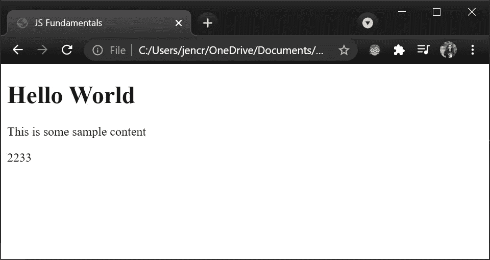
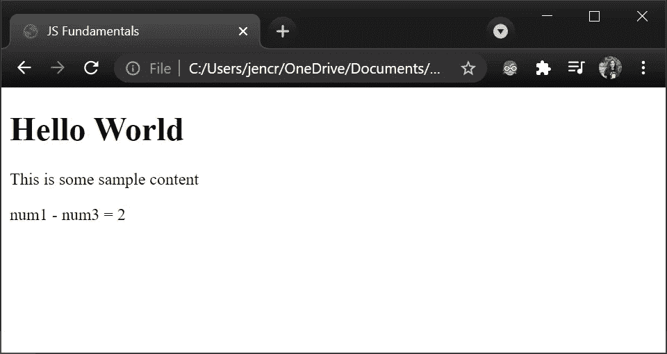
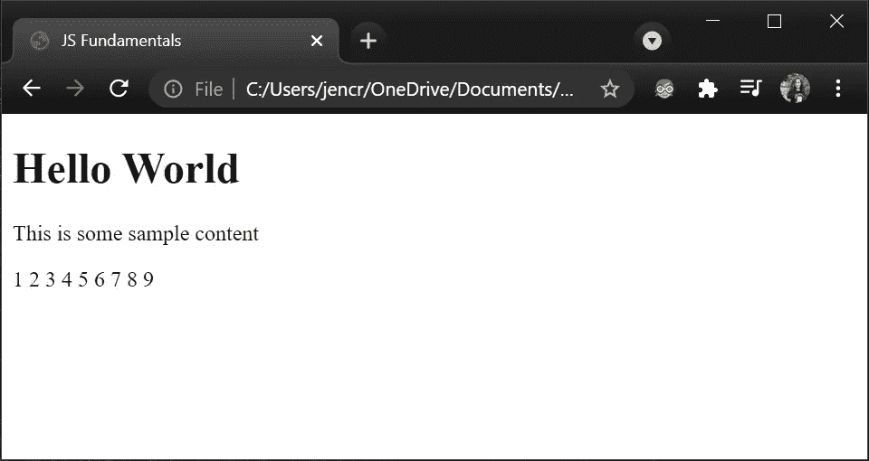

# JavaScript 基础知识

> 原文：<https://medium.com/codex/javascript-fundamentals-26121157fad2?source=collection_archive---------11----------------------->

## 快速、全面地介绍 JS 的基础知识。


克劳迪奥·施瓦兹在 [Unsplash](https://unsplash.com?utm_source=medium&utm_medium=referral) 上的照片

# **什么是 JavaScript (JS)？JS 是基于/类似于 Java 吗？**

这是一个常见的问题。答案是:不，JS 和 Java 有很大的不同。Java 是一种依赖于 IDE 的编程语言，需要编译器才能运行，通常用于软件开发。另一方面，JS 是一种简单、易学、轻量级、基于面向对象浏览器的编程语言，可以在任何最新的浏览器上运行。它不依赖于 IDE，可以使用任何基本的代码编辑器对其进行编码。当 JS 与 HTML 一起使用时，网站上的动态交互性被启用。

# JS 的应用:

移动和 web 应用、web 和开发、服务器应用、web 服务器、游戏等。

# 先决条件:

HTML 和 CSS

首先，让我们创建一个名为 index.html 的基本 HTML 页面。(在需要解释代码的地方添加了注释)

**index.html**

```
<!--The DOCTYPE tag isn't a part of the HTML tag. It simply provides the browser with information about the expected content-- ><!DOCTYPE html>
<html lang=”en”>
   <head> <!--The meta tag defines the information about the data (metadata) about an HTML file. charset as UTF-8 tells the browser to use the UTF-8 character encoding which is a method of converting your typed characters into machine-readable code-- > <meta charset="UTF-8"> 
      <title>JS Fundamentals</title>
   </head> <body>
      <h1>Hello World</h1>
      <p>This is some sample content</p>
   </body>
</html>
```


作者图片

为了将我们的 JS 添加到我们的文件中，我们使用 HTML 

# **JS 警告框:**

可以使用 alert()方法以及括号中的消息来创建警告框。

**index.html**

```
<!DOCTYPE html>
<html lang=”en”>
   <head>
      <meta charset="UTF-8"> 
      <title>JS Fundamentals</title>
   </head> <body>
      <h1>Hello World</h1>
      <p>This is some sample content</p>

      **<script>
         alert("This is an alert box");
      </script>**
   </body>
</html>
```


作者图片

**注意:** JS '行代码也可以放在< head >部分。然而，最佳实践是将 JS <脚本>标签放在<正文>的末尾，在<页脚>之后。在上面的图像中，当页面被加载时，警告框出现，body 标签中的内容也显示在它的后面。如果我们将脚本标签和 alert()方法一起放在<头>的末尾，我们将得到下面的输出。


作者图片

正如您所看到的，警告框是可见的，但内容是不可见的，因为浏览器逐行呈现我们的代码，它找到了一个 JS 标记，现在正在等待我们单击 ok 按钮，之后网站的内容将会出现。由于这个原因，脚本标记通常放在末尾，如前所示。

我们现在已经知道在哪里放置我们的脚本并创建一个警告框。最终，我们将有更多的函数和方法添加到脚本标签中。这可能会导致我们的 HTML 文件太大。为了避免这种情况，在 CSS 中我们创建了一个不同的样式表，并在其中添加了我们所有的样式，这种样式也可以被网站的不同组件重用。同样，我们可以创建一个包含主 JS 文件的 JS 文件夹。在这个文件中，我们可以添加我们的警告框方法和其他 JS 方法，函数。使用 HTML 文件中的一行代码，我们可以方便地访问和实现所有这些 JS 方法。

**index.html**

```
<script **src="./js/main.js"**></script>
```

**js/main.js**

```
alert("This is an alert box");
```


作者图片

如果你没有使用最新的 HTML 和 JS 版本，你可能需要提到脚本类型。

【index.html 

```
<script **type=”text/javascript”** src=”./js/main.js”></script>
```

# 使用 JS 和浏览器控制台

控制台日志是最好的开发工具之一，几乎存在于每个浏览器中。它们可以写成如下形式，

```
**console.log**('Hey! This is a JS Fundamentals tutorial');
```


作者图片

通过创建变量和执行计算，您也可以在浏览器控制台中工作。


作者图片

您也可以创建控制台警告和错误。


作者图片

要在控制台中写入多行，可以在写入每一行后按 Shift+Enter。


作者图片

控制台日志为开发人员提供了编写、管理和监控代码的能力。

# JS 中的变量:

变量保存可重用的数据。您可以创建变量来存储/管理 JS 中的数据。这些变量可以使用“var”来创建。例如，变量名称。

变量名可以由字母、数字、' _ '或' $ '组成，但不能以数字开头，字母之间也不能有空格。例如，如果您希望您的变量被称为周销售额，您可以将它写成“weekly_sales”或“weekly sales”

注意:您可以使用大写字母作为变量的第一个字母，但传统上大写字母用于初始化构造函数。

# 数组

数组是一种可以保存多个值的 JavaScript 变量。它们有一个基于 0 的索引，这意味着它从 0 开始其值的索引计数。例如，如果我们想打印一个给定数组的第一个值，我们可以这样做。

```
*var* **sampleArray** = [112,352,567,294,130];    // Initiating an array of numbersdocument.write(**sampleArray[0]**);     // Calling the first value in the array. The first value's index is 0
```


作者图片

## 数组方法

reverse()、join()、sort()是数组方法，基本上是 JS 数组的内置函数。

**1。reverse() :** 这个方法反转给定数组中值的位置。

```
*var* sampleArray = [112,352,567,294,130];
**sampleArray.reverse()**;
document.write("Reversed array is "+sampleArray);
```


作者图片

**2。join() :** Join 将数组从基于 0 的索引转换为字符串。为了演示这一点，我们将使用我们的控制台日志。

```
*var* sampleArray = [112,352,567,294,130];
console.log(sampleArray);
```


作者图片

正如我们在上面的输出中看到的，数组以索引的方式显示。但是在使用如下所示的 join 方法时，我们的数组显示为一个字符串。

```
*var* sampleArray = [112,352,567,294,130];
*var* newArray = **sampleArray.join()**;
console.log(newArray);
```


作者图片

**3。sort() :** 默认情况下，sort 方法以升序方式对数组中的值进行排序。要以降序方式对值进行排序，可以使用 sort 方法，然后使用 reverse 方法。

```
*var* sampleArray = [112,352,567,294,130];
document.write(**sampleArray.sort()**);
```


作者图片

你可以在这里阅读更多关于变量[的内容](https://developer.mozilla.org/en-US/docs/Web/JavaScript)。

# JavaScript 数据类型

## 数字

在 python 等其他编程语言中，有不同类型的数字，如浮点型、双精度型、长整型等。然而，在 JS 中，数字数据类型包括所有类型的数字。数字数据类型的变量初始化如下:

```
*var* n1 = 22;
```

如果我们将一个数字初始化为字符串

```
*var n2 = "33";*
```

并执行以下操作

```
n3 = n1 + n2;
document.write(n3);
```

数据类型为数字的变量值将与数据类型为字符串的变量值连接在一起。



作者图片

然而，如果我们要执行任何其他操作，如乘法或除法，我们将得到 NaN(不是一个数字)作为输出。要将数字从字符串数据类型转换为数字数据类型，我们可以编写以下代码行。

```
*var n2 = "33";
var* n4 = *Number*(n2);
```

在处理 JS 数字时，我们可以选择使用数学对象，如 round、max、min、PI、random、sqrt、log 等。

```
*var* n1 = 22, n2 = 33, n3 = 11, n4 = 55.09;
document.write(“Round of “+n4+” is “**+Math.round(n4)**);
document.write(“Min of “+n1+”, “+n2+”, “+n3+”, “+n4+” is “**+Math.min(n1, n2, n3, n4)**);
document.write(“Max of “+n1+”, “+n2+”, “+n3+”, “+n4+” is “**+Math.max(n1, n2, n3, n4)**);
document.write(“PI is “**+Math.PI**);
document.write(“JS displayed “**+Math.random()**+” as a random number”);
document.write(“Square root of 91 is “**+Math.sqrt(91)**);
document.write(“Log of 12 is “**+Math.log(12)**);
```


作者图片

## 用线串

在 JS 中，你可以用双引号或单引号来存储字符串。如果您的字符串本身包含双引号或单引号，您可能会遇到错误。为了避免这种情况，在你的引语前加一个反斜杠。

```
*var* sampleString = “He said \”Hello World\” when he woke up”;
document.write(sampleString);
```


作者图片

就像数组和数字一样，字符串也有自己的属性和方法，比如 length、toUpperCase、toLowerCase、split 等。

```
*var* sampleString = “He said \”Hello World\” when he woke up”;
document.write(sampleString);
document.write(“Length of the given string is “+sampleString**.length**);
document.write(“The given string in uppercase is: “+sampleString**.toUpperCase()**);
document.write(“The given string in lowercase is: “+sampleString.**toLowerCase()**);
document.write(“Split string: “+sampleString.**split(“ “)**);
```


作者图片

字符串也有索引。例如，如果你想在一个字符串中找到一个特定的单词，你可以使用 indexOf 方法找到它的位置(索引)。该方法区分大小写，将返回给定单词第一次出现的位置。

```
*var* sampleString = "He said \"Hello World\" when he woke up";
document.write(sampleString);
document.write("<br>");
document.write("Index of world: "+sampleString.**indexOf("World")**);
```


作者图片

我们还可以使用 slice 方法对字符串进行切片，以获得一个子串。在这个方法的括号中，我们需要提到两个值。第一，我们将要切割字符串的位置，第二，我们需要切割字符串的字符的位置。

```
document.write(“Sliced string is: “**+sampleString.slice(3,8)**); // Here we’re only slicing out the word “said”
```


作者图片

## 日期

当您使用 JS 时，您可能最终需要使用日期。创建一个包含日期、时间和年份的庞大数组列表是极其困难的。这就是 JS 日期发挥作用的地方。它们是最容易操作的对象。要打印当前日期和时间，我们可以执行以下操作

```
*var* currentDT = **new *Date*()**;
document.write(“The current date and time is: “+currentDT);
```


作者图片

为了得到一个精确的日期，我们可以在 date 方法中指定年、月和日。

```
*var* anotherDate = **new *Date*(2020, 02, 16)**;
document.write(anotherDate);
```


作者图片

您还可以指定指定日期的某个时间。

```
*var* anotherDate = **new *Date*(2020, 02, 16, 13, 04, 26)**;
document.write(anotherDate);
```


作者图片

与字符串和数组一样，我们也有日期对象的方法:

*   getMonth()；—显示当前月数
*   get full year()；—显示全年
*   getYear()；—显示年份(不推荐使用的方法)
*   getDate()；—显示给定的日期
*   get hours()；—显示给定的小时
*   getTime()；—显示给定的小时

下面举例说明了如何实现这些方法。

```
document.write(“The given date is : “**+anotherDate**);
document.write(“The month is : “**+anotherDate.getMonth()**);
```


作者图片

# JavaScript 中的对象:

我们学会了使用预定义的 JavaScript 对象，比如数组和日期。现在我们将继续创建我们自己的自定义对象。例如，我们不是为学生属性创建几个变量，而是创建一个对象，如下所示

```
*var* student1 = **{
   name: "Kyle",
   class: "A",
   roll_no: 22
};***document.write("Name: "+student1.name);
document.write("Class: "+student1.class);
document.write("Roll No: "+student1.roll_no);*
```


作者图片

# 用 JavaScript 进行面向对象编程

我们可以在函数中使用一行代码显示学生对象的所有上述细节。因此不需要调用 student 对象的每个属性。

```
*var* student1 = {
   name: “Kyle”,
   class: “A”,
   roll_no: 22
};*var* student2 = {
   name: “Eric”,
   class: “B”,
   roll_no: 45
};*function* studentDetails()
{
   // Displays all the attributes of every object created.
   document.write(“<br>Student Name: “+this.name+”, <br>Class: “+this.class+”, <br>Roll No:”+this.roll_no) ;
}// We create a logDetails method inside the object and assign it to the studentDetails function
student1.logDetails = studentDetails;
student2.logDetails = studentDetails;// To display every detail of the student, call the logDetails method as shown below
student1.logDetails();
student2.logDetails();
```


作者图片

# JS 条件:

JS 条件很容易理解。如果括号中提到的条件为真，将执行括号中的任务。如果提到的条件不成立，它将继续查找下一个括号中提到的条件，并检查这是否成立。如果为真，将执行下面大括号中的任务。如果不是，它将继续检查下一个条件的有效性，依此类推。

```
if (condition)
{
   //code
}
else if (condition)
{
   //code
}
else
{
   //code
}
```

您也可以在这些条件中创建这些 if else 条件。这样的条件被称为嵌套条件，它们以下面的格式编写。

```
if (condition)
{
   if (condition)
   {
      //code
   }
   else if (condition)
   {
      //code
   }
   else
   {
      //code
   }
}
else if (condition)
{
   if (condition)
   {
      //code
   }
   else
   {
      //code
   }
}
else
{
   //code
}
```

# JS 中的运算符:

## 算术运算符

*   **加法(+)**

```
*var* num1 = 4;
*var* num2 = 3;
*var* num3 = 2;// Addition
*var* res1 = num2 **+** num3;
*var* res1_message = “num2 + num3 = “
document.write(res1_message);
document.write(res1);
```


作者图片

*   **减法(-)**

```
// Subtraction
*var* res2 = num1 **—** num3;
*var* res2_message = “num1 — num3 = “
document.write(res2_message);
document.write(res2);
```



作者图片

*   **乘法(*)**

```
// Multiplication
*var* res3 = num1 ***** num2;
*var* res3_message = “num1 * num2 = “
document.write(res3_message);
document.write(res3);
```


作者图片

*   **除法(/)**

```
// Division
*var* res4 = num1 **/** num3;
*var* res4_message = “num1 / num3 = “
document.write(res4_message);
document.write(res4);
```


作者图片

*   **模数(%)**

```
// Modulus
*var* res5 = num1 **%** num2;
*var* res5_message = “num1 % num2 = “
document.write(res5_message);
document.write(res5);
```


作者图片

## **赋值运算符(=，+=，-=，*=，/=)**

在上面的例子中，' = '符号是一个赋值操作符。其他一些赋值运算符有

```
//Addition and other arithmetic operations can also be done as follows
*var* num4 = 5;
num4 **+=** 1;
document.write(num4);
```


作者图片

```
num4 **-=** num3;
document.write(num4);
```


作者图片

```
num4 ***=** num1;
document.write(num4);
```


作者图片

```
num4 **/=** num3;
document.write(num4);
```


作者图片

## 比较运算符(==，！=, ===, !==，>， =，<=)

```
// num1 = 4; num3 = 2
if (num1 **==** num3)
{
   *var* message1 = “num1 and num3 have the same values”;
   document.write(message1);
}
else
{
   *var* message2 = “num1 and num3 have different values”;
   document.write(message2);
}
```


Image by author

```
// num1 = 4; num3 = 2
if (num1 **!=** num3)
{
   *var* message1 = "Different values";
   document.write(message1);
}
else
{
   *var* message2 = "Same values";
   document.write(message2);
}
```


Image by author

```
// num4 = 8; num1 = 4
if ((num4/2) **===** num1) // Here ‘===’ checks for equal value and equal type
{
   *var* message1 = “Same values”;
   document.write(message1);
}
else
{
   *var* message2 = “Different values”;
   document.write(message2);
}
```


Image by author

```
// num4 = 8; num1 = 4
if ((num4/2) **!==** num1)
{
   *var* message1 = "num4/2 and num1 have different values";
   document.write(message1);
}
else
{
   *var* message2 = "num4/2 and num1 have the same values";
   document.write(message2);
}
```


Image by author

```
// num4 = 8; num1 = 4
if (num4 **>** num1)
{
   *var* message1 = "num4 is greater than num1";
   document.write(message1);
}
else
{
   *var* message2 = "num1 is greater than num4";
   document.write(message2);
}
```


Image by author

```
// num4 = 8; num1 = 4
if (num4 **<** num1)
{
   *var* message1 = "num1 > num4";
   document.write(message1);
}
else
{
   *var* message2 = "num4 > num1";
   document.write(message2);
}
```


Image by author

```
// num4 = 8; num1 = 4
if (num4 **>=** num1)
{
   *var* message1 = "num4 >= num1";
   document.write(message1);
}
else
{
   *var* message2 = "num1 >= num4";
   document.write(message2);
}
```


Image by author

```
// num4 = 8; num1 = 4
if (num4 **<=** num1)
{
   *var* message1 = "num4 <= num1";
   document.write(message1);
}
else
{
   *var* message2 = "num1 <= num4";
   document.write(message2);
}
```


Image by author

## Logical Operators

These can be used to combine multiple conditions.

**和:& &**

**或者:||**

```
// num1 = 4; num2 = 3; num3 =2;num4 = 8
if ((num4/num3) == num1 **&&** (num2*2)/num2 == num3)
{
   document.write(“true”);
}
else
{
   document.write(“false”);
}
```


作者图片

同样，您也可以实现逻辑 OR。

## 递增和递减运算符(++，—)

这些运算符提供了一种简单的递增和递减值的方法，通常用于计数。“++”运算符增加给定值，而“—”运算符减少给定值。这些操作符(前缀或后缀)放在哪里很重要。查看下面的代码和输出，以便更好地理解。

```
*var* num5 = 5;
document.write("num5 ="+num5+";\n");res5 = **++num5**;
document.write(" res5 ="+res5);
```


作者图片

```
*var* num5 = 5;
document.write("num5 ="+num5+";\n");res5 = **num5++**;
document.write(" res5 ="+res5);
```


作者图片

## 三元运算符

三元运算符可以基于条件具有两个值中的一个，并且是唯一接受三个操作数的 js 运算符。

```
// num1 = 4; num2 = 3; num3 = 2;
*let* res6 = ((num1/num3) > num2) **?** ‘greater’ **:** ‘not greater’
document.write(res6);
```


作者图片

您可以通过参考 JS 操作符的[文档](https://developer.mozilla.org/en-US/docs/Web/JavaScript/Guide/Expressions_and_Operators#conditional_ternary_operator)来更深入地研究它们。

# JS 循环

在 JS 中，我们经常会发现需要重复使用某些代码行。这种代码的重复称为循环。JS 中有许多类型的循环，下面只列出其中的几个。

*   **while 循环:**在 While 循环中，只要满足 While 循环中的条件，就会执行大括号中写的任务。

```
*var* num6 = 1;
**while**(num6 < 6)
{
   document.write(num6+”\n”);
   num6++;
}
```


作者图片

*   **Do while 循环:**在 Do while 循环中，当条件满足时，JS 将执行括号中给出的某个任务。while 和 do while 循环的主要区别在于，while 循环在执行大括号中的任务之前测试条件，而 do-while 循环在大括号中的任务完成之后检查条件。

```
*var* num6 = 1;
**do**{
   document.write(num6+”\n”);
   num6++;
}**while**(num6<7);
```


作者图片

*   **For 循环:**在 For 循环中，只要满足上述条件，就会执行括号中的任务。

```
**for** (i=1; i<=10; i++)
{
   document.write(i+”\n”);
}
```



作者图片

要跳出循环，可以使用 break 语句；要跳过循环中的迭代，可以使用 continue 语句。

```
for (i=1; i<=10; i++)
{
   if( i == 5 )
   {
      **continue;** //when i reaches 5, it will jump over it and not print it
   }
   else if ( i == 8 )
   {
      **break;** //when i encounters the value 8, it will jump out of the loop and stop printing values
   }
   else
   {
      document.write(i+”\n”);
   }
}
```


# JS 函数

假设我们有几个任务要执行，比如计算圆的面积、分数百分比、获取窗口高度或宽度，或者简单地计算一个新值。我们可以把所有这些计算组合在一起或者分开，这些组合就叫做函数。关于函数的一个常见问题是它们必须在哪里声明？在调用函数之前，必须先定义它们。函数名以“function”关键字开头，括号中包含必需的变量。调用函数时，括号中提供的值将分别赋给这些变量，后面括号中的任务将相应地继续执行

```
***function*** sum(*a*, *b*)
{
   res = *a* + *b*;
   document.write(“Sum of “+*a*+” and “+*b*+” is “+res); //This will print the sum
}sum(9, 12) // Here we call our function that we defined earlier and mention the values for a and b in the parenthesis
```


作者图片

# 变量作用域

## **全局**

如果一个变量是在函数之外定义的，它被称为全局变量。这意味着程序中的任何函数或代码行都可以访问变量及其值。

```
*function* sum(*a*, *b*)
{
   res = *a* + *b*;
   document.write("Sum of "+*a*+" & "+*b*+" is "+res);
}// Global variables ***var* a = 7;
*var* b = 46;**sum(a, b);
```


作者图片

## **本地**

如果变量是在函数内部定义的，其他函数或代码行就不能访问该变量。这样的变量称为局部变量。

```
*function* sum(*a*)
{
   // 'b' is a local variable as it's confined to the function and it's value is inaccessible outside this function
   ***var* b = 4;
   res = *a* + b;**
   document.write("Sum of "+*a*+" & "+b+" is "+res);
}// 'a' is a global variable
*var* a = 7;sum(a);
```


作者图片

**如果在调用函数的时候增加或减少变量会怎么样？**

如果在调用函数时添加的值多于需要的值，这些值会被忽略。在下面的例子中，没有变量赋值 11。因此，它被忽略，并相应地显示输出。

```
*function* sum(*a*, *b*)
{
   res = *a* + *b*;
   document.write(“Sum of “+*a*+” & “+*b*+” is “+res);
}sum(10, 34, **11**);
```


作者图片

如果所需的值尚未定义，输出将声明这些值未定义，如下所示。

```
*function* sum(*a*, *b*, ***c***)
{
   res = *a* + *b* + *c*;
   document.write(“Sum of “+*a*+”, “+*b*+”, and “+*c*+” is “+res);
}sum(10, 34);
```


作者图片

让我们结合到目前为止所学的知识，用函数创建循环。在下面的代码中，我们打印两个给定值之间的数字。

```
*function* numbers(*a*, *b*)
{
   for( i = *a*; i <= *b*; i++) //This loops initiates the count from 99 i.e. i = 99, increments i, prints the numbers till i reaches 106
   {
      document.write(i+” \n “);
   }
}numbers(99, 106); //We call our numbers function to print the numbers from 99 to 106
```


作者图片

这总结了 JavaScript 的基础。

我希望这篇文章是有帮助的。谢谢你阅读它！

> *你可以在这里联系我**。*