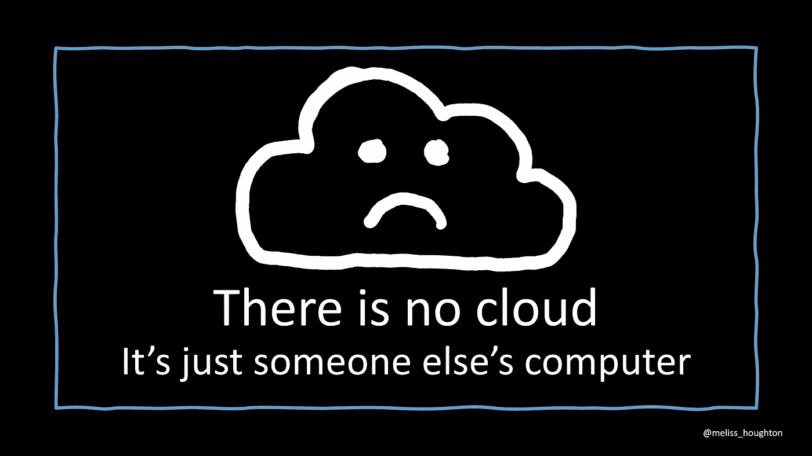
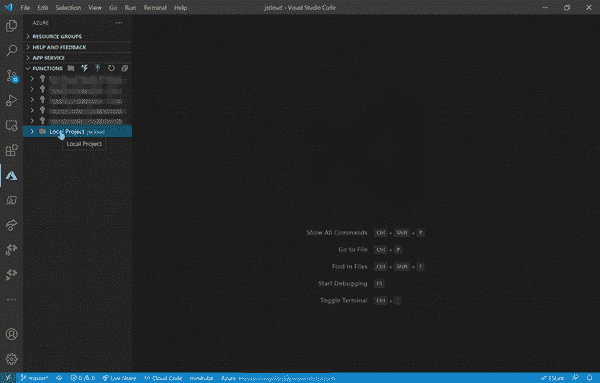

# 云中的 JavaScript

> 原文：<https://medium.com/codex/javascript-in-the-cloud-557917019455?source=collection_archive---------12----------------------->

## *看看 JavaScript 的历史和你可以用****JavaScript****在* ***云中做的有趣的事情！***

# 介绍

传统上， [JavaScript](https://developer.mozilla.org/en-US/docs/Web/JavaScript) 是网络语言，现在依然如此。但是今天，它是如此的多。随着服务器端 JavaScript 的出现和各大云平台对 JavaScript 的支持，JavaScript 的威力大幅提升。在云中使用 JavaScript 可以构建、维护、优化和部署端到端的 JavaScript 应用程序。

云平台为我们提供了工具、弹性和可扩展性来创建高性能应用，而无需管理物理基础架构。您可以在使用您已经知道的语言时利用云: **JavaScript！**

# 什么是云？

[云](https://azure.microsoft.com/en-au/overview/what-is-the-cloud/)指的是在互联网上运行的软件和服务，而不是在你的本地电脑上。云是其他地方的服务器，通常在大型数据中心。诸如 Azure、AWS、T21、谷歌云等云提供商允许你在服务器上租用空间，并为你的使用付费。它们让您能够随着业务需求的变化而扩展，同时为您管理物理基础架构。你可以把它想象成租房子或租一块地，根据你使用的云计算的类型，提供不同的管理财产的控制级别。

所以真的，没有云。只是别人的电脑。

# JavaScript 是什么？

JavaScript 是一种允许你在网页上实现复杂功能的语言。

它是在 1995 年由供职于网景公司的布伦丹·艾希在 10 天内创建的。他创建了 JavaScript 作为脚本工具，在 Netscape Navigator 浏览器中操作网页。

JavaScript 开始成为最流行的客户端编程语言。今天，97%的网络使用 JavaScript。

然而，JavaScript 不仅仅是一种客户端编程语言。微软的合作伙伴项目经理 Scott Hanselman 甚至说他提议 [JavaScript 是一个操作系统](https://youtu.be/msPocYnU0N4?t=2532)。他将这种比较建立在 JavaScript 与操作系统具有相同特征的基础上。

JavaScript 是一种灵活且健壮的语言。因此，我们在云中使用 JavaScript 是有意义的。

# 云中的 JavaScript

最初，Eich 编写的 JavaScript 既是客户端语言，也是服务器端语言。然而，直到 2009 年 T4 创造了 Node.js，它才作为服务器端语言流行起来。

[Node.js](https://nodejs.dev/) 是一个开源的、跨平台的后端 JavaScript 运行时环境，运行在 V8 引擎上，在 web 浏览器之外执行 JavaScript 代码。随着 Node.js 作为服务器端 JavaScript 编程语言的出现，它开放了在云中使用 JavaScript 的能力。

今天，所有主要的云提供商都支持云中的 JavaScript。

用斯科特·汉瑟曼的话说:

> *云不关心语言选择。*

# 云中的 JavaScript 工具

如果你想在云端开发 JavaScript，有一些优秀的工具和指南可以帮助你。像 [Visual Studio Code](https://code.visualstudio.com/) 和 [WebStorm](https://www.jetbrains.com/webstorm/) 这样的 JavaScript IDEs 拥有扩展，可以让你与你喜欢的云提供商集成，访问快速启动模板，编写、调试和部署你的云应用。

所有主要的提供商都有一套 JavaScript 的 SDK 和客户端库，可以从您的 JavaScript 应用程序中集成他们的服务。这些库允许您:

还有更多！

# JavaScript 的力量

JavaScript 是一种强大的语言。我们可以将 JavaScript 用于网络、移动、游戏、人工智能等等。

观看 Scott Hanselman 的演讲 [JavaScript、云以及新虚拟机的兴起](https://youtu.be/msPocYnU0N4)，观看用 JavaScript 实现的 Linux 和奔腾处理器的完整实现的演示，以及用 JavaScript 可以做的其他一些疯狂的事情。

网络的创造者 T2·蒂姆·伯纳斯·李·T3 提出了一个概念，叫做最小能量法则。该规则建议选择最不强大的语言来满足给定的目的。

作为这个规则的[推论](https://www.merriam-webster.com/dictionary/corollary)，我们得到[阿特伍德定律](https://blog.codinghorror.com/the-principle-of-least-power/)。

> *任何*可以*用 JavaScript 编写的应用，*最终都会*用 JavaScript 编写。*

# 摘要

总之，如果你还没有使用 JavaScript，我希望你今天就开始学习。如果你已经在使用 JavaScript，我希望你开始探索你能用它做什么。

因为使用 JavaScript 的机会是无限的，尤其是在与云的力量相结合的时候。

*最初发布于*[*https://melissahoughton . dev*](https://melissahoughton.dev/2021/03/22/js-cloud.html)*。*