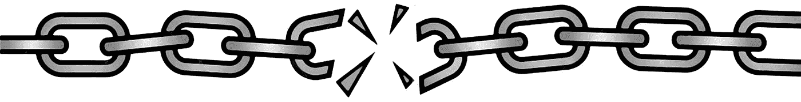

# JavaScript 方法链接…这一切都太愚蠢了！

> 原文：<https://medium.com/codex/javascript-method-chaining-its-all-so-stupid-4236e5c64370?source=collection_archive---------1----------------------->

一段时间以来，我们看到了将方法和响应链接在一起的趋势。jQuery 开创了这一趋势，现在随着诸如承诺之类的东西的出现，它的受欢迎程度上升到了新的高度……但是坦率地说，这都是些令人麻木的过于复杂的废话！

垃圾只会进一步损害代码的清晰性和增加开销，这是因为它让所有东西都该死…