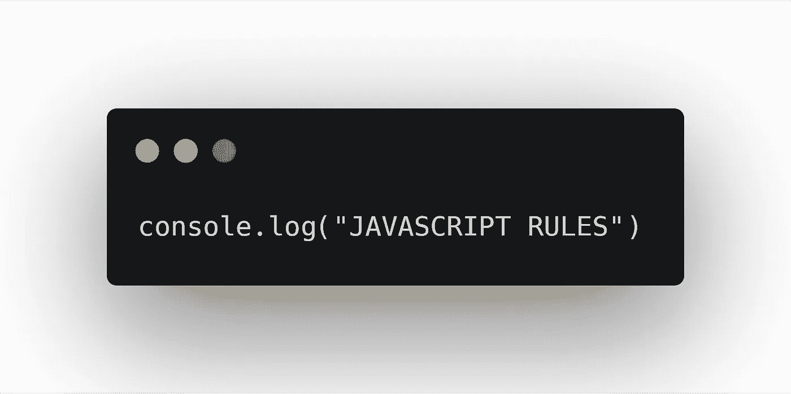

# 面向傻瓜的 JavaScript 承诺

> 原文：<https://medium.com/codex/javascript-promise-for-dummies-f3e763c2ec26?source=collection_archive---------4----------------------->

## 我保证这很容易。



由作者通过[碳](https://carbon.now.sh/zjVsEKXaL4qCQx6FXCnl)创造

如果你在 javascript 中不使用承诺，你就错过了。JavaScript 异步工作**。这是一个方便的工具，让你的代码同步工作**。****

# ****为什么要答应？****

****有时候你需要等待 Axios(一个流行的 HTTP 请求库)返回值，然后再继续。一个承诺可以让你做到这一点。****

****它允许您编写异步执行但可预测的代码。****

## ****如果它是纯同步的****

****您将无法运行并行 HTTP 请求。****

****您可能需要发送多个 HTTP 请求来从多个 API 点获取数据。****

****异步执行允许您一次运行多个 HTTP 请求。Javascript 本质上是异步的，所以我们很好。****

## ****如果它是完全异步的****

****您将无法暂停代码执行。****

****发送 HTTP 请求后，您将得到响应。这些响应很重要，可能会被后面的另一段代码所需要。****

****如果我们不使用 Promise，下一行代码(可能需要响应)将在不等待响应的情况下运行。因此，由于未定义的响应，运行将是错误的。****

# ****创造承诺****

****让我们看一个基本的承诺。****

```
**new Promise ((resolve, reject) => {
  let success = true;
  // Code
  if (success) resolve()
  else reject()
})**
```

****其思想是，如果一切顺利，承诺将得到解决，如果一切不顺利，承诺将被拒绝。一个函数通常包装承诺。****

```
**function sleep (t) {
  return new Promise((resolve, reject) => {
    setTimeout(() => {
      resolve()
    }, t)
  })
}**
```

# ****处理承诺****

****有两种方法处理承诺(由函数返回):****

## ****然后接住****

****我用一个代码来解释。让我们使用我们的睡眠功能。****

```
**sleep(5000)
  .then(() => {
    console.log("done sleeping!")
  })
  .catch(() => {
    console.log("error while sleeping!")  
  })**
```

****调用睡眠函数后，我们可以使用 then 和 catch 处理返回的承诺。****

> ****。然后()处理 resolve()****
> 
> ****。catch()处理 reject()****

****你现在应该明白了。如果一个承诺解决了，那么我们可以继续。****

****如果一个承诺被拒绝，那么我们捕获抛出的错误。****

****您还可以通过 resolve 和 reject 传递值，这样一旦承诺完成，then 和 catch 就会接收值。****

```
**function sleep (t) {
  return new Promise((resolve, reject) => {
    setTimeout(() => {
      let random = Math.random()
      if (random > 0.5) resolve("I can sleep!")
      else reject("I cannot sleep!")
    }, t)
  })
}sleep(1000)
  .then((res) => console.log(res))
  .catch((err) => console.log(err))// if random > 0.5
> I can sleep! // else
> I cannot sleep!**
```

## ****异步等待****

****然后抓住方法是伟大的，但当我们需要一个接一个的多个承诺时，它会变得混乱。它看起来会像这样。****

```
**sleep(1000)
  .then((res) => {
    // sleep again
    sleep(1000)
      .then((res) => {    
        // sleep again
        sleep(1000)
          .then((res) => console.log("I sleep 3 times!"))
          .catch((err) => console.log(err))})
      .catch((err) => console.log(err)) 
  })
  .catch((err) => console.log(err))**
```

****对我来说像是承诺地狱。当然，代码是无用的，但你得到的想法。****

****Async-await 解决了这个问题。****

```
**async function main() {
  try { 
    await sleep(1000)
    await sleep(1000)
    await sleep(1000)
  } catch (e) {
    // handle error
  }
}main()**
```

****看起来是不是很棒？代码更加容易理解和简洁。****

> ****等待承诺的解决。它取代了。然后()。****
> 
> ****try and catch 块处理错误。它取代了。catch()。****

****如果您想从承诺接收响应，您可以将它赋给一个变量。****

```
**let res = await sleep(1000)**
```

****注意，您需要用一个异步函数来包装它(注意，异步是函数定义的开始)。****

# ******使用并行工程的承诺******

****假设您需要来自多个 API 点的数据才能继续。JavaScript 本质上是并行执行代码的。然而，如何等待所有的人呢？****

****Async-await 和 then-catch 通过等待一个承诺完成来执行下一行。****

## ****为 Promise.all 鼓掌()****

****Promise.all()解决了这个问题。该函数将等待**承诺数组**完成。****

****我通过代码来解释。****

****我们有一个向 URL 发送 HTTP 请求的函数。****

```
**function sendRequest (url) {
  return new Promise ((resolve, reject) => {
    // do something fun here
  })
}**
```

****我们有多个网址。****

```
**let urls = [url1, url2, url3, url4]**
```

****我们可以同时发送多个请求并将承诺添加到一个数组中。****

```
**let promises = []
urls.map(url => {
  promises.push(sendRequest(url))
})
[
  Promise { <pending> },
  Promise { <pending> },
  Promise { <pending> },
  Promise { <pending> }
]**
```

****承诺变量将如下所示:****

```
**console.log(promises)
[
  Promise { <pending> },
  Promise { <pending> },
  Promise { <pending> },
  Promise { <pending> }
]**
```

****然后我们用 Promise.all()****

```
**Promise.all(promises)
  .then(responses => console.log(responses))
  .catch(err => console.log(err))**
```

****响应将是来自每个请求的顺序响应数组。****

```
**console.log(responses)
> ['from url1','from url2','from url3','from url4']**
```

# ****外卖食品****

****JavaScript Promise 太棒了。它被 NPM 的图书馆广泛使用。即使您不使用库，当您想要改变 JavaScript 的异步特性时，它也会派上用场。****

****比起使用 while 循环来暂停，promise 是一种更优雅的方式。****