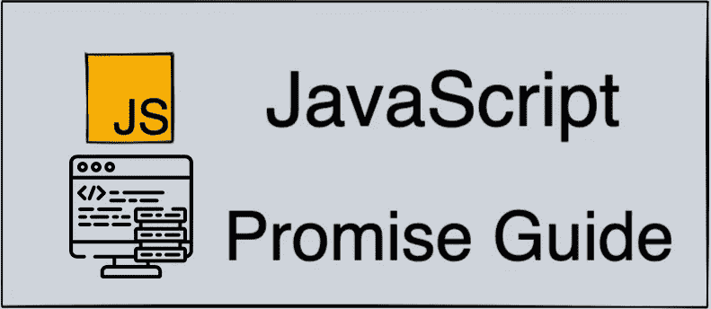
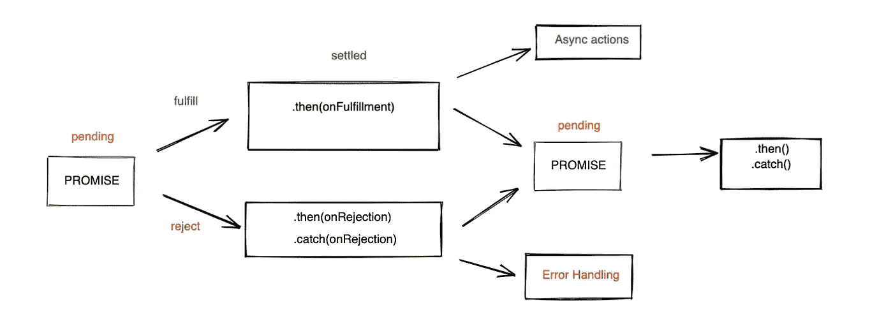

# 一个新兵训练营的毕业生解释的 JavaScript 承诺。

> 原文：<https://medium.com/codex/javascript-promises-explained-from-a-bootcamp-grad-c4acec9700a8?source=collection_archive---------7----------------------->



# **简介**

你好世界！我叫吴兴华，是熨斗学院软件工程项目的应届毕业生。在我上学的时候，我不得不依赖谷歌，但是很多时候这些文档非常长，难以阅读，所以我打算写一系列简单易读的编码概念指南，以回馈社区。

# **什么是承诺？**

JS 中的承诺就像现实生活中的承诺一样。让我们用这个例子，我答应你今天下午 3 点在公园见面，如果我出现了，那么我已经“履行”了我的承诺，或者如果我没有出现，那么我已经“拒绝”了我们的承诺。

# **承诺是如何实现的**

承诺是一个对象，它表示异步操作的最终完成或失败，并相应地返回值。

承诺有三个阶段:

*   待定:初始状态，检查参数，看是*满足*还是*拒绝*
*   满足:表示参数满足，操作成功
*   拒绝:表示参数不正确，操作将失败



上图显示了承诺是如何运作的。基本上，如果参数满足，*然后 onFulfillment* 将执行一些*异步动作*，或者如果参数失败，*然后 onRejection* 将执行一些*错误处理。*

```
//CODE SNIPPET #1let meetup = true || falselet metWithSteven = new Promise((onFulfillment, onRejection) => { if( meetup == true ){ onFulfillment("Met up with Steven today!") } else { onRejection("Steven was a no show today, hope he's okay") }})metWithSteven.then((result) => {
  console.log(result)
}).catch((error) => {
  console.log(error)
})
```

所以如果你看我上面的例子，你可以看到 metWithSteven 承诺依赖于 meetup 是真还是假，并根据参数处理结果，所以如果 meetup 是真的，它将*。然后*返回 onFulfillment 值，它是字符串“今天与 Steven 会面！”或者如果 meetup 是假的或者其他什么地方出了问题，它就会*。捕捉*错误*和*返回 OnRejection 值。

# **链接**

很多时候，您需要连续执行多个异步操作，这被称为链接。在这个演示中，我将继续使用我最初的例子，所以如果我们确实见面了，我们是在下午 3 点见面的吗？我们在公园见过吗？

```
//CODE SNIPPET #2let meetUpLocation = "park"
let meetUpTime = "4PM"metWithSteven.then(results => {
  if( meetUpLocation == "park" ) {
    return results + " We met up at the park."
  }
})
.then(results => {
  if( meetUpTime == "3PM" ) {
    return results + " At 3PM."
  }
})
.then(console.log)
.catch(error)
```

因此，如果我们查看代码片段 1 和 2，我们知道会面是*真的*，会面地点确实是在*公园*，但是会面时间是在*下午 4 点*。

因此，代码将运行它的第一个承诺检查，这是真的，所以结果将是"*今天遇到了 Steven！*”然后它将检查第二个承诺逻辑，即 park 和新的*结果*将是“今天与 Steven 见面了！我们在公园相遇。”这将是最终的结果，因为我们没有在下午 3 点见面。

这只是 JavaScript 中承诺有多有用的一个小例子，我希望这本初学者指南对目前正在学习 JS 的人有所帮助。随着时间的推移，我会写更多关于 JavaScript 的博客，如果你有任何要求，请留下评论或联系我的 LinkedIn。