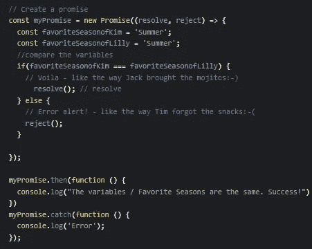
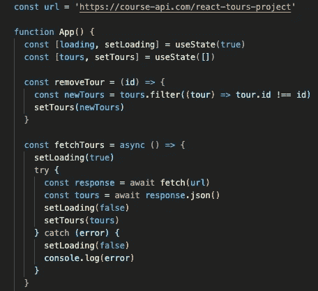
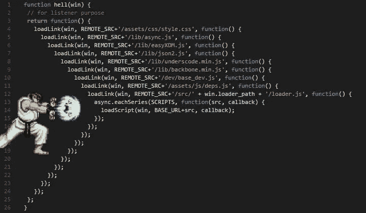

# 异步&等待/承诺的演练

> 原文：<https://medium.com/codex/javascript-react-callback-hell-promises-async-await-1a1bfdc8a10c?source=collection_archive---------12----------------------->

还记得那句老话吗，“一诺千金”？在现实世界中，当你承诺做某事时，无论你在哪里，你都应该信守承诺。嗯，即使是臭名昭著的角色，所有时代的恶魔罪犯，“小丑”似乎也非常认真地对待他的承诺:-)编程世界也不例外。

引用插图

玩笑归玩笑，承诺也是 JavaScript 领域的基石。我将用一个基本的比喻来告诉你这个概念的要点。想象一下，你要举办一场非凡的夏季派对。

沉积照片插图

因为这是一个大事件，你需要一些额外的人手来确保事情从一开始就能顺利进行。因此，你好心地请你的朋友(姑且称他为“杰克”)提前买了莫吉托鸡尾酒。与此同时，你还需要处理一些重要的杂事，由于时间的限制，你不知何故被迫向另一个朋友(姑且称他为“蒂姆”)求助零食，尽管你知道他很健忘。聚会那天，所有的莫吉托都到了；但是，没有零食！很自然，你会生蒂姆的气，但是没用。该做的都做了，派对应该继续进行，不吃零食了。你真可耻，蒂姆！:-)

现在，让我们稍微剖析一下我们虚构的故事，并尝试在编程世界中与“承诺”建立一些联系。如果您仔细检查上面的代码片段，您会看到“承诺”是如何按照所需的公式工作的，以及我们如何在这里插入基于当事人的场景。

如果 Jack 和 Tim 都履行了责任，也就是说遵守了他们的承诺(就像上面代码片段中 Kim 和 Lilly 最喜欢的季节匹配的方式)，一切都会很棒/代码不会抛出任何错误。但是，当 Tim 忘记零食/请求被拒绝时，就该通过控制台检查错误的来源了。

在上面的例子中，没有[面向 API 的任务](https://www.mulesoft.com/resources/api/what-is-an-api)，但是程序员无时无刻不在与 API 打交道，并且承诺在这个过程中会非常有帮助。为了更好地理解这个概念，让我们通过包含一个 API 来重新塑造同一个场景。有一个新的承诺(例如，从外部 API 服务器获取数据= Jack 和 Tim 对您的承诺)采取“解决”(例如，成功检索 API 数据。杰克遵守了他的诺言。)和‘拒绝’(蒂姆无法信守承诺。=出现了一个错误。)参数。代码块‘then&catch’引导我们完成剩下的过程。

在技术世界里，改进从未停止，一些额外的功能/版本不断出现，这就是作为一名程序员的好处，因为你可以不断更新自己。 [**ES6**](https://www.geeksforgeeks.org/introduction-to-es6/) 提供的 **async** & **await** 关键词，让承诺的实现变得更加容易。在处理异步动作时，这两个确实很有帮助。

正如我在之前的文章中通过[与你分享的，React 在某种程度上是深受喜爱的 JavaScript 的一个孩子，所以我们从 promises / asynch + await 关键字中受益的方式非常相似。现在让我们分析一个基于 React 的例子。如果您没有使用 React 的经验，下面的内容对您来说可能有点复杂，但是我们如何实现异步& await 并没有太大的不同。你可以在这里](/codex/shall-we-create-a-basic-project-from-scratch-via-react-a49a65ac1767)看到一些基于 JavaScript 的例子[。](https://www.geeksforgeeks.org/async-await-function-in-javascript/)

在上面的 React 项目中，我们首先需要将 API 的 url 存储在一个变量中，以便能够从服务器获取数据。正如您在上面的代码块中看到的，从相关 API 中获取一些旅游的过程以 ***异步*** 开始，然后 ***等待*** 连续两次接管任务。为了能够以有组织的方式查看数据，我们将响应与 json 结合起来。Try & catch 块可以帮助我们瞬间发现错误。

长话短说，承诺帮助程序员编写[异步代码](https://eloquentjavascript.net/11_async.html)。使用承诺是摆脱[回调地狱](https://www.bmc.com/blogs/callback-hell/#:~:text=Callback%20Hell%2C%20also%20known%20as,a%20few%20callbacks%20seem%20harmless.)的可靠策略，基于 ES6 的异步& await 关键字使这个过程变得不那么复杂。

一个超级英雄(承诺)将程序员从回调地狱中拯救出来:-)

如果你很难记住这些公式/语法，实际上有两种有效的方法可以让你受益。第一个是使用[肌肉记忆](https://www.popsci.com/what-is-muscle-memory/)。多次键入代码块。越多越好…如果可能的话，不要借助类似 VS 代码的编辑器。你可以使用文字处理器。把它们写在一张纸上几次。当你意识到它们是如何不费吹灰之力就变得朗朗上口时，你会大吃一惊的。你越是使用相关的语法，它就会成为你的第二天性。更不用说对于[白板编码面试](https://www.codecademy.com/resources/blog/whiteboard-interview-tips/)来说，这实际上是一个很好的实践，这可能相当困难。

Freepik 的迷因

第二种方法与一种叫做“[记忆宫殿](https://fs.blog/the-memory-palace/#:~:text=The%20memory%20palace%20technique%20is,your%20memories%20to%20recall%20them.)”的技术有关。在写这些代码块的时候，试着把它们和一些荒谬/不真实的事情联系起来(就像上面奇怪的 json 提醒)。您甚至可以通过使用代码块中的片段来构思自己独特的故事。细节越古怪，在时间的流逝中就越容易记住。试一试吧。你不会后悔的。

学习一门新编程语言的唯一方法就是用它来写程序。——*丹尼斯·里奇*