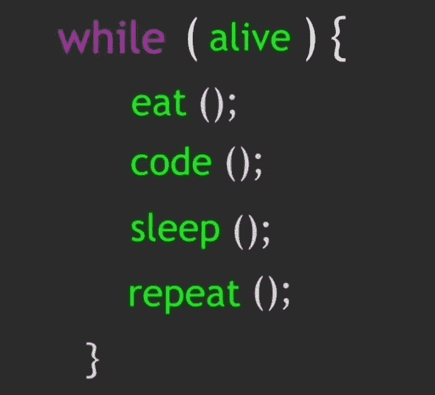

# “减少”方法的许多方面

> 原文：<https://medium.com/codex/javascript-react-diaries-many-faces-of-the-reduce-function-9999824b93da?source=collection_archive---------10----------------------->

你看过轰动一时的电影《天才雷普利先生》吗？在这部电影中，主角偷走了另一个人的生命。这个冒名顶替者实际上是故事中的反派，但随着故事的发展，尽管他不可否认地狡猾，但你还是忍不住钦佩那个怪异的人才。


imdb 拍摄的照片

好吧，JavaScript 中的' **reduce** '函数(自然也是它的后代，React)除了邪恶之外，在某种程度上像他。换句话说，这种超级酷(天才)的方法也可以采取各种形状，最终帮助你写出优质代码。

多亏了“reduce ”,在处理编码问题时，你甚至不需要看一看其他方法。我更愿意称之为‘万金油’；然而，你最好自己去看一下“reduce”函数是否真的名副其实。

首先，了解 reduce 函数可以接受的具体参数是很重要的。毕竟，如果我们打算做一些美味的东西，我们最好想出正确的食谱。

*   蓄电池
*   现值
*   当前索引
*   源阵列

不用说，没有必要使用所有这些参数。这真的取决于你正在解决的问题的类型。

在相关数组内的每次迭代之后，累加器都会被触发，并最终变成单个值。一些程序员把这种情况与滚雪球效应联系起来。


伊玛尼部落插图

不管选择多少丰富多彩的隐喻来定义这种方法的动态，我们都应该清楚，这种方法是如此无所不能，以至于它可以让您处理许多任务，如获得总和、平均值、最大值和最小值、排序、展平、反转数组等等。下面，你会看到在 JavaScript 和 React 的领域中，何时何地我们可能需要“reduce”方法。

**1-用“减少”计算总和**

如果你想得到这笔钱，“reduce”可以成为你忠实的仆人。上面提到的单词“accumulator”只是一个参数，在下面的例子中它被替换为单词“total ”,所以这个名字完全由你决定，就像其他占位符一样。重要的是它的功能，在这里，它平稳地计算总和。

```
let computerPrices = [2000, 2800, 1800, 1600, 3200];let sum = computerPrices.reduce((total, next) => {return total + next});console.log(`The sum is: ${sum}`); ***The sum is: $11400.
```

**2-使用“减少”进行过滤**

如果你的目的是利用 reduce 函数进行过滤，只需注意它会生成一个全新的数组，其中包含所有被传递的组件。

```
let values = [-8, -5, 7, 2, -1, -4];

let filteredVersion = values.reduce((total, next) => {

    if (next > 0) {
        total.push(next * 5);
    }
    return total;
}, []);

console.log(filteredVersion);*** The filtered version is [35, 10]
(The positive values are 7 & 2, so if you multiply them with 5, the result will be 35 & 10.)
```

上面的例子导致了一个新数组的诞生。这里相关的 reduce 函数的主要目的是只返回正数。“减少”功能只是将下一个值添加到总计/累加器中；然而，如果数字大于 if 语句中要求的“0 ”,情况就是这样。

**3-用“减少”获得最小值&最大值**

如果你想知道如何从一个数组中获得最大值和最小值，下面是一个基本的例子。Math.max 和 Math.min 函数用于计算总值。这里，累加器值被迭代，直到数组的最后一个元素。

```
let numberOfActivities = [8, 4, 5, 2, 6];

const [startingValues] = numberOfActivities;

const minimuNumberOfActivities = numberOfActivities.reduce((total, next) => Math.min(total, next), startingValues);const maximumNumberOfActivities = numberOfActivities.reduce((total, next) => Math.max(total, next), startingValues);

console.log(`The minimum is: ${minimuNumberOfActivities}`);
console.log(`The maximum is: ${ maximumNumberOfActivities}`);*** The minimum number of activities is 2 and the maximum number of activities is 8.
```

**4-用“归约”拉平数组**

通过“减少”功能也很容易展平数组。

```
let animals = [['cats', 'dogs'], ['sharks', 'whales'], ['giraffes', 'deers'], ['insects', 'rats']];

let flattenedVersion = animals.reduce((total, next) => total.concat(next), []);

console.log(flattenedVersion);*** The flattened version is ['cats', 'dogs','sharks', 'whales', 'giraffes', 'deers', 'insects', 'rats']
```

在本例中，您将看到起始值等于一个空数组，这样 reduce 函数就可以将这些值合并到一个伞下。

**5-使用“减少”进行映射**

众所周知，在解决与 JavaScript & React 相关的难题时，map 方法非常流行。它一直被使用。您是否知道还可以通过 reduce 函数代替 map 函数从原始数组创建一个新数组？

```
let currentSalaries = [1500, 1800, 1200, 1600, 1100];

let calculatenewSalaries= currentSalaries.reduce((total, next) => {total.push(next * 3); return total}, []);console.log(calculatenewSalaries);*** The new salaries are [4500, 5400, 3600, 4800, 3300]
```

这里我们又有一个空数组。它使我们能够在(新的)数组中推进新的工资。想象一下，雇员得到了很好的加薪(x3 ), reduce 函数帮助雇主计算新版本的工资。

**6-带“减速”的倒车**

现在让我们使用我们的天才伙伴——reduce 函数来反转一个数组。

```
let listOfChores= ['doing the laundry', 'folding clothes','dusting', 'walking the pet'];

let reversedVersion = listOfChores.reduce((total, next) => {return [next, ...total]}, []);

console.log(reversedVersion);*** The reversed version of the chores are as follows: ['walking the pet','dusting', 'folding clothes','doing the laundry']
```

reduce 函数创建一个新数组，其中当前元素被添加到第一个位置，直到最后一个元素，这样它就可以形成同一数组的反转版本。

**7-带‘变径’的管道**

通过 reduce 函数也可以链接函数。

```
function increment(value) { 
    return value + 5; 
}

function decrement(value) {
    return value - 8; 
}

let allFunctions = [increment, decrement];

let outcome = allFunctions.reduce((total, function) => {    
  return function(total);
}, 12);

console.log(outcome);*** The outcome is 9\.  (12 + 5 = 17) (17 - 8 = 9)
```

在这个例子中，我们得到了一个初始值 12，当我们通过相关的函数(递增和递减)时，我们通过使用 reduce 函数得到了一个新值。

**8-与‘Reduce’一起使用**

[阿谀奉承](https://blog.logrocket.com/understanding-javascript-currying/#:~:text=What%20is%20currying%20in%20JavaScript,functions%20with%20a%20single%20argument.)本质上可能相当复杂，reduce 函数也可以替你处理。让我们回顾下面一个简单的例子。

```
const doubleValue = y => y * 2
const quadrupleValue = y => y * 4const combinedFunctions = (...functions) => input => functions.reduce((total, fn) => fn(total),input)const firstFunction = combinedFunctions(doubleValue);
const secondFunction = combinedFunctions(doubleValue, quadrupleValue);console.log(firstFunction(2))
console.log(secondFunction(7))*** The first function (firstFunction) will return 4\. (2 * 2 = 4) whereas the second function (secondFunction) will return 56.
(7 * 2 = 14)  (14 * 4 = 56)
```

在上面的例子中，combinedFunction 可以获得许多参数。一旦我们正确地设置了 reduce 函数，那么我们就可以通过其他函数(firstFunction & secondFunction)获得新的值。

**9-用“减少”计数出现次数**

这是 reduce 函数的另一个天赋。它能够记录数组中出现的事件。

```
const teenSlangExpressions = ['dope', 'lit', 'bae', 'bruh', 'flex', 'bae', 'dope', 'hell', 'dope', 'lit'];

const countTheOccurrences = teenSlangExpressions.reduce((total, next) => {total[next] = (total[next] || 0) + 1 ;
  return total;
}, {});

console.log(countTheOccurrences);*** The occurrences are as follows: 
{ dope: 3, lit: 2, bae: 2, bruh: 1, flex: 1, hell: 1}
```

正如你所看到的，一些俚语在上面的数组中出现了不止一次，这一次，我们得到了一个能够将数据传输到那里的对象，很自然地，它最初是空的。reduce 函数用键形成对象，并简单地计算出现的次数。顺便说一句，如果你想知道那些俚语的意思，就点击[这里](https://www.verywellfamily.com/a-teen-slang-dictionary-2610994)。

**10-用“减少”对对象进行分组**

在按属性对对象进行分组时，天才的 reduce 函数也是您的得力助手。我们通过一个例子来分析一下。

```
let conferenceAttendees = [

  { name: 'Jack', hobby: 'dancing',gender: 'male', job: 'doctor'},
  { name: 'Tom', hobby: 'singing',gender: 'male',job: 'lecturer'},
  { name: 'Gill', hobby: 'dancing',gender: 'female', job: 'dentist'},
  { name: 'Becky', hobby: 'singing',gender: 'female', job: 'intern'},
  { name: 'Bob', hobby: 'writing',gender: 'male', job: 'entrepreneur'}
];

let categorisedVersion = conferenceAttendees.reduce((result, conferenceAttendee) => {
(result[conferenceAttendee.hobby] || (result[conferenceAttendee.hobby] = [])).push(conferenceAttendee); return result;
}, {});

console.log(categorisedVersion);*** The finalised version (categorisedVersion) of the list will be as follows:{
  dancing: [{name: 'Jack', hobby: 'dancing',gender: 'male', job: 'doctor'},{name: 'Gill', hobby: 'dancing',gender: 'female', job: 'dentist'}], singing: [
 {name: 'Tom', hobby: 'singing',gender: 'male',job: 'lecturer'}, {name: 'Becky', hobby: 'singing',gender: 'female', job: 'intern' }], writing: [
 {name: 'Bob', hobby: 'writing',gender: 'male', job: 'entrepreneur'}],
}
```

有许多与会者，我们想根据他们的爱好将他们分组。像往常一样，初始启动是一个空对象。该对象的最终版本将根据参与者的爱好列出他们的属性。你当然可以用其他属性来分类。

**11-使用‘减少’进行平均计算**

如果您打算计算平均值，那么我们必须从索引和源数组中受益。

```
let studentsGrades = [10, 8, 5, 10, 6, 7, 3, 9, 4, 8];

let averageGrade = studentsGrades.reduce((total, next, index, array) => {

  total += next;

  if (index === array.length - 1) { 
    return total / array.length;
  } else { 
    return total;
  }
});

console.log(averageGrade);*** The average grade of the students will be 7\. 
(10 + 8 + 5 + 10 + 6 + 7 + 3 + 9 + 4 + 8 / 10 = 7)
```

**12-使用‘Reduce’查找唯一值**

坚持住！我们即将完成 reduce 函数的技能集。

接下来，我们得到了一个非常有用的工具，它可以帮助我们检测独特的值。

```
let nickNames = ['Fred', 'Abe', 'Bart', 'Dick', 'Abe', 'Bart'];

let uniqueNickNames = nickNames.reduce((total, next) => {

    if (total.includes(next)) {

        return total;
    } else {

        return [...total, next];
    }

}, []);

console.log(uniqueNickNames);*** The unique nicknames array will be as follows: 
['Fred','Dick']
```

这一次，我们得到了一堆在 18 世纪和 19 世纪似乎非常流行的[昵称](https://ctstatelibrary.org/access-services/nicknames/)，我们打算检查一个昵称是否已经是数组的一部分。为此，我们在 reduce 函数中使用了“includes”方法。如果有任何唯一的昵称，它们将在最终数组中列出(unique nicknames)

**13-使用“Reduce”将数组转换为对象**

reduce 函数部分的具体技能好像是无穷无尽的吧？别担心。我保证这是单子上的最后一项。

感谢 reduce 函数，我们能够将一个数组转换成一个对象，如下例所示。

```
let passengers = [
  { id: 1, name: 'Tim', age: 30, job: 'Executive Assistant' },
  { id: 2, name: 'Mary', age: 24, job: 'React Developer' },
  { id: 3, name: 'Ian', age: 38, job: 'politician' },
  { id: 4, name: 'Kim', age: 42, job: 'influencer' },
];

let object = passengers.reduce((total, element) => {

    const {id, ...attributes} = element;

    return {...total, [id]: attributes, };
}, {});

console.log(object);*** The final result / our object will be as follows:
{
  '1' : { name: 'Tim', age: 30, job: 'Executive Assistant' },
  '2' : { name: 'Mary', age: 24, job: 'React Developer' },
  '3' : { name: 'Ian', age: 38, job: 'politician' },
  '4' : { name: 'Kim', age: 42, job: 'influencer' },
};
```

有一个乘客对象数组。受益于 reduce 函数，我们可以改变数组的性质，最终将它变成一个对象。请记住，id 属性帮助我们识别最终对象中的元素。



风格技巧插图

总之，如果你的目的是成为 JavaScript & React 领域的魔术师，那么你就无法逃避消化超级有用的 reduce 函数的具体细节。征服这里列出的功能的唯一方法是创建自己的版本。你甚至不需要从零开始拿出大型项目。只是试着用前面提到的例子中使用的虚构的项目来玩玩。然后，你会很快掌握每一个。

编码快乐！