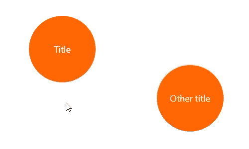

# 比 Bootstrap(开源库)小 6.5 倍的 JavaScript SVG 图编辑器

> 原文：<https://medium.com/codex/javascript-svg-diagram-editor-which-weighs-6-5-less-than-bootstrap-open-source-library-b753feaaf835?source=collection_archive---------2----------------------->


状态机工作流编辑器

[试玩](https://alexeyboiko.github.io/DgrmJS/) | [GitHub](https://github.com/AlexeyBoiko/DgrmJS)

使用 Blazor Webassembly 创建图编辑器的实验( [Blazor Webassembly SVG 拖放](/codex/blazor-webassembly-svg-drag-and-drop-e680769ac682)， [Blazor WebAssembly:连接 SVG 中的线](https://alexey-boyko.medium.com/blazor-webassembly-connecting-lines-in-svg-c319f93c1475))表明 Blazor 不适合密集的 DOM 操作。

事先就知道会有下沉:WebAssembly 不能直接访问 DOM，WebAssembly 使用 JavaScript interop 来改变 DOM。延迟是如此之高，以至于在添加第三个形状后，在移动设备上的拖动速度变慢了。

# 拒绝框架(对于此任务)

怀疑 Blazor 的虚拟 DOM 不正确地跟踪变化(可能 Blazor 试图更新比需要更多的 DOM 对象)是没有道理的。事件限制和其他微软建议([ASP.NET 核心 Blazor 性能最佳实践](https://docs.microsoft.com/en-us/aspnet/core/blazor/performance?view=aspnetcore-6.0))没有帮助。

更新一个属性有许多细微差别:

*   虚拟 DOM、树、子树，
*   变化的“循环”(一个地方的变化导致另一个地方的变化，那里的变化导致第一个地方的变化)，
*   向组件传递参数并跟踪它们的更改、订阅/取消订阅的细微差别。

使用 Blazor，一个琐碎的 JavaScript 任务变得太复杂了。框架在这里只会碍事。过度复杂不仅表现在 Blazor 上，在其他框架上也是如此。如果你还没看过，可以看看《苗条的哈里斯——反思反应》的创作者的谈话。在视频中有一个 React 应用程序刹车的例子:当进入文本字段时，DOM 被动态重建。在这里，DOM 是随着鼠标的移动(拖动形状)而动态重建的。

Vanilla-JavaScript 原型在 1000 个形状时没有表现出变慢的迹象。

在使用 Angular 多年之后，用普通的 JavaScript 做一些事情似乎是一种倒退。好的:手动读取 HTML 属性并挂起处理程序。但是没有组件，没有 IoC，没有模板，怎么开发呢？最重要的是——没有“反应力”？然而，退出。很快就过去了。事实证明，存在超越框架边界的生命，并且在某些方面更加完整。

# 拒绝类型脚本(类型脚本编译器)

类型检查、智能感知和其他工具——这就是 TypeScript 受欢迎的原因。TypeScript 有接口、文字甚至泛型。TypeScript 如此容易让人上瘾，以至于人们很容易忘记 TypeScript 只是 JavaScript 描述类型的一种方式。是的，在[typescriptlang.org](https://www.typescriptlang.org/)的主页上写着:“TypeScript 是带有类型语法的 JavaScript。”

[JSDoc](https://jsdoc.app/) 提供了所有相同的特性(类型检查、智能感知等。).

用 JSDoc“打字”的例子:

```
/**
 * [@param](http://twitter.com/param) {SVGGraphicsElement} svgEl
 * [@param](http://twitter.com/param) {number} transform
 * [@param](http://twitter.com/param) {SVGSVGElement=} svg pass if svgEl not yet in DOM
 * [@returns](http://twitter.com/returns) {SVGTransform}
 */
 function ensureTransform(svgEl, transform, svg) {
    ...
    return ...;
}
```

您甚至可以在 TypeScript 中描述类型，并在 js 文件中使用它们:

```
// ts-file
interface IDiagram {
    on(evtType: DiagramEventType,
        listener: EventListenerOrEventListenerObject): this;
    shapeAdd(param: PresenterShapeAppendParam): IDiagramShape;
    shapeDel(shape: IDiagramShape): void;
    shapeConnect(param: DiagramShapeConnectParam): void;
}// js-file - Diagram implements IDiagram
/** [@implements](http://twitter.com/implements) {IDiagram} */
export class Diagram {
    …
}
```

在这种情况下,“查找所有引用”、“重命名”和“检查对象是否实现了接口”都将起作用(至少在 Visual Studio 代码中，一切都是现成的)。

不使用 TypeScript 编译器的优点:

*   JS 代码正是你写的，
*   加速开发—无需等待编译，
*   不需要映射文件，更容易调试。

JSDoc 不如 TypeScript 简洁，语法不常见，IDE 支持较差。
一个混合的方法被证明是方便的:

*   TypeScript 中 ts 文件的类型描述
*   用 JSDoc 实现 JavaScript 中的真实代码。

# DgrmJS

结果是一个普通的 JavaScript 库。

DgrmJS 是一个用于创建 SVG 图的 JavaScript 库。该库的主要目标是在 BPM(业务流程管理)系统中建立工作流。

*   适用于桌面和移动设备
*   没有依赖关系
*   小尺寸
*   形状是以声明方式创建的

主要思想

*   允许开发人员使用标准 SVG 对象和功能，以声明方式创建将在图表中使用的形状。
    要创建形状，开发人员应该在标准 SVG 标记中添加特殊的数据属性。因此任何 svg 图像都可以用作图表中的形状。
*   DgrmJS 调度事件，如“形状被选中”或“形状正在连接到另一个形状”。
    开发者可以使用这些事件来实现自己的逻辑，例如，对工作流进行 JSON 描述。

“圆形”形状模板的声明性描述示例:

```
<g data-templ="circle">
    <circle ... />
    <text data-key="text"></text>

    <!--
        out connector
        data-connect-point - point into shape where connector line starts
        data-connect-dir - direction of connector line
    -->
    <circle
        data-connect="out"
        data-connect-point="60,0"
        data-connect-dir="right" ...>
    </circle>

    <!--
        in connector
    -->
    <circle
        data-connect="in"
        data-connect-point="-60,0"
        data-connect-dir="left" ...>
    </circle>
</g>
```

下图显示了使用“圆”模板创建的两个形状(两个圆)。通过点击图—显示输出连接器，您可以从中拉出连接线。当您将连接线的末端悬停在图形上时，将显示输入连接器。



形状的连接

向图表添加形状的代码:

```
import { svgDiagramCreate } from './diagram/svg-presenter/svg-diagram-fuctory.js';const diagram =
    svgDiagramCreate(document.getElementById('diagram'));diagram.shapeAdd({
    templateKey: 'circle',
    position: { x: 120, y: 120 }
});
```

关于 GitHub 的更多例子。

# 结论

这篇文章并没有呼吁放弃框架或类型脚本。长期坚持同样的范式、方法、框架，结果会“盲目”，缩小视野范围。往往我们甚至不做选择——试着给 Blazor WebAssembly 或者 Svelte developer 找个空缺，你只能在 React 和 Angular(也有 Vue)之间选择。

有机会去实验就好了。从“反应式方法”的泡沫中走出来是很有趣的。


DgrmJS 和 Bootstrap 的大小比较