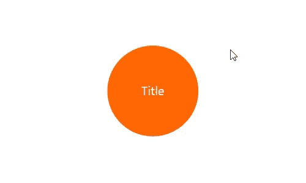

# SVG 的 JavaScript 文本编辑器

> 原文：<https://medium.com/codex/javascript-text-editor-for-svg-6881f670d432?source=collection_archive---------2----------------------->

[试玩](https://app.dgrm.net/) | [GitHub](https://github.com/AlexeyBoiko/DgrmJS)



*图一。SVG 文本编辑器，支持选择，复制，粘贴。适用于 PC 和移动设备。*

这篇文章描述了如何制作一个文本编辑器。源代码附后。

# SVG 中的多行文本

SVG 没有换行符。对于多行文本，SVG 使用<tspan>。</tspan>


图二。多行文本，第三行为空

```
<text x="0" y="0">
   <tspan x="0" y="0">Line 1</tspan>
   <tspan x="0" y="20px">Line 2</tspan>
   <!-- Line 3 is empty
   <tspan x="0" y="40px"></tspan> -->
   <tspan x="0" y="60px">Line 4</tspan>
</text>
```

*清单 1。SVG 中的多行文本。第三行是空的。行高 20px。*

<tspan>元件的位置相对于<text>的顶部边缘。必须计算“y”属性的值。</text></tspan>

可以避免“y”属性的计算。清单 2 给出了相同的结果。“dy”属性与固定值一起使用。“dy”表示相对于前一个元素的位置。

```
<text x="0" y="0">
    <tspan x="0" dy="0">Line 1</tspan>
    <tspan x="0" dy="20px">Line 2</tspan>
    <tspan x="0" dy="20px" visibility="hidden">.</tspan>
    <tspan x="0" dy="20px">Line 4</tspan>
</text>
```

*清单 2。SVG 中的多行文本。第三行是空的。行高 20px。缩进是相对于前一个元素设置的。*

# 用 JavaScript 形成多行标记

下面的函数使用固定的“dy”属性呈现标记。标记如清单 2 所示。

```
/**
 * create multiline tspan markup
 * [@param](http://twitter.com/param) {string} str
 * [@param](http://twitter.com/param) {number} lineHeight
 * [@returns](http://twitter.com/returns) {string}
 */
function svgStrToTspan(str, lineHeight) {
    return str.split('\n').map((t, i) => {
        return `<tspan
            x="0"
            dy="${i === 0 ? '0' : `${lineHeight}px`}"
            ${t.length === 0 ? 'visibility="hidden"' : ''}>

                ${t.length === 0
                    ? '.'
                    : escapeHtml(t).replaceAll(' ', '&nbsp;')}

            </tspan>`;
    }).join('');
}
```

*清单 3。函数进行多行标记*

在图 1 中，当您添加一行时，文本向上移动。因此，文本总是在圆的中心。清单 4 展示了这是如何实现的:

```
/**
 * [@param](http://twitter.com/param) {SVGTextElement} textEl target text element
 * [@param](http://twitter.com/param) {string} str
 * [@param](http://twitter.com/param) {{lineHeight:number, verticalMiddle?:number}} param
 * [@returns](http://twitter.com/returns) {void}
 */
export function svgTextDraw(textEl, str, param) {
    textEl.innerHTML = svgStrToTspan(str, param.lineHeight);
    if (param.verticalMiddle != null) {
        textEl.y.baseVal[0].value =
            param.verticalMiddle - textEl.getBBox().height / 2;
    }
}
```

*清单 4。该函数将文本插入 SVG。当指定 verticalMiddle 时，文本垂直居中。*

# 文字编辑器

编辑器必须支持所有标准功能:

*   文本导航、选择、插入、复制；
*   自动更正，拼写检查。
*   在 PC 和移动设备上工作。

对于标准特征，有一个标准<textarea>。</textarea>

编辑的算法:

*   透明的<textarea>位于文本上方。<br/><textarea>字体也是透明的；</textarea>
*   在输入时，调用清单 4 中的 svgTextDraw
*   重新计算<textarea>的尺寸和位置。</textarea>

该算法在 textareaCreate 函数中实现。功能代码在[GitHub](https://github.com/AlexeyBoiko/DgrmJS/blob/main/src/diagram-extensions/infrastructure/svg-textarea.js)上的一个单独文件中。

编辑器可以连接到任何<text>元素:</text>

```
const textEditor = textareaCreate(
    // {SVGTextElement}
    textEl,
    // text params
    { lineHeight: 20, verticalMiddle: 10 },
    // init value
    'init text',
    // onchange
    val => {...},
    // onblur
    val => {...});
…
// delete textarea
textEditor.remove();
```

*清单 5。为<文本>文本*创建文本编辑器

# 关于 dgrm.net 的其他文章

*   [JavaScript SVG 图表编辑器 3.9 KB(开源库)](/codex/javascript-svg-diagram-editor-which-weighs-6-5-less-than-bootstrap-open-source-library-b753feaaf835)
*   [JavaScript 图表编辑器，从 PNG 图像(开源)呈现图表](/codex/javascript-diagram-editor-that-renders-diagrams-from-png-images-open-source-d1de0f053088)

# 如何支持该项目

*   开始使用流程图编辑器[Dgrm.net](https://dgrm.net/)。
    告诉我你的想法。在 [GitHub](https://github.com/AlexeyBoiko/DgrmJS) 上的评论，私信。我什么都读，我会保留一份提案清单。
*   告诉你的朋友。
*   在 [GitHub](https://github.com/AlexeyBoiko/DgrmJS) 上给一颗星。