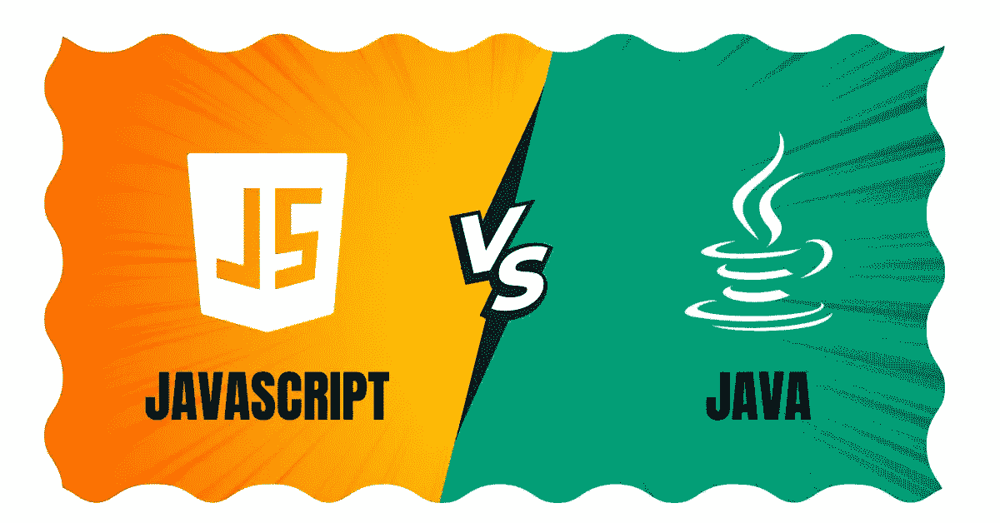

# JavaScript 与 Java:了解主要区别

> 原文：<https://medium.com/codex/javascript-vs-java-know-the-major-differences-8f3d21c32fcf?source=collection_archive---------15----------------------->

Javascript vs Java 是一个持续多年的长期争论。所以，今天在这篇博客中，我将告诉你 Java 和 JavaScript 之间的所有主要区别。Java 和 JavaScript 有不同的编写和执行代码的方式。他们也有非常不同的能力。

JavaScript 和 Java 都被编程新手和非技术人员所误解。他们认为这些技术是一样的。但事实并非如此。它们唯一的共同点是名字“Java”JavaScript 和 Java 是功能强大的语言，有自己独特的功能。各有利弊。这些语言的独特之处是什么？

Java 在许多应用程序中使用，例如 Android 应用程序、游戏、信用卡编程以及桌面或基于 web 的应用程序的开发。JavaScript 用于使网页更具交互性和动态性。此外，JavaScript 目前也用于开发移动应用程序。在比较 Javascript 和 Java 之前，让我们仔细看看每种语言，以便更好地理解它们。

如果您需要任何关于 JavaScript 的[帮助或任何](https://www.javaassignmenthelp.com/Help-With-JavaScript) [Java 赋值帮助](https://www.javaassignmenthelp.com/Java-Assignment-Help)，请与我们的专家讨论您的需求，以最实惠的价格获得最佳解决方案。

# Java 是什么？

Java 是一种通用的编程语言，它遵循一个原则:“编写一次，到处运行。”Java 应用程序可以编译成字节码在 Java 虚拟机(JVM)上运行。JVM 在源代码、计算机可以理解的 1 和 2 之间架起了一座桥梁。Java 可以在任何安装了 JVM 的机器上运行。Java 也是最流行的网络语言之一。它是基于 Android 的移动应用程序的首选编程语言。尽管 Java 小程序由于安全问题正在失去人气，但它们在前端仍然有很好的表现。

# JavaScript 是什么？

JavaScript 是由 Brendon Eichen 在 1995 年开发的。它既是客户端编程语言，也是服务器端编程语言。它用于创建 web 应用程序。以下是 JavaScript 的一些最重要的特性:

*   惊人的速度
*   易用性
*   跨平台兼容性

它与 HTML、PHP、CSS 和 Perl 等其他语言相结合，创建功能丰富的 web 应用程序。JavaScript 用于许多领域，包括服务器开发、游戏和机器人。

在过去几年中，诸如 ReactJS 和 Angular 之类的 JavaScript 库和框架的流行程度有了极大的提高。JavaScript 在网飞、贝宝和优步等公司的产品中使用。现在让我们比较一下 JavaScript 和 JavaScript。

# JavaScript vs Java

JavaScript 和 Java 都是 IT 行业的重要技术。下面是 Java 和 JavaScript 之间主要差异的详细列表。

# 面向对象编程

在 JavaScript 和 Java 中，面向对象的编程特性是很重要的。JavaScript 和 JavaScript 都是面向对象的编程语言。两种语言都能够使用抽象、封装、继承和多态等概念。两种语言都使用类和对象来执行操作。最显著的区别是 JavaScript 是一种脚本语言。相比之下，Java 是一种编程语言。

# 句法

Java 的语法与 C 或 C++非常相似。JavaScript 遵循与 C 编程语言相似的语法。语法非常相似，因为两种语言都使用类和对象。

# 变量定义

Java 是一种静态类型的语言。所有变量都需要在部署前声明。同时，JavaScript 是动态类型化的。变量声明可以在任何需要的时候进行。

# 汇编

Java 既可以编译，也可以解释。每个 Java 程序首先被 Java 运行时环境(JRE)转换成字节码。Java 虚拟机(JVM)解释这些字节码，使它们成为一种解释语言。另一方面，JavaScript 是严格解释的。解释程序读取程序的每一行并检查错误。

# 跑步平台

在 JavaScript 和 Java 中，运行平台是很重要的。Java 应用程序和程序运行在 Java 虚拟机(JVM)上。这通常与 Java 软件开发工具包(SDK)一起安装。JVM 是执行 Java 代码的平台。它在执行过程中解释字节码。JavaScript 程序可以在网络浏览器中使用。它们不需要任何设置。

# 并发

Java 采用基于线程的方法。这种方法将程序分成在硬件上同时运行的小段代码。这加快了进程并减少了开销。JavaScript 使用基于事件的方法。基于事件的应用程序使用回调和事件循环来划分工作。

# 和睦相处

这两种语言都被广泛使用并提供了很好的兼容性。Java 是跨平台的，支持 macOS、Windows、Linux 等操作系统。JavaScript 跨浏览器友好，支持 Safari、Chrome、Firefox 等浏览器。

# 薪水

你还需要知道 JavaScript 和 Java 开发人员的平均工资。在美国，Java 开发人员的平均年薪约为 74，000 美元。另一方面，JavaScript 在美国的平均年薪约为 82，000 美元。

# 结论

在这篇博客中，我们讨论了 JavaScript 和 Java 的一切。两者都是广泛使用的技术。Java 是一种通用编程语言。另一方面，JavaScript 是一种脚本语言。希望在读完这篇博客后，你对 JavaScript 和 Java 的所有疑问都被清除了。