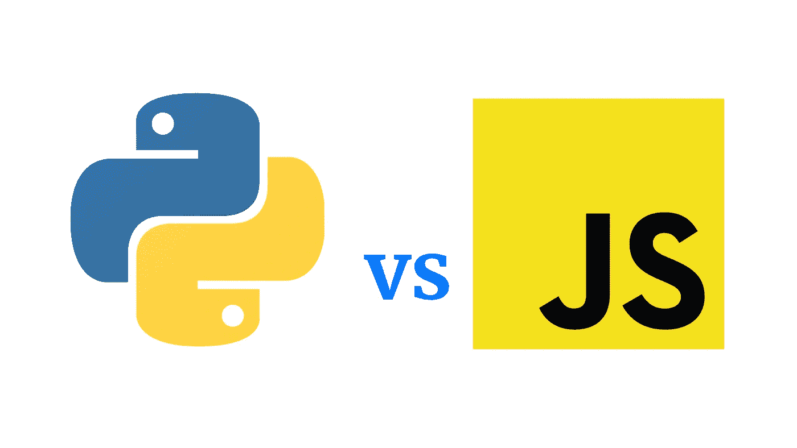

# Web 开发 JavaScript Vs Python？

> 原文：<https://medium.com/codex/javascript-vs-python-for-web-development-21a0c17590c3?source=collection_archive---------8----------------------->

JavaScript 和 Python 之间有很多不同，但是两者都有很多应用。JavaScript 经常被用作 web 应用程序的前端。但是，它很少在 web 浏览器之外使用。本文比较了 JavaScript 和 Python，以帮助您决定使用哪一种。这两种语言之间的差异在下面强调。请继续阅读，了解这两种语言的不同之处，以及如何使用它们来创建优秀的 web 应用程序。

