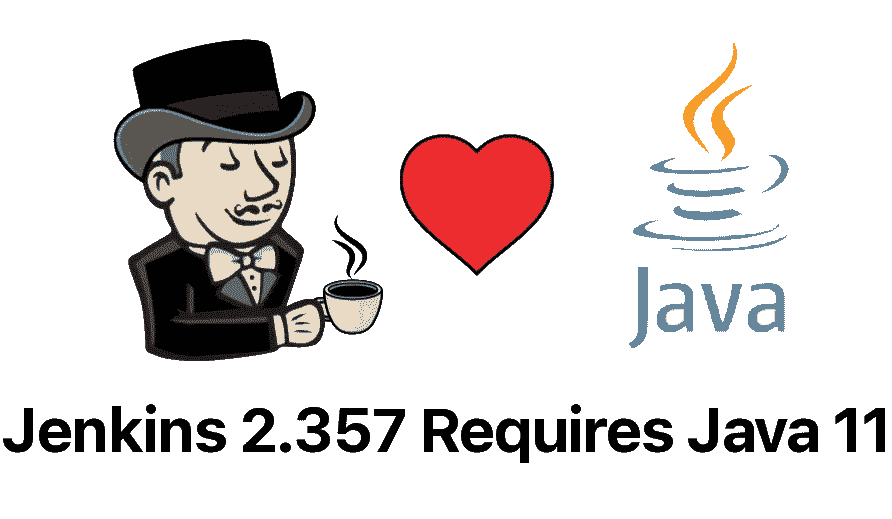

# 詹金斯宣布弃用 Java 8

> 原文：<https://medium.com/codex/jenkins-announces-the-deprecation-of-java-8-236fd126ea7b?source=collection_archive---------7----------------------->

开源 DevOps 工具 Jenkins 已经宣布，从 6 月 28 日发布的 Jenkins 2.357 和即将到来的 9 月 LTS 发布开始，Jenkins 至少需要 Java 11。

Jenkins 原名 Hudson，是一个已经存在了十多年的成熟的持续集成工具。自 2005 年成立以来，詹金斯项目已经经历了几次…