# JetBrains Django-开发者调查结果说明

> 原文：<https://medium.com/codex/jetbrains-django-developer-survey-results-explained-211c06237a34?source=collection_archive---------11----------------------->

## 开发人员的视点

## 固执己见的观点

JetBrains 发布各种技术的开发者调查，[今年也不例外](https://lp.jetbrains.com/django-developer-survey-2021-486/?utm_campaign=Django%2BNewsletter&utm_medium=email&utm_source=Django_Newsletter_109)。调查结果反映了社区的趋势和变化，有助于我们更好地了解未来什么是相关的，什么不是。

> 寻找一些 Python 或 JS 自由职业者，工资高达 50€/小时？请不要犹豫，请[通过 Twitter](https://twitter.com/SchifferThorin) 或 [Linkedin](https://www.linkedin.com/in/thorin-schiffer/) 联系我，告诉我你的简历、空闲时间和时薪。(CET +/- 3 小时)。

## 版本控制

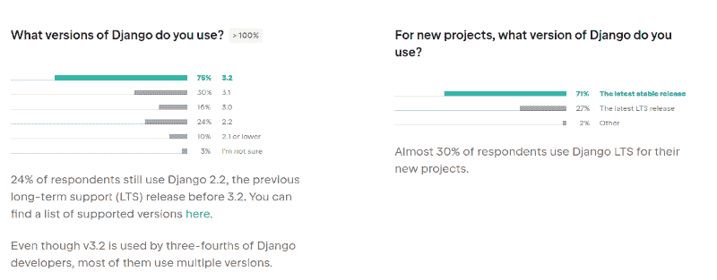

对 Django 统治模式的改变得到了回报，在几十年的 PRs 封锁和偏袒后，清新的风清晰可见。语义版本化推动人们更快地升级，因为主要版本的增量没有过去那么大，因此更新的痛苦要低得多。

## 测试

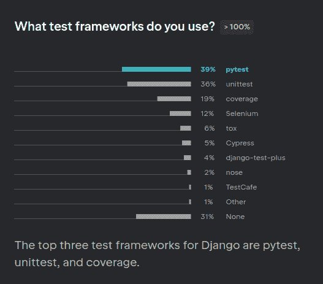

PyUnit 在 python 世界中总是感觉格格不入，难怪 pytest 要接管了，这个领域似乎完全被那个古老的 JUnit 后裔占据了。Pytest 是一个现代的、模块化的、总的来说非常优秀的测试任何应用程序的工具，事实上 pytest-django 到目前为止从未给我带来麻烦。首先很高兴看到它。

## 异步ˌ非同步(asynchronous)

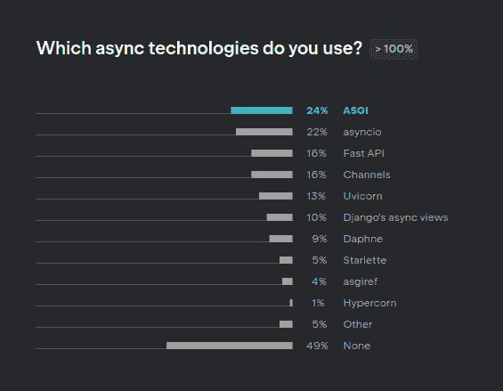

Django 通往 async 的道路并不平坦。sync 框架的一个明显的里程碑——使 Django ORM 完全异步化——需要一段时间才能发展到稳定状态并被社区接受。

ASGI 是 Django 开发人员熟知的 WSGI 的异步版本，这只是第一步:当然，没有异步应用服务器就没有可异步的框架。但还是 Django 和 async？没有。

Django 社区相当资深，随着资历加深，对新技术的开放程度下降。Python 版本的使用也证明了这一点。

## Python 版本

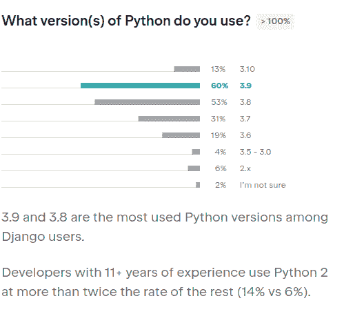

3-4 年前，这种情况并不乐观。就我个人而言，我不相信 Python 会发展到 3x，因为所有主要的框架和技术都在与这个转变作斗争。最后，这并不困难，我和我被证明是错误的。

Python2 的高级开发人员没有意识到他们的工作受到了这种变化的威胁，很有可能会成为技术的坟墓。与 PyPY 或 Cython 相关的大量代码似乎是难以承受的工作量。作为一个彻底的悲观主义者，我不认为他们都能成功。

## 集成驱动电子设备

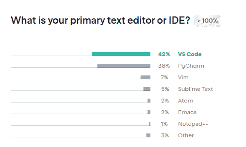

尽管相对年轻，VS 代码已经如此迅速地占领了开发社区，事实上它是由谁开发的呢？微软！开源社区中最受憎恨的公司现在被 Django 开发人员使用的比 PyCharm 更多，py charm 似乎是这个分支中无可争议的领导者。也就是说，看起来所有的产品都有其生命周期，只需要重新启动。什么是 VS 代码，如果不是开源的话，让我清一下嗓子。

JetBrains 在过去几年中的缺点，他们主要的基于 Java 的平台思想的性能下降，以及他们对自己的基于云的开发环境和云原生 IDE 的特别关注，多年来没有解决的错误:所有这些都使人们寻求替代方案。有一个！

尽管 VS 代码是基于电子的，因此甚至不能提供本地应用程序的性能，但它很好地服务于经常被全球忽视的用户群:Linux 共产主义者，我很乐意成为其中之一。

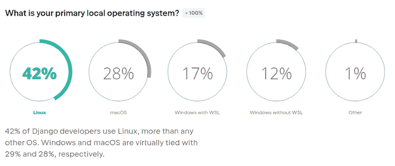

Linux 在后端世界扮演着重要的角色，微软明白这一点。虽然 JetBrains 甚至创建了自己的 JVM，以解决 OpenJDK (OMG)和专有的 Oracle JVM 几十年来一直未能解决的性能问题和缺陷。自从塞特亚·纳德拉领导公司以来，微软转向 Linux 和开源社区，并推出了令人惊讶的产品，这对于 2010 年初的微软来说是不可想象的。在沉默中开发的 AzureDevops 被证明是一个相当不错的工具，涵盖了 2022 年云开发者的所有需求，而不是统治极客的笔记本电脑和 OMFG WSL 的代码 Windows 的 Linux 子系统。如果微软的任何一位高管在 2012 年至 2013 年说过类似的话，他们的职业生涯就会结束。正式的。

## 林挺和质量

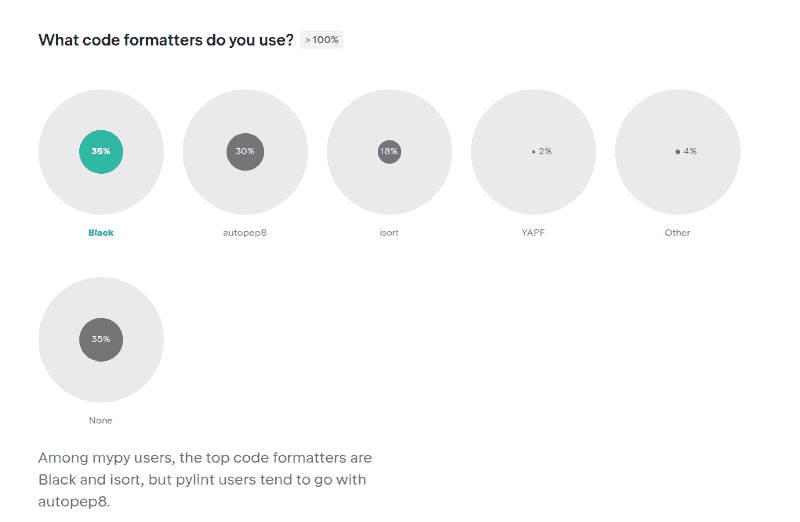

又一个意想不到的新人主宰！Black 在 PyPI 上的第一个版本是 2018 年 3 月 14 日，从那以后，这个格式化和林挺工具一直是所有其他成熟工具的良好竞争对手，如 flake8、PyUnit、autopep8 和类似工具。在这里，我不是特别同意 JetBrains 的分类，因为我真的看不出林挺和代码格式之间有什么大的区别。从数学上讲，是一样的。

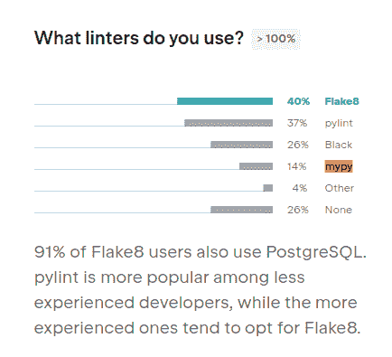

Django 社区的 MyPy 只有 14%

MyPy 如此著名，非常现代，并且与 FastAPI 和 pydantic 等优秀的库和框架很好地结合在一起，把重点放在类型注释上，在 Django 中没有真正的位置。发生在 ORM 周围的魔法和不可避免的循环导入只会造成无尽的混乱。Django 开发人员比较保守，因为在 Django 中输入并没有明显的附加价值，所以大多数开发人员决定不采用它。

Pylint 的性能问题和大量的误报，使得这个工具很难在实践中使用，这是 flake8 赢得这场战斗这么久的实际原因。

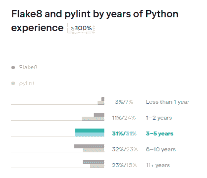

在这个调查中有趣的比较:Pylint 在初级和高级组中失去了它的社区，但是在中级组中使用的情况差不多。我可以确定我也有我的“皮林阶段”，我希望一切都完美无缺:最好的是最坏的。Pylint 带来的麻烦多于价值。

在非 Django 的 Python 世界中，类型注释允许在第一时间捕捉类型错误，MyPy 是一个强有力的工具来强制正确的类型，特别是在使用[预提交](https://pre-commit.com/)的情况下。

## 云

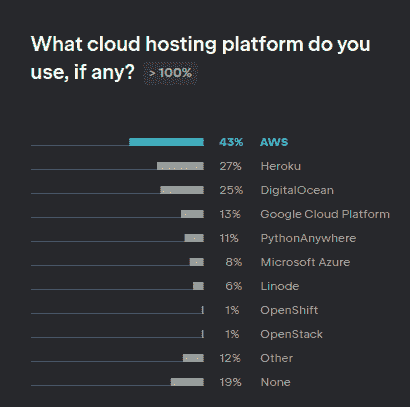

AWS 在第一位，这里没有什么大的惊喜。第二个是 Heroku，它为创业项目提供了令人惊叹的工具包，并因其在 2010 年代早期的开拓而受到了一些影响。AzureDevops 的结果低得令人惊讶，是因为它是微软，所以仍然不被信任吗？时间会证明的。

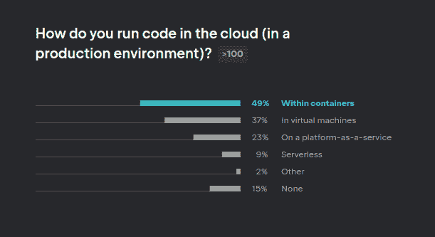

容器的 49%是一个合乎逻辑的结果:由于 Docker 和微服务已经彻底改变了部署，开发人员希望花更少的时间来关心他们的代码如何交付给用户。9%,这意味着 AWS Lambda 的巨大成本，已经是一个很好的结果了。

37%用于虚拟机虽然看起来不合逻辑，但这也是由于 Django 社区的时代。人们年龄越大，创新的意愿就越低，这一点显而易见。40-50 岁的 Django 开发人员更喜欢自己动手处理应用程序中发生的事情，甚至有时更喜欢快速修复一个良好的 ssh 会话。

在巨大的并行性和抽象的弹性和无限的基础设施的现代需求中，Django 开发者仍然倾向于停留在过去。除此之外，性能下降和迁移到容器环境的成本似乎是他们做出决定的一个重要因素，尽管众所周知，在中型应用程序中，I/O 是降低应用程序速度的最大问题。事实上，对于像 Django 这样的同步框架来说，lambda 是一个完美的选择，在 Django 中，工人池耗尽是一个真实的问题，任何 Django 开发人员都至少经历过一次。502 坏网关。

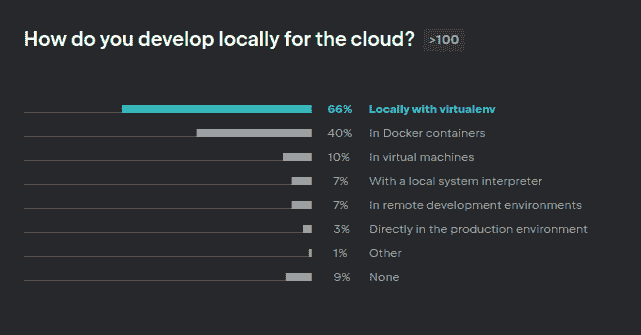

这是一个显著的结果:不要使用容器进行开发。我见过开发人员甚至不使用卷，也不为他们所做的任何更改重建 Docker 映像，而是为他们更改的每一行等待 50-70 秒。想象一下他们变得多么没有生产力。容器用于配置项和产品。

## 海峡群岛

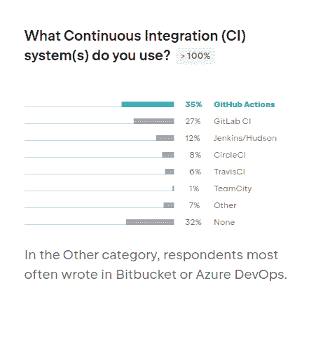

GitHub 行动的兴起是绝对正当的。大多数直接竞争对手都在实施相同的概念，尽管社区担心 GitHub 在被微软收购后会退化到类似 Skype 的残疾阶段，但 GitHub actions 在 CI 领域确实是一种全新的方法。带有可插入操作和基本映像的公共存储库加快了常规任务的速度，这是一个故事中的新词，在这个故事中，一切似乎都已经被讲述过了。正确使用时，GitHub 动作解决了容器化 CI 的最大问题:性能。

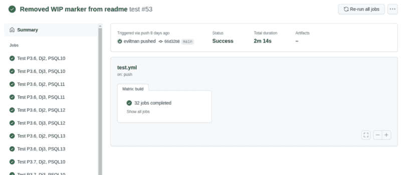

测试一个矩阵，在 2 分钟内完成几十个任务，很简单

Jenkins 是一个老朋友，也有 12%的份额，这可以用 Django 社区中的巨大保守性来解释，这与虚拟机一起出现，并可用于供应。

> 我不是在评判，但詹金斯是一个来自前前前后一代技术的工具，在 2022 年的现代技术格局中没有一席之地。自主管理的 GitLab 在所有标准上都击败了 Jenkins。

## 社区

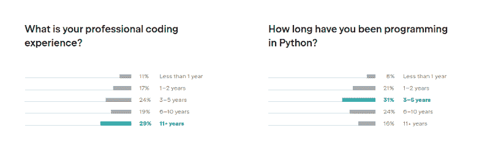

真正令人高兴的是，主要使用其他语言的高级开发人员已经转向 Python，这反映在第二个图表的中间 3-5 年组中。2to3 灾难已解决，令人惊叹的数据科学工具，基于 asyncio 的新技术和框架，当之无愧的 Python place 1 in TIOBE Index 吸引了开发人员，并为 Python 的回归创造了必要的动力，并在未来催生更多优秀的技术。

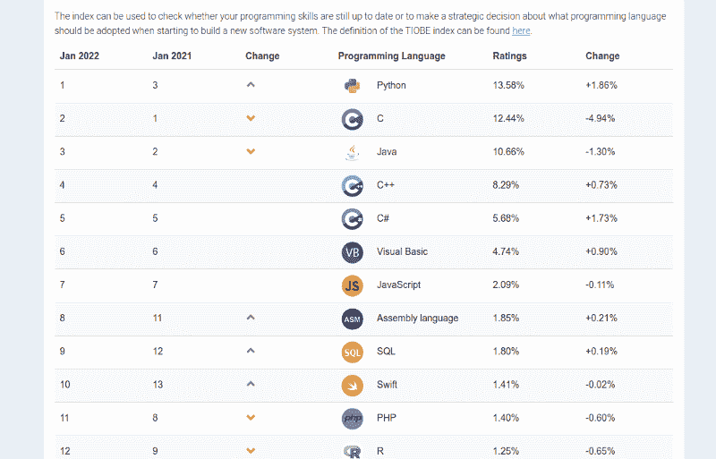

> 对于 Python 来说，这是极好的一年，最好的还在后面！

=====================================

如果你喜欢这个，看看我最近的文章:

🕒[为什么你的软件质量随着时间退化](https://thorin-schiffer.medium.com/same-old-story-4d1ef4df0824):短篇故事

😃 [RapidAPI:使用 Python 的第一步](/analytics-vidhya/rapidapi-and-fastapi-d720789a5b7e)

🐍 [6 种重要的编程语言及其最初用途](/analytics-vidhya/6-important-programming-languages-and-their-original-purpose-52780c42f0ff)