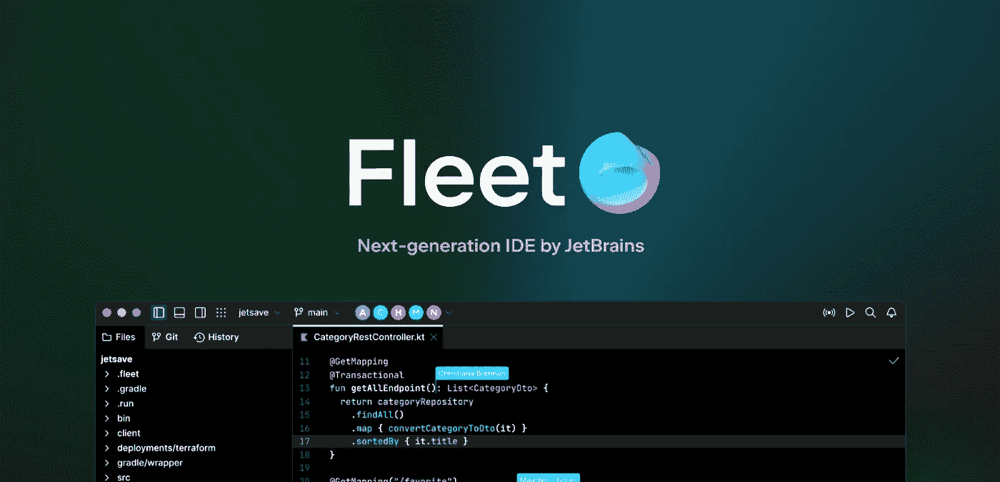
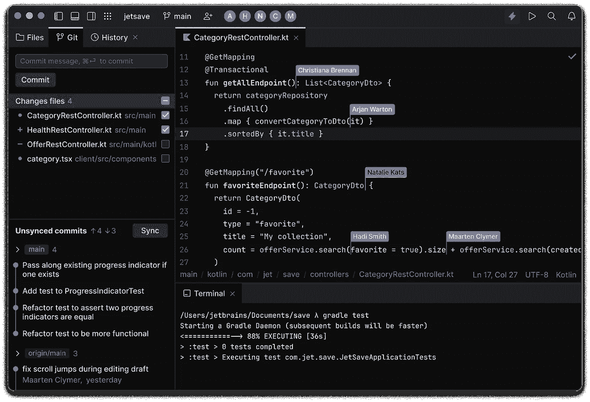
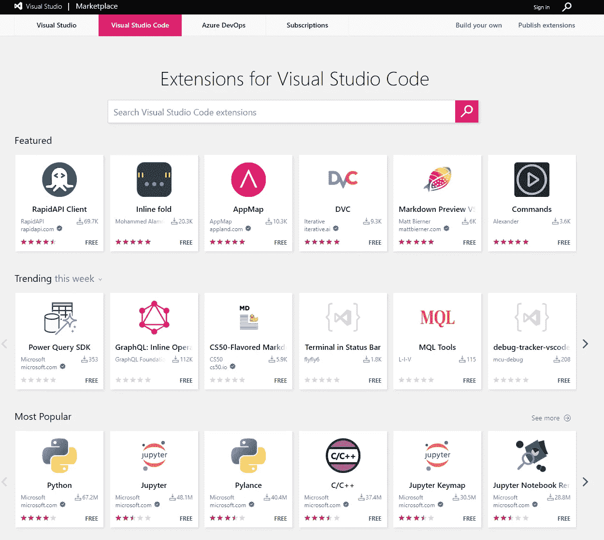
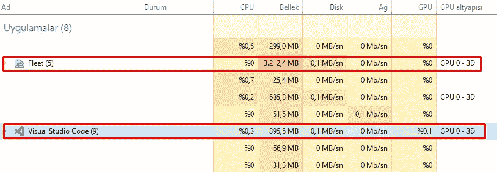

# JetBrains 舰队 vs 代码|舰队 VS 代码是黑仔吗？

> 原文：<https://medium.com/codex/jetbrains-fleet-vs-vs-code-is-fleet-vs-code-killer-b11e2feeea0d?source=collection_archive---------0----------------------->

## JetBrains 发布了他们全新的代码编辑器(或者 IDE？)舰队。我花了几个小时在我的前端项目上。作为一名初级前端开发人员，我在这里分享我对新 JetBrains 车队的看法。真的是 VS 代码杀手吗？

[JetBrains 舰队原创页面。](https://www.jetbrains.com/fleet/)

每个人都知道 JetBrains 受他们 IDEs 的欢迎。几乎每一种编程语言都有不同的 ide。是的，他们用它们赚了很多钱。但是人们已经开始抱怨了。如果有人用不同的编程语言从事不同的项目，更改 IDE 会很麻烦。可能 JetBrains 也听到了这些抱怨。他们刚刚发布了他们的“多语言”代码编辑器。实际上，很难将 Fleet 称为代码编辑器或 IDE。舰队是他们之间的东西。

# UI/UX |车队与代码

[JetBrains 舰队原创页面。](https://www.jetbrains.com/fleet/)

我是一个经常在 VS 代码中改变主题、改变桌面背景等等的人……这对我来说有点恶心。如果我习惯了看到背景，而我甚至没有“看到”它，我会改变它。有了这些改变，我觉得更有动力，更有新鲜感。所以，我不是那个可以在他们之间批评 UI/UX 的人。我可以说我喜欢舰队的主题和 UX。它真的很酷，很好用，而且很简约。但是，这不是一个加号。因为 VS 代码里已经有舰队的主题了。我可以马上用它。

# 社区和扩展图书馆

[链接到图书馆](https://marketplace.visualstudio.com/vscode)

我认为甚至不需要提及它，但是 VS 代码有一个很棒的社区。有了这种能力，它还有一个很棒的扩展库。VS 代码只是一个具有高度可定制技能的编辑器。另一方面，Fleet 目前甚至不支持扩展。所以，JetBrains 将首先分享他们的 API 进行扩展，我们将开始等待新的扩展等等。这意味着我们至少有 2 年的时间将 Fleet 视为 VS Code 的竞争对手。两年是个乐观的想法。

# 速度和性能

两个编辑器上相同项目(Next.js)的性能。

正如您在上面看到的，我为两个编辑器打开了同一个项目。当我在 VS 代码上打开我的项目时，我可以在 2-3 秒后开始编辑。但当我试图在 Fleet 上打开同一个项目时，我等待了 1:30 多分钟才能够用智能模式编写代码。我第一次打开智能模式，它下载了一些扩展和一些东西。但即使在那之后，表演也没有任何好转。

# 总体|代码与 JetBrains 车队

作为一名初级前端开发人员，我试图批评我所看到的关于 Fleet 的一切。我对我的小可爱 VS 代码很满意，不会改变它。但是，JetBrains 车队有很好的潜力。我相信，在 2-3 年后，它将成为 VS 代码的一个优秀的竞争对手，而且它已经被需要了。如果我写的有什么错误，请不要犹豫，在评论里写出来。请分享你对舰队的看法。我会等着的！还有，如果你觉得内容有用，可以通过下面的提示支持我😇。