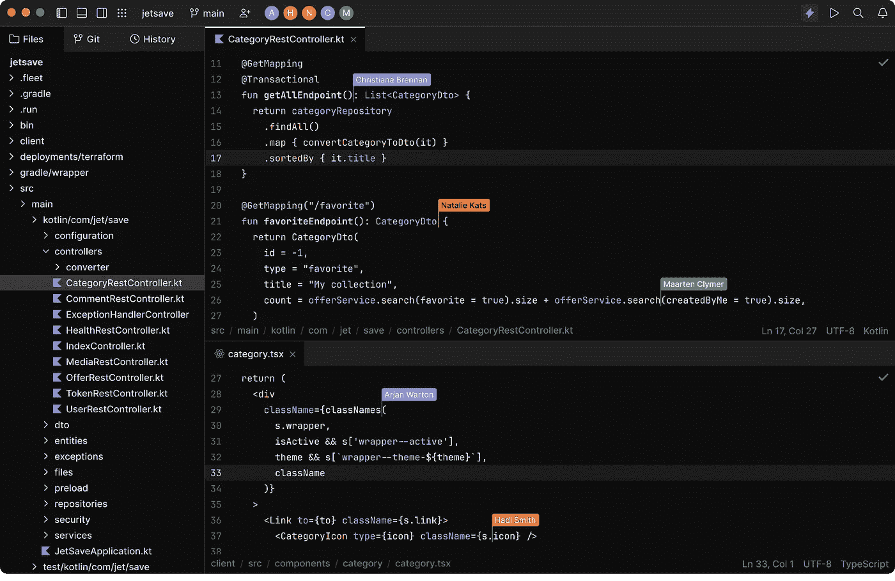

# JetBrains 开发了另一个 IDE，叫做 Fleet

> 原文：<https://medium.com/codex/jetbrains-has-developed-another-ide-called-fleet-c3a7cc2e45eb?source=collection_archive---------8----------------------->

JetBrains 宣布首次公开预览舰队，所有人都可以使用。Fleet 是 JetBrains 打造的下一代 IDE，于 2021 年首次正式推出。它是一个新的分布式多语言编辑器和 IDE，基于 JetBrains 后端的 IntelliJ 平台，从头开始构建，具有全新的用户界面和分布式架构。

# 开始使用舰队