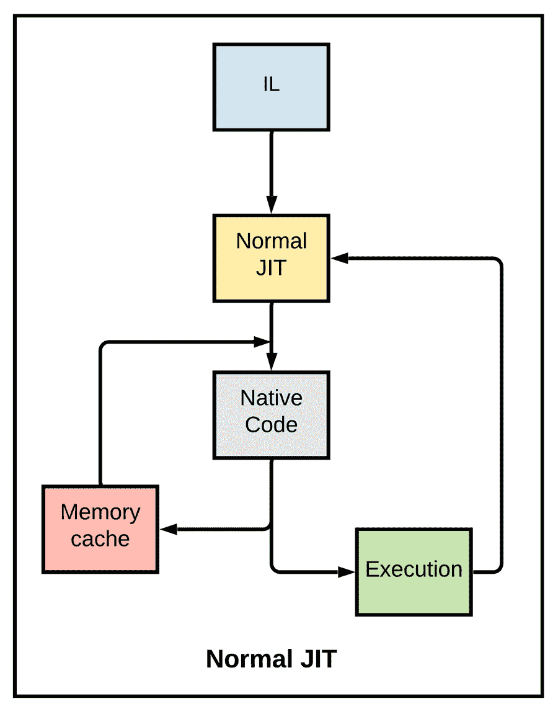
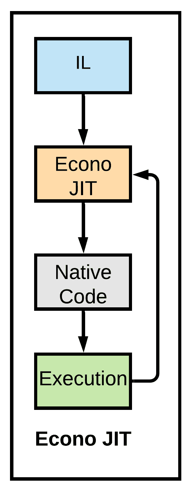
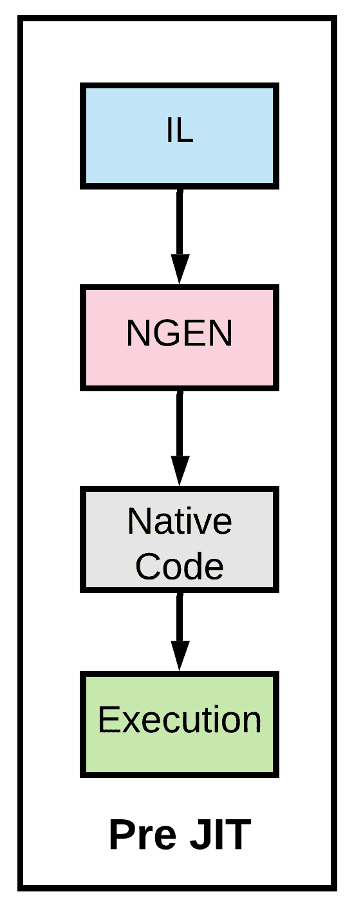

# 中的 JIT 编译器。网

> 原文：<https://medium.com/codex/jit-compiler-in-net-ea4e6acc173a?source=collection_archive---------7----------------------->

大多数程序员使用人类可以理解的高级编程语言来创建他们的软件/应用程序。利用这一点，开发人员构建应用程序必须执行的基本逻辑，或者使用它需要实现的结果。

由于它们是人类可以理解的格式，除了对如何编程的基本理解之外，开发人员不需要经过任何特殊的训练来编写逻辑。

通常，程序员创建源代码，并将其发送给机器执行。现在，既然代码是用高级编程语言写的，你就得让机器理解它。为此，它必须被翻译成不同的语言。

这就是编译器发挥作用的地方。

在这篇文章中，我们将研究。NET 框架称为 JIT。

**目录**

1.  什么是 JIT？
2.  JIT 的类型
3.  JIT 编译器的好处
4.  结论

# 什么是 JIT？

首先，让我们了解什么是编译器。

编译器是将源代码翻译成机器可理解语言的工具。英寸 CLR 提供了一个编译器，可以将源代码转换成微软中间语言(MSIL)。

然而，MSIL 码不能被机器执行。它还需要在运行时被翻译成机器可理解的本机代码。这是由。Net 将它转换成特定于 CPU 的代码。

将源代码翻译成 MSIL，然后将 MSIL 翻译成本机代码的两步过程称为隐式编译。

JIT 的一个关键方面是它的可移植性。为了使应用程序在不同的平台上工作，必须将源代码编译到多个目标平台上。JIT 使两步过程变得更容易。第一步(将源代码转换成 MSIL)是与平台无关的。第二步变得更容易，因为每个目标平台的机器中都有一个 JIT，它将 MSIL 翻译成本机代码。

JIT 编译器负责管理任何属于。NET 框架。

JIT 编译器的输入是创建的。exe 或。dll(基本上处于 MSIL 状态)。一旦用户执行 exe 文件，JIT 编译器就开始执行它的功能..

JIT 编译器有三种类型。让我们在下一节中详细了解一下。

# JIT 的类型

## 正常 JIT

有了这个编译器，在运行时调用所需的方法时就会被编译。同时，它们被存储在被称为“jitted”的内存缓存中。从缓存中为后续调用引用相同的方法。

## 经济 JIT

该编译器编译运行时调用的所需方法。与普通的 JIT 不同，编译后的代码不存储在内存缓存中。相反，它是在需要时编译的。Econo JITs 的启动延迟更短，因为它们花在编译上的时间更少。这对于启动时间较长的应用程序非常有用。但是，这从。Net 2.0 版本。

## 预 JIT

在这个编译器中，整个源代码，而不是使用的方法，被直接转换为本地代码。这是使用本机图像生成器(Ngen.exe)完成的。这样，可以从缓存中使用本机代码，而不是调用 JIT 编译器。

# JIT 编译器的好处

编译器根据编译行为发生的时间而不同。像 JIT 一样，还有另一种流行的编译技术，叫做提前编译(AOT)。就 JIT 而言，只有在运行时，代码才会被编译。在 AOT 的例子中，代码甚至在运行之前就被编译了——它是作为部署过程本身的一部分来完成的。

换句话说，显式编译甚至在程序执行之前就使用 AOT 编译器将源代码直接翻译成本机代码。AOT 的设计方式使得任何 CPU 都可以理解翻译后的代码来执行。此外，它们在大规模应用程序中也很方便，这些应用程序的编译会消耗大量的时间和内存。

就速度而言，如果有足够的内存和计算能力，JIT 编译器比 AOT 编译器更胜一筹。因为 JIT 在执行代码的同一台机器上编译代码，所以它拥有代码优化所需的信息。此外，JIT 还提供了关于执行代码的机器的信息。因此可以优化代码，只编译所需的方法，而忽略其他未涉及的代码。

当 JIT 在执行代码的机器上编译代码时，它可以将代码编译和微调到一个粒度级别，以便与执行代码的特定系统相匹配。

以下是使用 JIT 编译器的一些其他优势

1.  它消耗的内存较少，因为它只编译运行时需要的方法。
2.  在运行代码时，根据分析帮助执行代码优化。

同时，使用 JIT 编译器也有一些缺点。他们是-

1.  应用程序的初始启动时间很长
2.  运行时大量使用内存缓存

# 最后的话

JIT 编译器通过独立于平台的解决方案解决了交付本机代码的问题。此外，它还能够收集执行数据并根据需要优化代码。下一步尝试使用 JIT 编译器。NET 应用程序，并体验它在这篇文章中强调的一长串好处。

*原载于*[*https://www . partech . nl*](https://www.partech.nl/nl/publicaties/2021/08/jit-compiler-in-dot-net)*。*