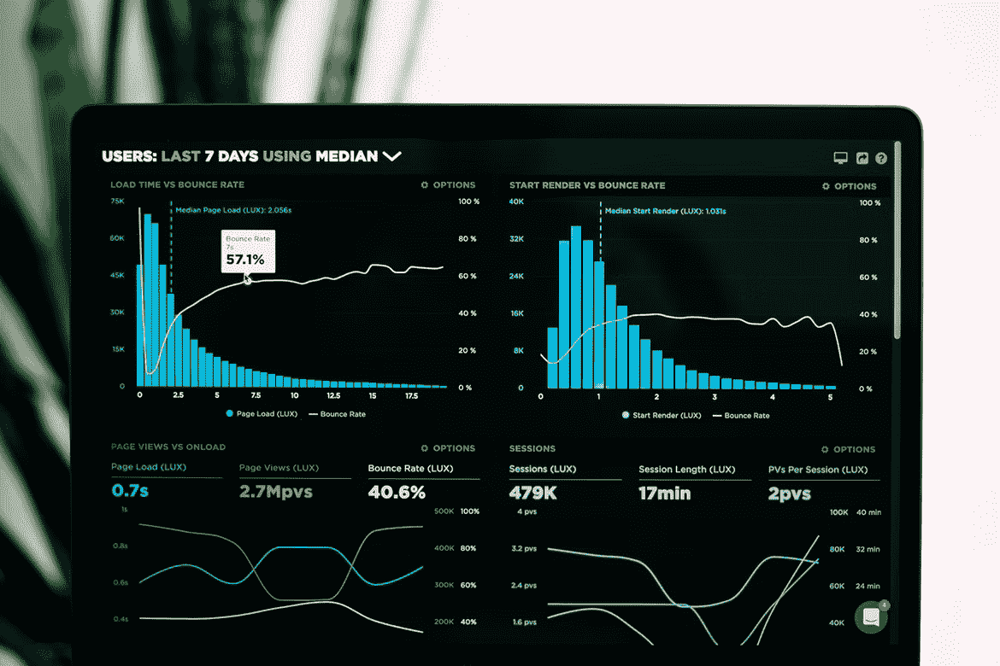
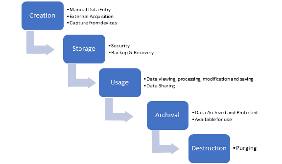
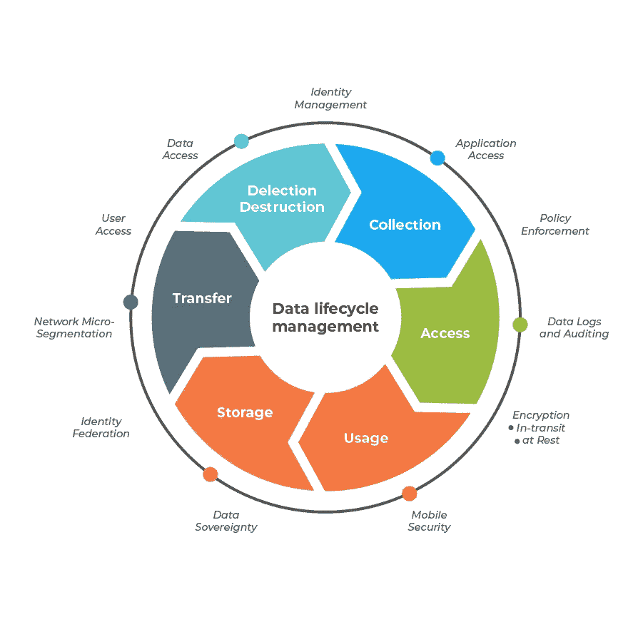

# 加入数据组织？关于数据生命周期管理，您必须知道什么

> 原文：<https://medium.com/codex/joining-a-data-organization-what-you-must-know-about-data-lifecycle-management-8e47327bd3f5?source=collection_archive---------6----------------------->

[图片](https://unsplash.com/photos/JKUTrJ4vK00)由[卢克·切瑟](https://unsplash.com/@lukechesser)在 Unsplash 上拍摄

组织越来越受数据驱动，因此他们依赖海量数据来运行业务的各个方面，从获得客户到创造新产品。遵循数据驱动的业务方法是当今的主要趋势之一。现在产生的数据比人类历史上的任何时候都多，而且它还在继续扩展到许多来源。

正确利用数据可以做任何事情——从推动行业发展到改善医疗保健，甚至影响选举。为了发挥作用，所有数据都必须在其整个生命周期中得到管理，从数据的创建一直到数据的删除。如果组织没有正确实施数据生命周期管理，这将是一个真正的挑战。

# 一个例子

从单个数据在公司内移动的角度来考虑[数据生命周期管理](https://lakefs.io/what-is-data-lifecycle-management)。例如，在销售过程中捕获一条数据，然后输入数据库。然后，这些新数据将被访问或共享，以用于后续处理、报告、分析或其他目的，或者它可能只是停留在数据库中并变得过时。数据甚至可能在过程中具有验证逻辑，但是这些数据最终会过时。现在，它需要存档、清除或删除。

将数据从其生命周期的一个阶段转移到下一个阶段的过程称为数据生命周期管理。它定义并自动执行有用生命周期的各个阶段，并确定[数据优先级](https://www.ibm.com/docs/en/taddm/7.3.0?topic=items-prioritization-data)，充当将数据从一个阶段推进到下一个阶段的催化剂。

数据生命周期管理不关心给定记录中包含的单个数据，而是关心整个记录。因此，该系统旨在回答何时删除该信息的问题。

# 数据生命周期管理的各个阶段

[来源](https://www.dataworks.ie/5-stages-in-the-data-management-lifecycle-process/)

在我们进入 6 个阶段的细节之前，让我们了解一下这些相同的名字是如何组合在一起定义更广泛的阶段的。

生活中的一切都是一个产生数据的过程。因此，我们可以将数据生成视为数据生命周期的第一阶段。一旦产生了数据，就必须收集数据，这实质上是记录生命产生的信息的过程。数据收集可以采取任何形式，从调查到医疗记录和销售数据。每个组织都会根据自己的需求采取不同的方式。

在收集之后，这些数据必须存储在某个地方，要么在计算机硬盘上，要么在基于云的服务器上。通过分析，我们提取信息，并将其转化为情报。这是我们数据生命周期的最后一个阶段，它允许我们利用这种新发现的智能来增加真正的价值，或者简单地说，允许我们采取行动。

# 数据创建

所有数据都是在某个地方创建的。然而，大量的数据可能会丢失，因为这些数据可能是在个人驱动器上产生的，被写下但未被保存，或者包含在怪异和独特的数据格式中。因此，数据生命周期管理中存在数据创建，以最大限度地收集准确的数据。它是根据数据的使用地点、用途和使用人，从整个企业中获取数据。

数据收集过程还需要指定文件的类型以及数据的敏感性，因为这是治理开始根据数据是私有、敏感、受限还是公开来划分数据的地方。这保护了公司的知识产权和客户关系。

# 数据存储

这是我们维护数据的地方——我们合成数据。实施数据冗余和安全技术，以不会被无意更改的方式存储数据，都是[数据存储](https://www.ibm.com/topics/data-storage)的例子。当我们创建数据生命周期管理策略时，我们希望确保存储的数据没有单点故障，并且数据存储必须是结构的合规部分。

作为一个组织，我们的政策应该确保数据存储必须符合合同和当地法律。定义各种数据恢复计划也很重要，这样我们就有了一个在恢复驱动器时通过使用临时备份来继续访问数据的计划。

# 数据使用

数据生命周期管理策略或计划应该定义谁和什么可以使用数据。一旦我们正确设置了前两个阶段，数据使用阶段就相对简单了，因为试图访问数据的用户或系统或流程会将他们的访问权限映射到敏感度。

在数据生命周期的利用阶段，数据用于支持组织活动。数据可以被检查、操作、编辑和存储。为确保所有数据更新完全可追溯，应对所有关键数据进行审计跟踪。

# 数据共享

通常，数据使用和共享被合并为一个阶段。数据也可以与公司外部的其他人共享。在管理不善的数据生命周期流程中，数据共享是最脆弱的环节。非正式共享数据的个人越多，信息不符合政府或政策规则的可能性就越大。我们不仅需要平衡用户跨不同系统和用户共享数据的需求，还需要平衡数据的敏感性。

# 数据存档

[数据归档](https://www.proofpoint.com/us/threat-reference/data-archiving)是指在数据的有效寿命结束后存储数据。大多数情况下，用户和系统在日常操作中不需要大部分数据。但是偶尔，你可能想要访问数据；可能是出于临时、报告或分析目的。因此，在数据被销毁之前，应始终对其进行归档。

一个好的数据生命周期管理策略必须定义我们需要在何时、何地以及多长时间内归档一些数据。

# 数据销毁

这是数据生命周期的最后阶段。保留的数据量逐渐增加，虽然您可能希望无限期地保存所有数据，但这是不可能的。存储成本和法规要求迫使您删除不再需要的数据。

从组织中消除数据项的所有副本被称为数据销毁或清除。它的核心有两个方面。需要有一个策略来销毁第二阶段(数据存储)的活动数据以及归档数据。这意味着遵守内部治理、政策以及当地和国际法律。所以，基本上，这一步取决于数据项的具体类型和敏感度。

[来源](/jagoanhosting/what-is-data-lifecycle-management-and-what-phases-would-it-pass-through-94dbd207ff54)

# 结论

简而言之，数据生命周期管理是在组织内管理数据的整个生命周期(从创建到报废)的流程、策略和程序。它不是特定的产品或协议，而是组织中数据管理的综合方法。

它运行在一个基于策略的系统上，该系统在其整个使用寿命中管理许多应用程序、系统、数据库甚至存储介质之间的信息流。数据生命周期的强大之处在于它是通用的。这一概念并不局限于某个行业，它确实可以让最终用户利用他们拥有的数据做出更好的决策。