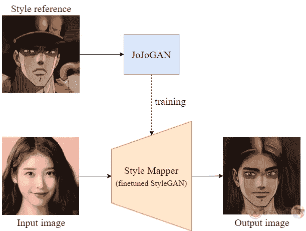

# JoJoGAN 使用 StyleGAN 在面上进行样式转换-创建 JoJo 面(使用代码)

> 原文：<https://medium.com/codex/jojogan-style-transfer-on-faces-using-stylegan-create-jojo-faces-cc0907a9bc6?source=collection_archive---------2----------------------->

## 论文解释:JoJoGAN —一次拍摄的面部风格化

# 介绍

JoJoGAN 概述