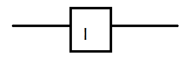
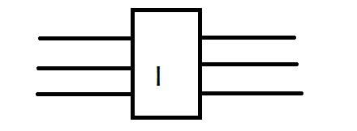

# 面向大数据的 Hadoop 之旅

> 原文：<https://medium.com/codex/journey-to-hadoop-e2dbc30acc?source=collection_archive---------16----------------------->

## “Hadoop 现在是一个内核，相当于一个处理大数据的操作系统”——Hadoop 联合创始人 [Doug Cutting](https://www.youtube.com/watch?v=4jhSXsJCcEI) 。但它是如何变成今天这个样子的呢？为了理解 Hadoop 之旅，让我们回到最初触及计算极限的时候。

这一时期——70 年代末。AC/DC 如火如荼，“热裤”成为时尚，数据以传统计算无法跟上的速度增长。(具体来说，当时的粒子研究实验需要比现有能力大得多的计算能力)。20 世纪 70 年代，并行计算应运而生，以应对对计算能力的需求。1975 年，向量并行化作为满足日益增长的计算需求的解决方案出现。背后的概念很简单。考虑一个指令

> for(I = 0；i < 1000i++) { a[i]=b[i]+c[i] }

传统上，单个数据点(即一个 b[i]和一个 c[i])通过单组指令(sum)传递(图 1)。然而，在矢量并行化中，编译器认为一组数据(或一块内存)可以通过同一组指令来传递，因此可以一次性加载该块内存以提高速度(图 1)。

作者创建的图像

CRAY 超级计算机在 80 年代后期成为标准，像咖啡机一样大的大型 CRAY 2 计算机用于计算密集型环境。然而，向量并行化速度达到了极限，超级计算机变得非常昂贵。

这一时期(80 年代末)与线程并行性的增长相融合。一个程序会产生多个线程，每个线程执行一部分工作。由于 CPU 最多只能处理一定数量的线程，同时产生和运行线程，因此推动了使用多个高质量系统的趋势。称为大规模并行编程，它涉及通过网络连接多台机器，工作负载分布在这些系统上，减少了处理时间。然而，MPP 系统的发展受到 MPI(消息传递接口，机器通过网络进行通信的协议)对网络速度的依赖性的限制。因此，这种方法也达到了极限，让位给了当时出现的下一个想法

集群和网格计算在 90 年代中期加快了速度，这主要是因为它不需要昂贵的专用软件。用于简单任务的商用现货(COTS)系统可以大量连接在一起，以应对计算成本高昂的任务。谷歌是第一个把它带到下一个层次的公司，它抛弃了互联网，创建了一个网络索引来证明这种方法的有效性。谷歌的成功引发了对基于类似技术的开源网络搜索引擎的需求。

进入，道格切割和他的项目“坚果”(2002)。

该项目的早期版本能够抓取和索引几百万个页面，但它只能在少数系统上运行，限制了水平扩展的潜力。2003 年，谷歌发布了“[谷歌文件系统](https://ai.google/research/pubs/pub51)”，这篇论文讨论了一种用于数据密集型应用的分布式文件存储的创新方法，这促使 Cutting 为 Nutch 构建了自己的版本。第二年，谷歌发布了一篇关于“ [MapReduce](https://ai.google/research/pubs/pub62) 的论文，其中提出了一个通用框架来处理大型数据集，并再次为 Nutch 构建了一个版本。这被证明是 Nutch 项目的一个转折点。雅虎受到这些论文的极大启发，也想利用相同的概念建立一个系统，并听说 Nutch 是一个开源搜索引擎，运行在他们邀请 Cutting 与他们的团队合作的相同范例上。卡丁同意了，他说“[看起来非常合适，因为我正在寻找更多的人来开发它，以及那些拥有数千台电脑在](https://gigaom.com/2013/03/04/the-history-of-hadoop-from-4-nodes-to-the-future-of-data/)上运行它的人。”

雅虎决定将 Nutch 的存储和处理部分转移到一个独立的项目 Hadoop。(以道格·卡丁的儿子的大象玩具命名)。到 2006 年，Hadoop 已经是一个开源项目，不断被开发和讨论，并导致增长率和采用率的爆炸式增长，成为今天的大数据存储、处理和分析的首选解决方案。

如果你想看到更多这样的内容，请留下一些掌声(没有上限😁).

如果你正在寻找免费的一对一指导，请在 Medium 和 [LinkedIn](https://www.linkedin.com/in/karunt/) 上关注我并在 LinkedIn 上留言。