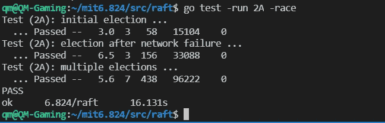

# 麻省理工学院之旅 6.824——实验室 2A 筏领导选举

> 原文：<https://medium.com/codex/journey-to-mit-6-824-lab-2a-raft-leader-election-974087a55740?source=collection_archive---------4----------------------->

由[格伦·凯莉](https://unsplash.com/@glencarrie?utm_source=medium&utm_medium=referral)在 [Unsplash](https://unsplash.com?utm_source=medium&utm_medium=referral) 拍摄的照片

距离实验一已经有一段时间了，这次我将讲述我是如何完成实验二 Raft 实现的。如果你对实验室一感兴趣，请查看这个[https://medium . com/codex/journey-to-MIT-6-824-la b-1-MapReduce-ebe 58800 ef9 e](/codex/journey-to-mit-6-824-lab-1-mapreduce-ebe58800ef9e)。

# 筏板概述

首先，我们来对 Raft 做一个概述。Raft 是管理复制日志的一致算法。我理解的 Raft 的核心思想是:

*   任何时候只有一个领导者才能避免大脑分裂的问题。
*   提交的日志保证被大多数人复制，因此它们不会丢失。
*   Raft 非常好理解，可以用来构建现实世界的系统。`etcd`在 k8s 中是使用 Raft 算法进行容错的。

本文 [***寻找可理解的共识算法***](https://www.usenix.org/system/files/conference/atc14/atc14-paper-ongaro.pdf) 涵盖了你需要了解的关于 Raft 的每一个细节，我强烈推荐仔细阅读多次。

本实验分为四个部分:a)领导者选举，b)日志，c)持续，d)日志压缩，我将逐一讲解。

# 2A 工党领袖选举

在整个实验 2 中，我们只需要在文件`raft.go`中编写代码。A 部分是关于领导者选举的，测试将创建多个服务器，并在超时前断言预期的领导者选举。

## 设计概述

让我们回顾一下上面的文章在高层次上介绍的领导人是如何选举产生的。

首先，在集群初始化时，所有服务器都作为从服务器启动。每个服务器将启动一个随机选择时间的计时器。当这个计时器触发时，服务器将自己从跟随者变成候选人。与此同时，它增加期限，并向所有对等方发送消息请求投票，然后等待回复。

当服务器收到投票请求时，它仅在以下情况下投票:

*   候选人有更高的任期
*   如果候选人有相同的术语，但日志至少是最新的。

否则，投票请求将被拒绝。一个对等体只能为一个任期的候选人投票，但当它收到另一个任期比它投票的候选人更长的投票请求时，它将放弃以前的投票。

如果候选人在下一次计时器启动前没有获得足够的选票，当前的投票将无效，候选人将开始新的任期更长的选举。

一旦候选人收到大多数同伴的投票，它就从候选人变成领导者，并立即广播权威以阻止其他服务器开始领导者选举。领导者将定期广播该信息。

这是关于设计的概述，现在让我们深入研究一下实现。

## 数据结构

对于第 2 部分，我们需要实现两个 RPC 调用:`RquestVote`和`AppendEntries`以及请求投票或追加条目的 ticker，以及支持它们的数据结构。

先说数据结构。根据上面的设计评审，除了实验室提供的字段，我们还需要:

*   `currentTerm`表示本服务器的当前期限
*   `votedFor`表明这个仆人在选举中投票给了谁
*   `leaderId`说出谁是现任领导人
*   `state`表示服务者是追随者、候选人还是领导者
*   `electionTimer`开始新的选举
*   `heartbeatTicker`定期追加领导条目
*   `logs`表示服务器拥有的日志条目

因此，筏形结构看起来如下:

**请求投票**

首先，让我们实现请求投票 RPC。在实验室提供的框架中，每个服务器实例已经有了一个`ticker()`函数，而`elelctionTimer`应该在 Make()函数中初始化。根据这篇论文，计时器应该是一个仔细选择的随机值。在本实验中，我们使用 300 毫秒到 450 毫秒之间的随机值来避免分裂投票问题。

即使在实验说明中，也不建议使用定时器和 go 的 ticker，因为定时器本身有一些微妙的技巧。我仍然相信使用它们利大于弊。

在 ticker()中添加当`electionTimer`触发时的处理程序:

现在让我们深入探讨一下当这个计时器触发时应该做些什么。

首先，每当计时器触发时，我们需要用一个新值重置计时器，这样计时器就可以重复触发。如果服务器状态是 leader，则什么都不做并返回，否则将服务器状态设置为候选并递增`currentTerm`。

接下来，服务器应该将`requestVote`消息发送给它的所有对等点。消息参数应该包含服务器的当前术语、候选 id、最后一个日志索引(即`len(rf.logs)`)和最后一个日志的术语(在 2A 实验室中始终为 0)。注意，这些 RPC 消息应该并行发送，所以我们为每个 RPC 调用启动一个 goroutine，并创建一个通道来接收对等体的投票结果。

所有消息发出后，它会一直监听结果通道来统计投票结果。如果成功接收到响应并检查投票是否被授权，否则，认为投票未被授权(或者，服务器可以继续发送请求投票，直到接收到响应)。

如果收到多数人的投票，服务器就声称它赢得了选举，并向当局广播。但在此之前，有一个角落的情况下，服务器的状态被改为追随者，因为当它正在计算投票结果，另一个服务器已经赢得了选举。在这种情况下，服务器除了终止选举之外什么也不做。

这就是服务器请求投票的方式。现在让我们看看服务器如何响应投票请求。

如果请求中的项较小，这是一个过时的选举，请求应该被拒绝。

如果请求中的术语高于服务器的术语，这意味着正在进行新的选举，如果服务器曾经对以前的术语投过票，服务器应该重置其投票。

否则，如果服务器没有投票，或者服务器已经投票给了这个候选人(如果 RPC 响应没有到达候选人，并且 RPC 被重试)，服务器应该对这两种情况中的任何一种进行投票:

*   候选人的上一任期高于服务器的上一任期。
*   候选项的最后一项等于服务器的最后一项，但候选项的日志等于或多于服务器。

## 追加条目

一旦服务器被选为领导者，它应该在`AppendEntries` RPC 调用中广播它的权限。在 lab2a 中，没有日志，但是`AppendEntries`仍然作为心跳被周期性地调用。服务器在实验室框架提供的`Make()`函数中初始化心跳 ticker，并在`ticker()`函数中处理 ticker fires 信号。注意:在本实验中，测试预计每秒不超过 10 次心跳，因此最小心跳间隔为 100 毫秒。

`sendAppendEntries`只是使用 go 例程发送 RPC 消息，包括领导者的当前任期、领导者 id 和日志(lab2a 中为空)。

在 lab2a 中，响应`AppendEntries`也很简单。如果领导任期更小，就返回 false。否则，服务器确保其保持为追随者状态，重置其选举计时器，并为其状态分配领导者的任期和领导者 id。

现在我们已经实现了 lab2a 的大部分内容，但是我们还必须实现`GetState`来让所有的测试都通过，这将返回当前的术语和一个 bool 值，表明这个服务器是否认为它是领导者。

如果我们运行测试，我们应该看到所有测试都通过了:

## 诀窍和提示

这个实验室在`util.go`文件中提供了一个有用的记录器。但是，时间戳和打印的日志在分钟级别停止，这对于调试来说是不够的。我们可以很容易地让它打印出带有微秒时间戳的日志，以便于调试，这在测试由于奇怪的原因失败时帮了我很大的忙。

如果你像我一样使用`time.Timer`，很可能你的程序会在测试中永远挂起。原因是与定时器相关联的信道的竞争条件。通常情况下，定时器的用法如下:

记住`ticker()`功能也读取频道，所以有可能频道在`ticker()`内被耗尽，但是定时器没有完全停止。如果我们再次重置计时器，它将停留在从该频道读取。要解决这个问题，稍微修改一下停止计时器的代码:

在这种情况下，如果在定时器停止之前通道已经排空，它将什么也不做。

这部分的完整代码可以在[https://github.com/QingpingMeng/mit6.824/pull/2](https://github.com/QingpingMeng/mit6.824/pull/2)找到。感谢阅读！