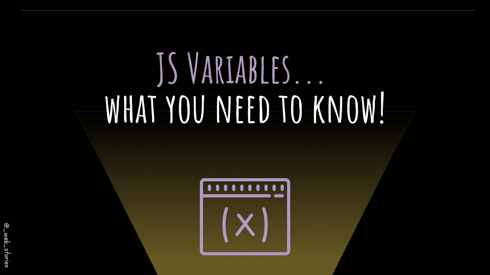

# JS 变量...你需要知道的！

> 原文：<https://medium.com/codex/js-variables-what-you-need-to-know-fb8994ed9d0d?source=collection_archive---------13----------------------->

## 关于 JS 变量的所有要点

作者:FAM

## 你好👋

一个没有数据的网页只是一个空白的网页，不是吗？😆

数据对任何 web 应用程序来说都是必不可少的，为了能够使用数据，操纵数据，在应用程序中做不可思议的事情，你需要变量来存储这些数据，并在需要时使用它们！