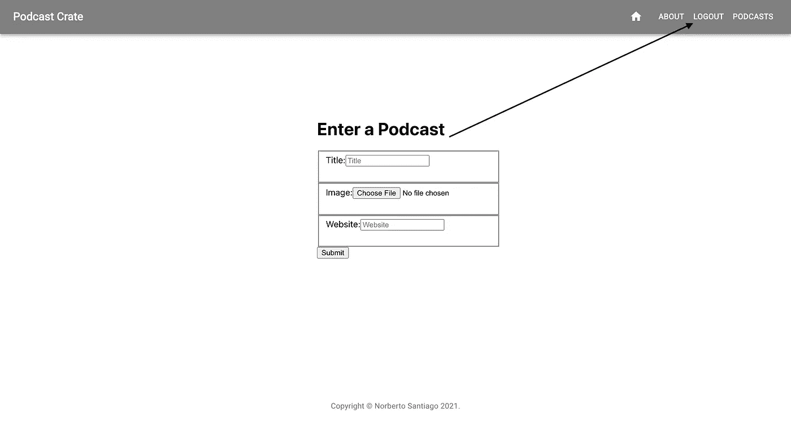

# React/Redux 上的 JSON Web 令牌认证

> 原文：<https://medium.com/codex/json-web-token-authentication-on-react-redux-982e5f003422?source=collection_archive---------0----------------------->


*2022 年 1 月 14 日更新，有重要说明和一些更新的代码片段。*

有一个词会经常出现，那就是认证。根据[韦氏词典](https://www.merriam-webster.com/dictionary/authentication)的说法，认证是显示某物(如身份、艺术品或金融交易)真实、真实或真实的行为、过程或方法。用技术术语来说，它将显示用户连接的应用程序是一个输入密码的正版应用程序。

让我们专注于 React-Redux 前端。如果您正在为您的 Bootcamp 组合项目寻找使用 Ruby on Rails 后端的身份验证，[该文档和 GitHub repo 是一个很好的演练](https://github.com/dakotalmartinez/rails-devise-jwt-tutorial)。他还得到了 [frontend React-Redux 演练](https://github.com/DakotaLMartinez/react-redux-auth-client)，虽然我的代码在调试了几个问题后结果是不一样的。

由于我们专注于身份验证，让我们假设我们已经通过运行命令`npx create-react-app my-app — template redux`创建了一个带有 Redux 的 React 应用程序，并且在实现身份验证之前拥有了我们想要的所有动作、组件和 reducers。

非常重要的是，在深入研究在我们的项目中添加身份验证之前，让我们确保我们添加了我们将要在 index.js 文件的`combineReducer`函数中实现的身份验证缩减器。

```
import authorization from './reducers/authorizationReducer'; const reducer = combineReducers({  
   podcasts,  
   authorization,
})
```

# 动作:

让我们继续前进，并得到行动头痛的方式。我最近了解到，最佳实践是将它们存储在同一个文件中。因此，在动作文件夹中，让我们创建一个文件，并将其命名为`actionTypes.js`。在该文件中，我们将添加动作类型`AUTHENTICATED`和`NOT_AUTHENTICATED`，并导出它们。

```
const AUTHENTICATED = 'AUTHENTICATED'
const NOT_AUTHENTICATED = 'NOT_AUTHENTICATED' export {AUTHENTICATED, NOT_AUTHENTICATED}
```

我们将通过创建一个名为 auth.js 的文件来创建导入动作类型的动作。在同一个文件中，我们将添加函数`setToken`、`getToken`和`deleteToken`，因为我们正在处理 [JWT 令牌，这些令牌将被相应地存储](https://javascript.plainenglish.io/where-to-store-the-json-web-token-jwt-4f76abcd4577)和删除。在这种情况下，我使用`localStorage`来保存那些令牌。

以下是整个文件:

在继续之前，让我们将所有的新动作导入到一个`index`文件中。

`export { signupUser, loginUser, logoutUser, checkAuth } from “./auth”;`

# 减速器:

现在我们已经完成了身份验证操作。让我们来照顾减速器。让我们转到 reducers 文件夹并创建文件`authorizationReducers.js`。还记得我们必须在`index.js`中为`combineReducers`功能添加授权吗？这是我们要导出减速器的地方。因此，让我们导入动作类型，声明一个初始状态并添加授权缩减器。

现在我们已经添加完了减速器。让我们深呼吸几秒钟。也许这是一个很好的时间来想想我们下一步该做什么。我们要创建组件吗？或者我们应该增加路线？对我来说，总是先有鸡还是先有蛋的困境。

# **路线:**

现在，在深呼吸，让我们到目前为止所学的一切都在脑海中沉淀下来之后，我们感觉放松了。让我们快速浏览一下我们的路线，以便能够连接到我们现有的组件。

就我而言，我在`app.js`文件中有路线。这是目前整个文件的样子。

在 React 项目中，路由是最简单的设置。安装`react-router-dom`，从库中导入，创建路线。除了一些例外，它可能是整个项目中最简单的一行代码。但是，接下来，我想集中讨论这两条路线:

```
<Route exact path='/' component={Home}/> <Route exact path='/about' render={(routerProps) => <wrappedComponents.AuthenticatedAbout {...routerProps}/>}/> <Route exact path='/signup' component={Signup} /> <Route exact path='/login' component={Login} /> <Route exact path='/logout' render={(routerProps) => <wrappedComponents.AuthenticatedLogout protected {...routerProps} />}/> <Route exact path='/podcasts/new' render={(routerProps) => <wrappedComponents.ProtectedPodcastInput protected {...routerProps} />}/> <Route exact path='/podcasts' render={(routerProps) => <wrappedComponents.AuthenticatedPodcasts {...routerProps} podcasts={this.props.podcasts}/>}/> 
```

注意组件名看起来有什么不同吗？这是因为我们需要调用`wrappedComponents`并确定那些将被保护的路由，并告诉我们将在导航栏中添加的三元条件语句何时显示登录和注册按钮以及何时显示注销按钮。

# 组件:

为了识别受保护的路由和不受保护的路由，让我们在 components 文件夹中创建一个文件并调用`index.js`。在这个文件中，我们将导入我们想要声明为`authComponents`或`protComponents`的组件，这些组件是我们认为重要的对象。此外，我们还将导入一个名为`withAuth`的重要组件，我们将在后面创建它。

```
import About from "./About";
import Podcasts from './Podcasts';
import PodcastInput from "./PodcastInput";
import PodcastEdit from "./PodcastEdit";
import Logout from "./Logout";
import Episodes from "./Episodes"
import withAuth from "./WithAuth"; const authComponents = {About, Podcasts, Logout, Episodes}
const protComponents = {PodcastEdit, PodcastInput}
```

接下来，我们创建空对象，创建两个名为`authenticatedComponents`和`protectedComponents`的空对象。

```
const authenticatedComponents = {}const protectedComponents = {}
```

现在我们已经创建了所有的四个对象，让我们添加两个循环，在其中我们将得到`withAuth`的结果并生成值。这些将作为`wrappedComponents`从文件导出到路线。

下面是整个`index.js`文件的样子:

说到`Wrapped`，那是我们将要在 withAuth.js 组件文件中创建的类组件。在那里，我们将处理从 actions 文件夹中的`index.js`文件导入的所有认证动作。我们甚至导入了一个加载指示器文件，如果你想在用户等待认证的时候变得有趣的话。

没有登录或注册页面，就没有认证。因此，让我们继续创建这两个组件。

**注意:**从`path=’/’`开始不要添加主页或任何其他组件作为保护组件。用受保护的组件启动 react 会导致后端崩溃。

**报名:**

**登录:**

**注销:**

最后，我们可以调整导航条来适应新的身份验证。我想提醒这个项目是用 Material-ui 实现的。更多详情请参考他们的[应用程序栏文档](https://mui.com/components/app-bar/)。整个`navbar.js`看起来是这样的:

我想着重谈以下几点:

从 react-redux 导入`useSelector`钩子。

`import { useSelector } from ‘react-redux’`

在`NavBar`函数中创建`loggedIn`钩子。

`const loggedIn = useSelector(state => state.authorization.loggedIn)`

在您想要显示认证特性切换按钮的`Navbar`类中，我们将输入以下代码。

现在，我们将能够注册新用户，登录现有用户，并在可能的时候注销。只需点击导航栏中的链接。



这里有一个截图，显示了在导航栏中使用注销按钮时，创建播客页面的外观。当前版本没有主页图标，但截屏只是一个例子。


这个过程很长，但是可以通过提供的文档、一些研究、一些帮助和耐心来完成。谁知道呢？也许你得到了这个惊人的项目，在实现认证时不会破坏那么多。

希望你能做到，我也希望这能帮助你。编码快乐！

# 总结:

1.  认证介绍。
2.  开始在 React-Redux 项目中实现身份验证。
3.  行动
4.  还原剂
5.  路线
6.  成分
7.  索引
8.  withAuth
9.  注册、登录、注销
10.  导航条

# 参考资料:

1.  https://www.merriam-webster.com/dictionary/authentication
2.  Dakota L Martinez，在 Github 上设计 Ruby Gem & JWT 文档:[https://Github . com/dakotalmartinez/rails-device-jwt-tutorial](https://github.com/dakotalmartinez/rails-devise-jwt-tutorial)
3.  Dakota L Martinez，React-Redux Github 上的 JWT 认证文档:【https://github.com/DakotaLMartinez/react-redux-auth-client 
4.  Naveen DA，你应该在哪里存储 JSON Web 令牌:[https://JavaScript . plain English . io/Where-to-Store-the-JSON-we b-token-jwt-4 f 76 ABCD 4577](https://javascript.plainenglish.io/where-to-store-the-json-web-token-jwt-4f76abcd4577)
5.  材质-ui App 栏文档:[https://mui.com/components/app-bar/](https://mui.com/components/app-bar/)