# 审判日:评估分类模型

> 原文：<https://medium.com/codex/judgement-day-evaluating-classification-models-c2667c9a7a47?source=collection_archive---------11----------------------->

我记得在 [Banana Data](https://banana-data.buzzsprout.com/) 上有一集，主持人在讨论人工智能写的笑话，并讨论当时 Gmail 预测文本功能的开端。这让我对模型评估产生了疑问:鉴于机器学习模型的广泛应用，到底什么是好模型，什么是坏模型？

在深入讨论之前，让我们先弄清楚模型评估中一个非常重要的词，这个词经常被错误地使用:准确性。

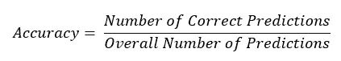

看起来很简单，对吧？虽然准确性看起来是评估模型的一个很好的标准，但是在很多情况下，这可能更有问题。对于不平衡的数据集来说尤其如此:一个类的数据比其他类多。然后，我们的模型将在不平衡数据集上进行训练，从而产生有利于具有更多代表性的类的高准确度分数。然而，我们的测试集或看不见的数据的准确性分数可能会非常低。那么，该怎么办呢？

在本文中，我将关注可以结合使用来判断我们的模型的各种模型度量。然而，重要的是要注意，有一些方法可以处理不平衡的数据集，甚至在创建模型之前就使它们平衡。查看[这篇文章](https://developers.google.com/machine-learning/data-prep/construct/sampling-splitting/imbalanced-data#:~:text=An%20effective%20way%20to%20handle,of%20the%20majority%20class%20examples.)，它对处理不平衡数据有很好的总结。在其他情况下，由于项目成功的标准，准确性可能不是理想的分数；机器学习应用于众多学科，因此需要领域知识来确定最合适的指标。那么，各种度量标准是什么，我们如何计算它们呢？

# 混淆矩阵

计算各种模型度量的一个很好的方法是首先查看混淆矩阵。混淆矩阵是矩阵的一种。你可以把它想象成一张表，在这张表中，我们列出了一个模型做出的正确和错误预测的数量，与被模拟的真实情况的数值进行了比较。

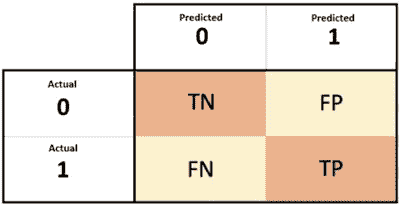

一个混淆矩阵的例子由[包装](https://subscription.packtpub.com/book/data/9781838555078/6/ch06lvl1sec34/confusion-matrix)

让我们快速浏览一下 TN、FP、FN 和 TP 的含义，然后再回到如何在模型评估中使用它们。

**TN:**True Negative-被正确预测为 0 类的预测数。
**FP:** 误报——将 0 类对象分类为 1 类的错误预测数。
**FN:** 假阴性-将 1 类对象分类为 0 类的错误预测数。
**TP:**True Positive-被正确预测为类别 1 的预测数。

这些有什么用？让我们来看看分类模型中最常用的一些指标。

# 回忆:真实阳性率

回忆有时被称为模型的敏感性。这有助于我们计算出该模型在预测正类中的对象方面有多好。

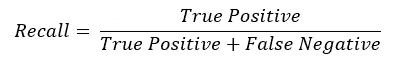

# 精度:正预测值

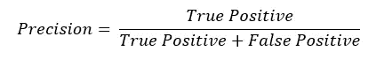

让我们以我的[乳腺癌分类](https://github.com/iban121/Springboard/blob/main/CapstoneProject_2/Notebooks/Preprocessing%20and%20Modelling.ipynb)项目为例，来理解阳性预测值测量的是什么:它是从所有恶性样本中正确分类为恶性的数量。

那么，我们应该使用哪一个呢？当然，在一个理想的世界里，或者在数据世界里，你在数据集中有完全可区分的类，我们可以让它们都有 1.0 分。这种情况很少发生。我们发现，当我们调整我们的模型并改进其中一个指标时，另一个指标将不可避免地下降。这不一定是一件坏事，但也不意味着我们的模式注定要失败。在很多情况下，优先考虑一个比另一个更有利。例如，在医学测试中，召回经常受到青睐，因为这给出了比精确度更高的假阳性率，因为医学诊断依赖于多个测试而不是一个测试。

我们如何确定其中一个优先于另一个？我们设置一个由情况决定的阈值，以确定一个人应该被偏爱的比率。例如，如果我们有一个不平衡的数据集，我们可以针对不同的阈值绘制我们的精确度分数和召回分数，以确定最佳的阈值。[看看这篇文章，它对精确召回曲线提供了很好的见解。](https://classeval.wordpress.com/introduction/introduction-to-the-precision-recall-plot/)

# F-1 分数

这是一个范围从 0 到 1 的值，其中 1 表示完美的精确度和召回率，0 表示两者的分数都很低。

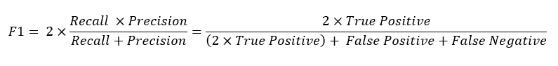

由于 F-1 分数取决于召回率*和精确度*分数，它可以是一个更好的衡量标准来判断我们的模型。F-1 得分越高，越接近 1，[其他两个指标的值](https://towardsdatascience.com/a-look-at-precision-recall-and-f1-score-36b5fd0dd3ec#:~:text=Some%20advantages%20of%20F1%2Dscore,metric%20across%20positive%2Fnegative%20samples.)就越高。

# 脱落:假阳性率

正如我前面提到的，在评估一个模型时，有假阳性率比其他指标更受青睐的例子。这可以计算为:

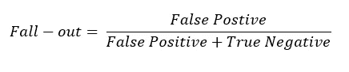

# 特异性:真阴性率

我喜欢把这个看作是负面类的回忆分数。

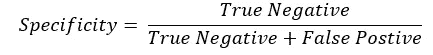

有时使用[特异性比灵敏度](https://vitalflux.com/ml-metrics-sensitivity-vs-specificity-difference/)更有优势，但同样，这取决于情况的性质。

# 中华民国和中华民国下的区域

接受者-操作者特征曲线(ROC)是所有阈值的真阳性率对假阳性率(召回率对脱落率)的图。下面是我为我的二元分类项目创建的两个不同的 K 近邻模型的两个 roc。

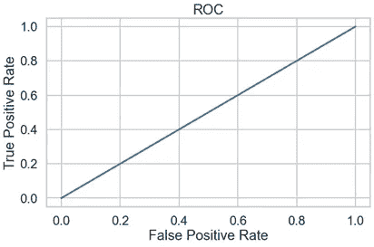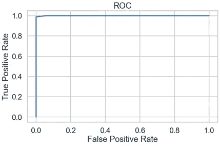

左边的图表明模型有 50%的机会正确预测类别，因此如果我们远离直线，那么模型在预测方面更好。右图显示了一个好得多的模型；在这种情况下，该模型在 99.99%的情况下都能正确预测。这个“机会”由曲线下的面积表示，因此面积越高，模型越好。

# 马修斯相关系数

MCC 是解决不平衡数据集分类问题的另一个好方法。

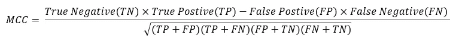

看起来很复杂，对吧？我不会担心记住公式，而是理解公式的含义。最终，Scikit Learn 或 Stats model 只需一行代码就能为我们提供 MCC。那么什么是 MCC 呢？您可以将 MCC 视为类似卡方统计的东西，它适用于二元和多类分类问题。从上面的等式中我们可以看出，只有对 正类和负类的*都做出大量的正确预测，MCC 才会有高分。[与准确度分数和 F1 分数](https://bmcgenomics.biomedcentral.com/articles/10.1186/s12864-019-6413-7#:~:text=As%20we%20explained%20earlier%2C%20the,any%20class%20balance%20or%20imbalance.)相比，它可以更好地判断不平衡数据集的模型。*

# 使用 Scikit Learn 评估模型

如果您对模型评估的 pythonic 方法感兴趣，我推荐使用 Scikit Learn。它不费吹灰之力就说出了几乎所有这些指标。下面是 Python 中必要的导入和典型输出的一个简单例子。下面的代码和数字来自我的项目，如果你感兴趣的话，请随意深入研究。

典型的格式是:

```
from sklearn.metrics import <metrics you want>

metrics(actual_values , model_predictions)
```

因此，对于我的一个 K 近邻模型，这里有一个 Scikit Learn 给我们的例子。

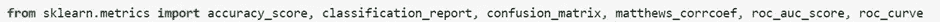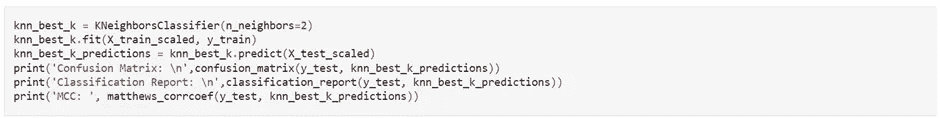

输出:

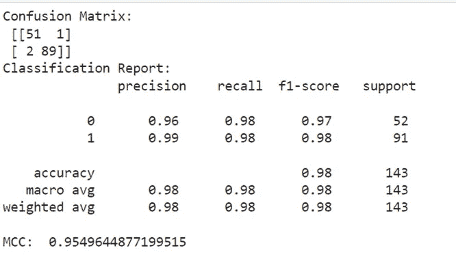

如您所见，大部分指标也是在分类报告中为我们计算的，这是一个很好的单行程序，为我们节省了一点麻烦。

我总是喜欢将 ROC 曲线可视化，所以我为这个模型做了以下工作:

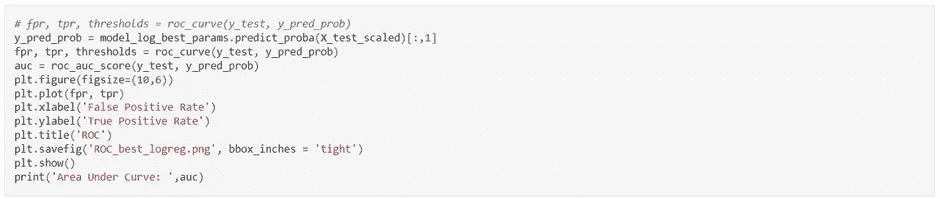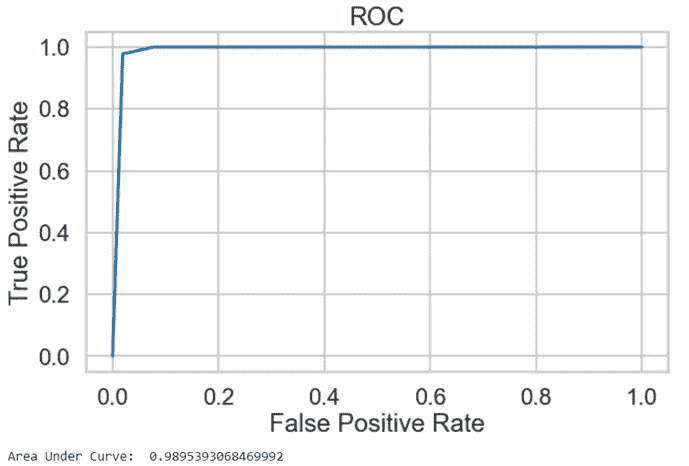

总的来说，这是数据科学学科中又一个无价的工具。