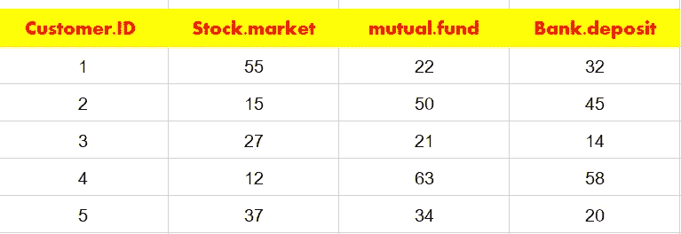
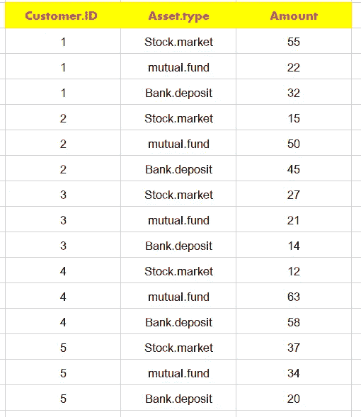
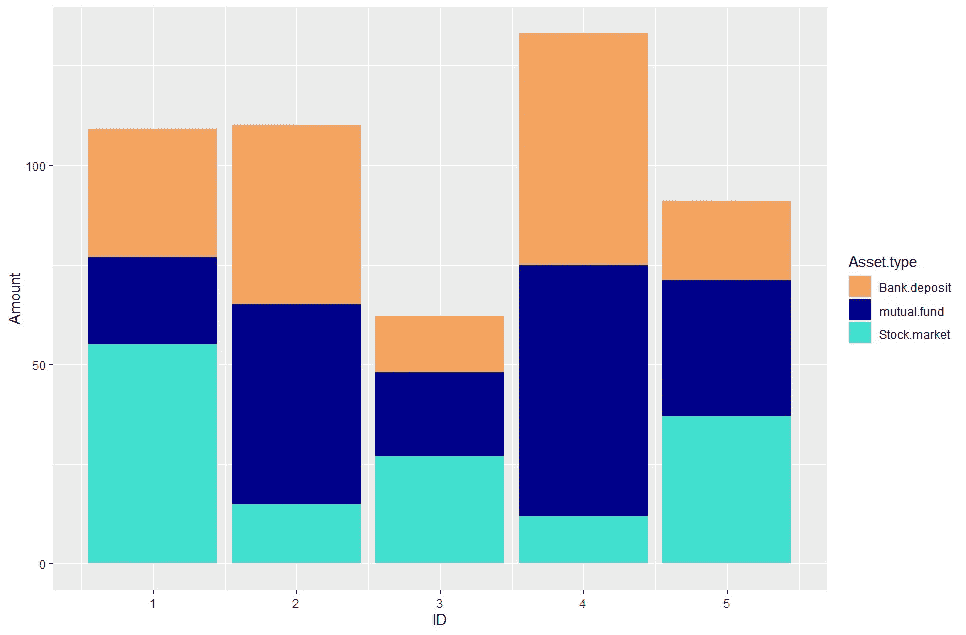
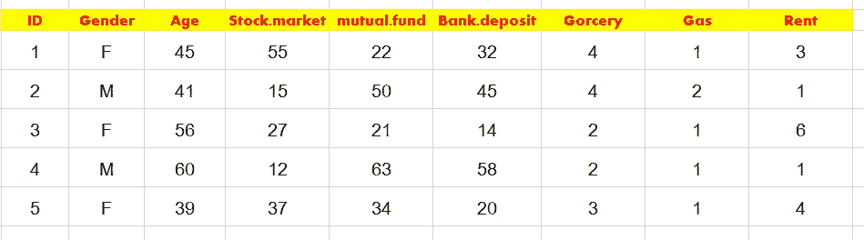
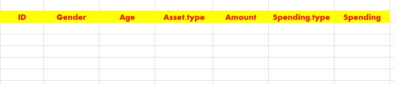
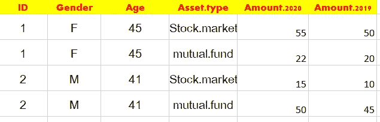
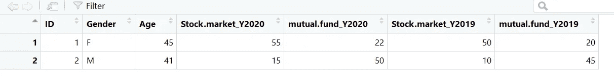

# 在 R 中处理宽类型和长类型数据:一种简单的好方法

> 原文：<https://medium.com/codex/juggling-wide-and-long-types-data-in-r-a-nice-and-easy-approach-e2473707f42f?source=collection_archive---------11----------------------->


您可能会听到人们谈论宽和长类型数据。什么是宽类型数据？这是一个由五个人组成的投资组合的例子。第一列记录个人 IDs 到 5)，其余记录每个个人投资于三种类型资产的金额:*股票.市场、共同基金*和*银行.存款*。



宽类型是常见的数据类型。如果我们想要汇总个人(或者更一般意义上的主题)的相似多维信息，它可能是默认的数据类型。销售经理可以使用广泛的数据来跟踪销售人员的每月表现，教师可以使用广泛的数据来记录学生在不同测试中的成绩，等等。

有时，数据分析要求以长格式提供数据。长数据记录相同数量的信息，但以不同的方式呈现信息。顾名思义，它比宽数据长，但比宽数据窄。如果我们在一个长数据中呈现投资组合；看起来是这样的:



前三排属于个人一号。她的性别和年龄信息重复三次(为什么是三次？)，对每一个个体也是如此。我们可以看到创建了两个新列:一列存储资产的类型，另一列存储该资产的投资额。

为什么要烦恼转型？原因有很多。R 中的许多分析要求数据是长类型的；为了共同绘制多个变量和生成图例，一些 ggplot 任务也需要长数据。或者你只有宽数据，一个编程语言只接受长类型，你要把 R 中的数据扯皮导出。

例如，如何使用上述数据绘制一个条形图，显示每项资产的相对投资部分？没有宽/长的变形，这项工作是困难的。



因此，在 R 学习的这个阶段，非常需要掌握一个简单的技巧来将 wide 转换成 long，以及 long 转换成 wide。解决了不该头疼的头疼。

在 R 中，人们曾经在 Reshape 2 包中使用 *dcast* 和 *melt* 函数，后来*展开*和*集合*函数在 *tidyr* 包中完成这项工作。各有利弊。随着新的 *tidyr* 包中 *pivot _longer* 和 *pivot_wider* 函数的引入，我们终于有了这个漂亮而简单的工具。

上述投资组合数据是转型的理想案例，因为每个人都投资于所有三种资产。使用管道操作，很容易在您自己身上复制以下结果。

将下面的全部代码复制到你的 R Studio 中导入 wide 数据，命名为 df.wide，关于 *read.table* 函数的一些图示可以在这篇[文章](/codex/a-comprehensive-summary-of-data-import-in-r-from-the-most-user-friendly-to-the-most-time-saving-6c87319b1927)中找到。

```
library(tidyr)df.wide=read.table(text="
ID  Gender Age Stock.market mutual.fund Bank.deposit
1 F 45 55 22 32
2 M 41 15 50 45
3 F 56 27 21 14
4 M 60 12 63 58
5 F 39 37 34 20
",header =T)df.wide %>% pivot_longer(4:6,names_to=”Asset.type”,values_to=”Amount”)->df.long
```

在上面的代码中，4:6 是我们希望 R 进行转换的列 id；此外，我们使用 *names_to* 参数指定了一个新列，这意味着您希望将 4:6(股票、市场、共同基金等)的列名放入这个新列，并将其命名为 *Asset.type* 。我们还使用 *values_to* 参数指定一个新列来存储相应的金额，并将这个新列命名为 *Amount* 。

相应地， *pivot_wider* 将 long 数据转换回 wide，切换参数 *names_from* 和 *values_from* 。

```
df.long %>% pivot_wider(names_from=”Asset.type”,values_from=”Amount”)
```

在上面的行中，引号可以删除。但是为了和 pivot_longer 的一致性，我们最好还是保留它们。

我没有将上述结果保存到新的 data.frame 中，因为我已经有了宽数据。您可以检查转换是否完成。

很简单，对吧？现在让我们看一些更复杂的场景。

完成数据。当我们从长变宽时，它们会让人头疼。比如下面我们去掉最后两行 *df.long* 。因此，没有关于个人 5 在共同基金和银行存款中的投资的信息。我们称这个新的长数据为 df.long2 ，

```
df.long2=read.table(text="Customer.ID Gender Age Asset.type Amount
1 F 45 Stock.market 55
1 F 45 mutual.fund 22
1 F 45 Bank.deposit 32
2 M 41 Stock.market 15
2 M 41 mutual.fund 50
2 M 41 Bank.deposit 45
3 F 56 Stock.market 27
3 F 56 mutual.fund 21
3 F 56 Bank.deposit 14
4 M 60 Stock.market 12
4 M 60 mutual.fund 63
4 M 60 Bank.deposit 58
5 F 39 Stock.market 37
",header =T)
```

看起来像这样:

```
Customer.ID Gender Age   Asset.type amount
1            1      F  45 Stock.market     55
2            1      F  45  mutual.fund     22
3            1      F  45 Bank.deposit     32
4            2      M  41 Stock.market     15
5            2      M  41  mutual.fund     50
6            2      M  41 Bank.deposit     45
7            3      F  56 Stock.market     27
8            3      F  56  mutual.fund     21
9            3      F  56 Bank.deposit     14
10           4      M  60 Stock.market     12
11           4      M  60  mutual.fund     63
12           4      M  60 Bank.deposit     58
**13           5      F  39 Stock.market     37**
```

如果我们使用上面的代码直接从长到宽进行转换，我们最终会得到这样的数据帧:

```
Customer.ID Gender   Age Stock.market mutual.fund Bank.deposit
        *<int>* *<chr>*  *<int>*        *<int>*       *<int>*        *<int>*
1           1 F         45           55          22           32
2           2 M         41           15          50           45
3           3 F         56           27          21           14
4           4 M         60           12          63           58
5           5 F         39           37          **NA           NA**
```

仍然创建宽数据，但是 R 使用 NA 替换丢失的值。如果我们确定个人五在这两项资产上投资为零，我们可以用零代替 NA。在代码中，我们将 v *alues_fill=0 的参数添加到 *pivot_wider* 中。*

```
df.long2 %>% pivot_wider(names_from="Asset.type",values_from="Amount",values_fill=0)
```

您可以用任何想要的值来替换零。

```
Customer.ID Gender   Age Stock.market mutual.fund Bank.deposit
        *<int>* *<chr>*  *<int>*        *<int>*       *<int>*        *<int>*
1           1 F         45           55          22           32
2           2 M         41           15          50           45
3           3 F         56           27          21           14
4           4 M         60           12          63           58
5           5 F         39           37           **0            0**
```

另一个复杂的场景正好相反:一个人有多行映射到一列。例如，在上面的投资组合数据框架中，个人 1 有两行银行存款，一行的贷方金额为 32，另一行为 70。

```
df.long3=read.table(text="Customer.ID Gender Age Asset.type Amount
1 F 45 Stock.market 55
1 F 45 mutual.fund 22
**1 F 45 Bank.deposit 32
1 F 45 Bank.deposit 70**
2 M 41 Stock.market 15
2 M 41 mutual.fund 50
2 M 41 Bank.deposit 45
3 F 56 Stock.market 27
3 F 56 mutual.fund 21
3 F 56 Bank.deposit 14
4 M 60 Stock.market 12
4 M 60 mutual.fund 63
4 M 60 Bank.deposit 58
5 F 39 Stock.market 37
",header =T)
```

如果我们直接使用 *pivot_wider* ，我们会得到错误消息。这是因为我们首先需要回答一个问题:在转换后的宽数据中，我们要为个人的银行存款记录什么信息？是 32 和 7 的和，还是 32 和 70 的平均值，还是 32 和 70 的最大值？只有在我们告诉 *pivot_wider* 我们的决定后，我们才能继续。

假设我们想得到银行存款总额。为此，我们添加 *values_fn=sum* 来告诉 R 对所有个人及其资产类型进行求和。

```
df.long3 %>% pivot_wider(names_from="Asset.type",values_from="Amount",values_fill=0,values_fn=sum)
```

当然，只执行一次求和:将个人的两笔银行存款相加，并将值(32+70=102)存储到新转换的 wide 数据中的 *Bank.deposit* 列。

```
Customer.ID Gender   Age Stock.market mutual.fund Bank.deposit
        *<int>* *<chr>*  *<int>*        *<int>*       *<int>*        *<int>*
1           1 F         45           55          22        **  102**
2           2 M         41           15          50           45
3           3 F         56           27          21           14
4           4 M         60           12          63           58
5           5 F         39           37           0            0
```

接下来，我们考虑一个更复杂的情况，您打算转换两个类别的大量数据。为了形成示例，我们向投资组合数据框架添加三列(食品杂货、汽油和租金)来表示这些个人的支出。



我们希望转换后的数据看起来像这样。



这是代码。我们使用两次 *pivot_longer* 。并且每次我们指定分别存储项目名称和值的列。此外，先执行第一个 *pivot_longer* 函数来标识食品杂货、汽油和租金的列 id 也很有用。

```
df.wide2=read.table(text="ID Gender Age Stock.market mutual.fund Bank.deposit Grocery Gas Rent
1 F 45 55 22 32 4 1 3
2 M 41 15 50 45 4 2 1
3 F 56 27 21 14 2 1 6
4 M 60 12 63 58 2 1 1
5 F 39 37 34 20 3 1 4
",header =T)df.wide2 %>% pivot_longer(4:6,names_to="Asset.type",values_to="Amount") %>% pivot_longer(4:6,names_to="Spending.type",values_to="Spending")
```

您将生成以下宽数据帧。

```
ID Gender   Age Asset.type   Amount Spending.type Spending
   *<int>* *<chr>*  *<int>* *<chr>*         *<int>* *<chr>*            *<int>*
 1     1 F         45 Stock.market     55 Grocery              4
 2     1 F         45 Stock.market     55 Gas                  1
 3     1 F         45 Stock.market     55 Rent                 3
 4     1 F         45 mutual.fund      22 Grocery              4
 5     1 F         45 mutual.fund      22 Gas                  1
 6     1 F         45 mutual.fund      22 Rent                 3
 7     1 F         45 Bank.deposit     32 Grocery              4
 8     1 F         45 Bank.deposit     32 Gas                  1
 9     1 F         45 Bank.deposit     32 Rent                 3
10     2 M         41 Stock.market     15 Grocery              4
# ... with 35 more rows
```

最后，有时我们需要转换混合 long-wide 类型中的多个列值，如下所示。



在上面的数据框架中，每种资产类型都有 2019 年和 2020 年的值，分别显示在两个单独的列中(宽类型)。然而，对于资产类型，每个 ID 占据两行(长类型)。

让我们导入数据。

```
df.long4=read.table(text="ID Gender Age Asset.type Amount.2020 Amount.2019
1 F 45 Stock.market 55 50
1 F 45 mutual.fund 22 20
2 M 41 Stock.market 15 10
2 M 41 mutual.fund 50 45
",header =T)
```

我们首先将两列*、Amount.2020* 和 *Amount.2019* 分别重命名为 *Y2020* 和 *Y2019* ，为新列创建易于解释的名称。然后我们使用 *pivot_wider* 并指定要转换的值的向量( *Y2020 和 Y2019)* 。此外，我们使用 *names_glue* 指定新列名的格式为 *Asset.type_Year* 。

```
df.wide3=df.long4%>% rename(Y2020=Amount.2020,Y2019=Amount.2019)%>% pivot_wider(names_from=Asset.type,values_from=c(Y2020,Y2019),names_glue = "{Asset.type}_{.value}")
```

新生成的宽数据如下所示



我们可以进一步将这个宽数据转换回一个“完整的”长数据，每个 ID 占据四行。我们使用“_”将 *names_to* argument 分隔成多个列，以使摘要更加清晰。

```
df.wide3%>%
pivot_longer(contains("_"),names_to=c("Asset","Year"),values_to="Amount",names_sep="_")
```

最后的最后，关于文章开头出现的情节。学会了我在这篇文章中描述的内容，你就可以简单明了地绘制它了！

```
library(ggplot2)df.wide %>% pivot_longer(4:6,names_to=”Asset.type”,values_to=”Amount”)%>% ggplot() + geom_col(aes(x=ID,y=Amount,fill=Asset.type),position=”stack”) +scale_fill_manual(values=c(“sandybrown”,”darkblue”,”turquoise”))
```

*#希望这篇文章让长/宽转换不再是你的问题。*