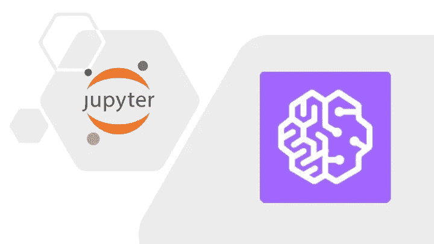

# Jupyter 笔记本和向 Sagemaker 工作室实验室和画布的演变

> 原文：<https://medium.com/codex/jupyter-notebook-and-evolution-towards-sagemaker-studio-lab-and-canvas-5c33c907b88c?source=collection_archive---------6----------------------->

## [云计算](https://towardsai.net/p/category/cloud-computing)

## 亚马逊机器学习工具包将 AI 开发产业化

Jupyter Notebook 于 2014 年发布，是一个面向数据科学家和从业者的开源、基于 web 的机器学习开发环境。Jupyter 笔记本是独立于语言和…