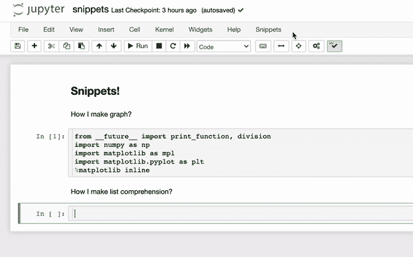

# 朱庇特笔记本能做到吗？

> 原文：<https://medium.com/codex/jupyter-notebook-can-do-that-b3185058fe76?source=collection_archive---------1----------------------->

## **用几个关键扩展来充实你的细胞**

等等，不是那些细胞。|图片由 [CDC](https://unsplash.com/@cdc?utm_source=medium&utm_medium=referral) 在 [Unsplash](https://unsplash.com?utm_source=medium&utm_medium=referral) 上拍摄

作为数据科学和一般编码的新手，我仍然在掌握 Jupyter Notebook 的窍门。我从 [Flatiron 的免费在线课程](https://flatironschool.com/learn-to-code-for-free/)和[哈佛的 CS50 on edX](https://www.edx.org/course/introduction-computer-science-harvardx-cs50x) *(爱你，* [*大卫*](https://www.newyorker.com/news/our-local-correspondents/how-harvards-star-computer-science-professor-built-a-distance-learning-empire) *)中学到了 IDE 编程的基本知识！)*，但是 Jupyter 笔记本是完全不同的动物。必须按顺序运行的细胞？降价什么？

键盘快捷键是迈向舒适的第一步。我很快学会了:

*   添加单元格(`A`表示上方，`B`表示下方)
*   删除单元格(`X`)
*   在代码(`Y`)和标记(`M`)之间切换
*   在命令(`esc`)和代码(`return`)之间切换
*   运行单元(`shift` + `tab`)

仅仅这几条捷径就让我的工作流程变得更快更干净，但我知道还有更多的捷径。

# 请看:扩展！

稍微谷歌一下，我就发现了 [Jupyter 扩展](https://github.com/ipython-contrib/jupyter_contrib_nbextensions)，这是一个用户创建的附加组件库，它极大地增强了在 Jupyter 笔记本上编码的体验。如果你有过这样的想法，“我希望我能在 Jupyter 笔记本上”，那么很有可能有一个扩展。

一旦你安装了 Jupyter Extensions，当你启动 Jupyter Notebook 时，你会看到一个新的标签“Nbextensions”。在这里，您可以单击每个扩展阅读简要描述或操作方法:

这么多扩展！

# 以下是我目前的最爱:

## 片段

不管我不得不输入多少次`import matplotlib.pyplot as plt`，还是会有忘记怎么拼写的时候。在摘录之前，我不得不检查我的其他笔记本或谷歌一下。但现在我可以点击 Snippets 菜单，将鼠标悬停在 Matplotlib 上，然后点击“笔记本设置”等:

“从未来开始”的任务是确保兼容性

当然，那里有一些我不需要的多余的行，但是删除它们仍然比谷歌搜索要快。

其他时候，我的手指在键盘上盘旋，凝视着天空，大脑一片空白，拼命地试图记住理解列表的语法。iterable 在输出之前吗？`in`去哪里？不再好奇:

就像魔法一样！

显然 Snippets 不知道我在做什么，我在使用什么变量，或者我想从什么操作开始制作列表。它只是填充了一个我可以编辑的低级例子，在这个例子中是一个从-10 到 10 的`x`的方块列表。我需要用我想对 iterable 中的每一项`x`执行的操作来替换`x**2`(并且可能将变量从`x`改为更具体/描述性的)。还有一个用条件语句理解列表的片段。

代码片段 ***不是*** 为你写代码！它只是为样板代码提供可编辑的模板。如果你有信心的话，这可能比你自己写出来要慢，但肯定比搜索或筛选堆栈溢出响应要快。对于像我这样仍在学习基础知识的人来说，这是一个很好的工具。

## 变量检查器

我经常给一个变量赋值，但是后来忘记从单元格返回它的值或者添加一个打印函数来查看它，所以我编辑并重新运行单元格。但是如果单元格中的代码对变量进行操作，那么第二次运行它会再次执行操作并改变变量的值…现在我必须从头开始运行所有的操作。如此令人沮丧和低效！

一定有更好的办法！

有了变量检查器，即使我忘记了返回或打印变量，我也可以轻松地查看我的代码以了解它的当前状态:

对你的代码来说就像 x 光眼镜！

## 便条簿

当我在处理熊猫数据帧时，我经常发现我的笔记本上堆满了六个单元格，充满了像`df.head()`、`df.info()`、`df.shape`、`df.describe()`这样的代码……你应该明白了。虽然有时我可能想在笔记本中使用它们，但通常我只是使用它们来确保我想使用的函数确实返回我认为它会返回的结果。我不是那种不顾一切地在函数调用中抛出`inplace=True`而不先检查的编码狂魔！但是我也不想在一个杂乱无章的笔记本上滚动，上面布满了我最终会删除的单元格。输入草稿栏:

这就像在你应该打开礼物之前打开它，却没有留下任何书面痕迹…

Scratchpad 只提供了一个单元格供您使用，但其思想是将其用于一次性检查和测试。你甚至可以用 matplotlib 显示图表。但是请注意:您执行的任何操作或分配的变量*都可能并且将会*影响您笔记本的状态！换句话说，在 Scratchpad 单元中运行`x=5`会在内核中创建一个全局变量`x`，该变量的赋值为`5`，可以在其他单元中访问。当心在没有书面记录的情况下改变你的变量！

# 外面还有更多…

这些只是我目前最喜欢的 3 款 Jupyter 笔记本扩展。以下是我试验过的其他一些例子:

*   Python Markdown 允许您将变量值动态插入 Markdown 单元格中(如字符串格式)
*   Live Markdown Preview 和它听起来的一样，在处理 MathJax 格式时特别有用
*   Runtools 为一次运行多个单元提供了键盘快捷键和标签选项
*   移动选定的单元格也像它听起来的那样，代替了繁琐但却是必要的选择→剪切→新建单元格→粘贴工作流程
*   Gist-它提供了将当前笔记本保存为 Github Gist 的快捷方式，这可能会对将来的中型帖子有用…

请在评论中告诉我你使用哪些扩展，或者你是否有更好的方法来利用 Jupyter Notebook 的功能。更不用说 Jupyter Labs 的整个世界(它有一个很棒而且相当新的调试器)，但我将把它留到另一篇文章中。快乐延伸！

木星巨大的红色内核|照片由 [NASA](https://unsplash.com/@nasa?utm_source=medium&utm_medium=referral) 在 [Unsplash](https://unsplash.com?utm_source=medium&utm_medium=referral) 上拍摄