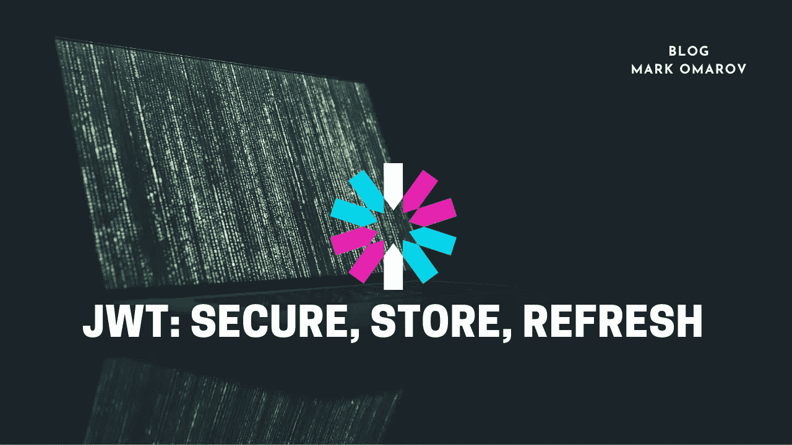
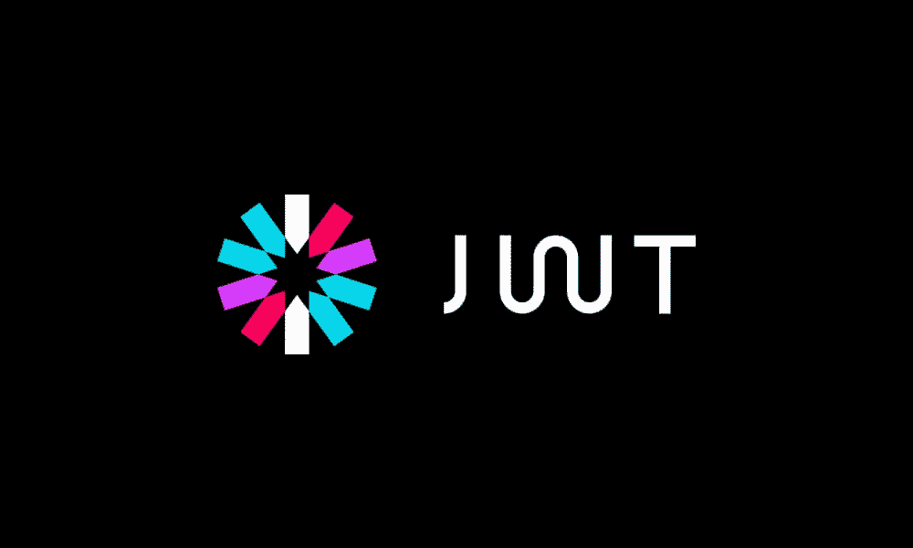

# JWT:安全、存储、更新

> 原文：<https://medium.com/codex/jwt-secure-store-refresh-7c4f9471b479?source=collection_archive---------2----------------------->

## 关于如何安全地操作 jwt、存储和刷新令牌的另一个观点

今天我将解释为什么将 JWT 存储在浏览器的离线存储中，比如 localStorage，或者通过 JavaScript 访问的 cookies 中，可能不是最佳选择。

让我们从 JWT 开始。我不解释它的用途和它是什么。我想你已经对 JWT、XSS/CSRF 和 HTTPS 有了基本的了解。

如果你对 JWT 不熟悉，请参考这里的这篇文章。如果你想更多地了解 XSS，请访问 OWASP 上的[这篇文章。对于](https://owasp.org/www-community/attacks/xss/) [CSRF，OWASP 也有另一篇文章](https://owasp.org/www-community/attacks/csrf)。最后，对于 [HTTP(S)，查看 Cloudflare 的文章。](https://www.cloudflare.com/learning/ssl/what-is-https/)

## **JWT 应该有什么**

你不想在 JWT 存储任何敏感数据。记住，任何拿到令牌的人都可以在没有密钥的情况下读取令牌上的声明。因此，避免存储可能危及用户、内部流程或任何敏感信息的用户详细信息。例如，您可以保留用户 id，也许是用户名，一些特权——可能，但是请抵制添加电子邮件、姓名、出生日期和其他泄露信息的诱惑。你肯定不想用 JWT 作为信息传递方式。

你也不想让你的 JWT 访问令牌活得太久。你可能需要给它 10 到 15 分钟的过期时间。在这种情况下，即使攻击者拥有令牌，它也会很快过期。

> 您还可以将 JWT 令牌存储在 DB 或其他地方，在入侵检测或潜在泄漏的情况下，使所有令牌失效(我们将讨论示例)。但是如果你运行微服务，那就不理想了；您可能希望服务验证令牌，而不连接到某个地方来检查令牌是否仍然有效。所以我们跳过这一步。

现在，我们将 JWT 存储在客户端的什么地方呢？在内存中，一旦我们收到 JWT，我们将它存储在我们的应用程序内存中，它应该是足够安全的。

迈克尔·泽兹奇在 [Unsplash](https://unsplash.com/s/photos/storage?utm_source=unsplash&utm_medium=referral&utm_content=creditCopyText) 上拍摄的照片

## **本地存储和 JS 可访问的 cookie**

LocalStorage 不加密你的数据，它也容易受到 XSS 攻击，但对 CSRF 攻击是安全的。因此，您可能不希望任何敏感信息或令牌存储在那里，尤其是未加密的信息。

> 一个小注意，CSRF 更容易处理，危害更小，这就是为什么我们要更多地关注 XSS。

JS 可访问的 cookies 很容易出现这两种情况，攻击者会很乐意得到令牌并做各种各样的事情。让我们添加一些香料——通过 web workers 刷新令牌，听起来很酷，但是用于通信的消息通道容易出现 XSS。😈

> 我想在这里指出，这不是一个噩梦，任何东西都可能被黑客攻击，在某些情况下，您甚至真的不必担心将令牌存储在哪里，只要它对您的应用程序和业务来说是合理的。有时最好继续使用本地存储，而不是部署防御 XSS、CSRF 和其他攻击，因为如果你考虑一下，你的令牌可能是安全的。然而，应用程序的其他部分可能不是。
> 然而，我仍然想分享这种方法，但只有你才能决定它在你的情况下是否值得。

照片由 [Ariana Suárez](https://unsplash.com/@arianassphotography?utm_source=unsplash&utm_medium=referral&utm_content=creditCopyText) 在 [Unsplash](https://unsplash.com/s/photos/cookies?utm_source=unsplash&utm_medium=referral&utm_content=creditCopyText) 上拍摄

## **HTTP only cookie、HTTP over TLS 和跨站点访问**

你可能已经猜到了，但我们还是来了。
我来解释一下，httpOnly cookies 无法通过 JavaScript 获得。对于 XSS 攻击来说要安全得多，因为没有办法通过编写脚本来访问 cookies，但是服务器会接受每个请求(尽管你需要配置它)；虽然这不是我们将用于服务授权的，但这是我们将用于获取 JWT 令牌的。

为什么我说“安全多了”，而不是“安全”？这是因为即使无法通过 JavaScript 访问 httpOnly cookies，攻击者也可能利用另一个漏洞来执行 XSS 攻击并向服务器发送请求。请记住这一点。💭

我已经提到过，这些 cookies 会发送到服务器并返回。嗯，如果有人采用 MITM 攻击向量，他们可能(实际上肯定会)得到这些饼干。这就是我在上面提到 HTTP over TLS 的原因。

> MITM 或中间人攻击，当攻击者站在您和您的路由器之间时。在这里阅读更多。

现在，如果您打算使用 SSL 或 TLS，这甚至没有那么重要。基本上，TLS 是 SSL 更好、更受欢迎的版本。你想使用 HTTPS 连接。这样，除了发送请求的主机之外，信息都将被加密，包括 cookies。
我不会在这里涉及更多关于 TLS 或 SSL 的细节。如果你想知道更多，请做你的研究，因为如果我都写在这里，没有人会通读。😄

这里的最后一个细节—对 cookies 使用 SameSite 属性；这样，您的 cookies 将只发送到您的服务器。[这里有一篇关于这个话题的好文章，你可以了解更多。](https://web.dev/samesite-cookies-explained/)

照片由[杰森·黑眼](https://unsplash.com/@jeisblack?utm_source=unsplash&utm_medium=referral&utm_content=creditCopyText)在 [Unsplash](https://unsplash.com/s/photos/secure?utm_source=unsplash&utm_medium=referral&utm_content=creditCopyText) 上拍摄

## **刷新和访问令牌**

我们谈到了 JWT，谈到了 cookie 和本地存储，谈到了如何安全地存储和发送 httpOnly cookies，现在让我们来谈谈令牌。

您将需要两个令牌—刷新和访问令牌。第一个将如其名所言——刷新我们的访问令牌。访问令牌是我们的 JWT，大约 10 分钟到期，刷新令牌可以是一个 uniq 字符串。它不应该包含任何信息，uuidv4 可能就足够了，过期时间可能会更长—几个小时、几天甚至几周。

> 您可能希望存储带有一些附加信息的刷新令牌，例如该令牌所属的用户、IP 地址，可能还有一些其他数据。如果您希望向用户显示会话并让他们撤销访问权限，这将非常有用。

当用户进行身份验证时(例如，在登录期间)，如果所提供的信息正确，您将颁发这两个令牌。作为 httpOnly cookie 发送回的 Refresh 令牌，带有相同的站点限制和期望的过期时间，以及在响应中返回给客户机的 JWT 令牌。

一旦 JWT 命中客户端，您就将它存储在内存中，并将其作为授权令牌分配给每个请求，以访问您的其他服务。现在我们需要考虑如何重振 JWT。由于它只在 10 分钟内到期，用户不会乐意每次到期都登录。

为此，您可能希望实现静默刷新。
本质上，您想要实现的是在 JWT 到期之前向服务器、向某个端点(如“/refresh-token ”)发送请求，在服务器上检查刷新令牌并发布新的 JWT 令牌，然后将其发送回客户端并再次存储在内存中。

由 [Unsplash](https://unsplash.com/s/photos/the-end?utm_source=unsplash&utm_medium=referral&utm_content=creditCopyText) 上的[路博宣礼塔](https://unsplash.com/@bubo?utm_source=unsplash&utm_medium=referral&utm_content=creditCopyText)拍摄的照片

## **结束会议**

是啊，现在没那么容易了，对吧？由于您可能在每次应用程序启动时都发送一个刷新 JWT 的请求，并且您无权访问 httpOnly cookies，那么当用户注销时，您如何结束会话呢？
您请求服务器结束会话，删除刷新令牌，可能在您的数据库中终止或撤销它，在客户端，您可以删除内存中的令牌并重定向回登录或您所做的任何事情。✨

停下来。如果我失去连接或服务器关闭会发生什么？
我如何结束会话，以便下一个使用机器的人不会简单地刷新页面并登录？🤔
棘手！使用另一个可通过 JS 访问的 cookie，或者在 localStorage 中存储一些值，然后在注销时将其从 cookie 或 localStorage 中删除。
每次你要请求刷新 JWT 时，验证本地存储中的 cookie 或值是否存在。

## **结论**

值得吗？这是你应该考虑的事情。
理想安全吗？不，没有这回事。
有没有更好的结束会话的方式？如果你知道——请给我发消息。我想听完。

如果你喜欢这本书，请考虑留下掌声。意义重大！
感谢大家的支持！