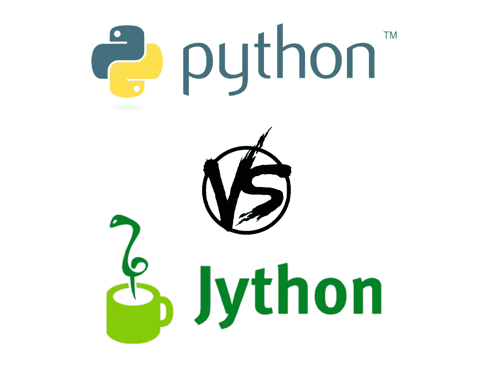

# Jython 与 Python——你应该选择哪一个？

> 原文：<https://medium.com/codex/jython-vs-python-which-one-should-you-choose-36d17bf7a792?source=collection_archive---------4----------------------->

## 它们看起来非常相似，但有重要的区别。发现它们，并找出在什么情况下使用哪一个

如果你是一个有经验的 Python 程序员，想要开始使用 Jython 编程语言，**了解这两个流行选项之间的关键区别**是很重要的…