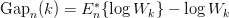

# k 均值

> 原文：<https://medium.com/codex/k-means-c5763e50898e?source=collection_archive---------3----------------------->


在 [Unsplash](https://unsplash.com?utm_source=medium&utm_medium=referral) 上由 [Boitumelo Phetla](https://unsplash.com/ja/@writecodenow?utm_source=medium&utm_medium=referral) 拍摄的照片

这是一种聚类算法，旨在将相似的实体分组到一个聚类中，并且适用于数值数据。

# **步骤**

1.选择簇的数量(k)

2.它随机初始化每个聚类的聚类中心，即该算法从第一组随机选择的质心开始，即随机选择几个点，将其视为聚类的质心。

3.对于每个数据点，计算距所有质心的欧几里德距离，并根据到所有质心的最小距离分配聚类。质心是代表群集中心的虚拟或真实位置

4.这一步是移动质心步。k 表示通过取聚类中所有数据点的平均值来移动每个聚类的质心。换句话说，该算法计算每个聚类的新质心(聚类中所有点的平均值)

当出现以下任一情况时，它会停止创建和优化集群:

-质心已经稳定，即它们的值没有变化，因为聚类已经成功

*   已达到定义的迭代次数。

# 寻找最佳聚类数的方法:

**肘法:**

这是确定最佳聚类数的最常用方法。该方法基于计算不同数量的组(k)的组内误差平方和(WSS ),并选择 WSS 变化首先开始减小的 k。

肘形法背后的思想是，对于少量的聚类，所解释的变化迅速变化，然后它变慢，导致曲线中形成肘形。拐点是我们可以用于聚类算法的聚类数。关于这种方法的更多细节可以在袁春辉和杨海涛的论文中找到。

我们将使用 [YellowBrick](https://www.scikit-yb.org/en/latest/) 库，它可以用几行代码实现 elbow 方法。它是 Scikit-Learn 的包装器，并且有一些很酷的机器学习可视化！

```
pip install yellowbrick(if not installed)from yellowbrick.cluster import KElbowVisualizermodel = KMeans()# k is range of number of clusters.visualizer = KElbowVisualizer(model, k=(2,30), timings= True)visualizer.fit(cluster_df)        # Fit data to visualizervisualizer.show()        # Finalize and render figure
```


KElbowVisualizer 函数适用于 2 到 30 之间的分类值范围的 KMeans 模型。肘点是通过 8 个聚类实现的，这 8 个聚类是由函数本身突出显示的。该函数还通过绿线告知我们为不同数量的聚类绘制模型需要多少时间。

**轮廓系数:**

点 *i* 的轮廓系数定义如下:


其中 *b(i)* 是点 *i* 到任何其他聚类中所有点的最小平均距离，而 *a(i)* 是 *i* 到其聚类中所有点的平均距离。例如，如果我们只有 3 个聚类 A、B 和 C，并且 I 属于聚类 C，那么通过测量 *i* 到聚类 A 中每一点的平均距离，即 I 到聚类 B 中每一点的平均距离，并取最小结果值来计算 *b(i)* 。数据集的轮廓系数是单个点的轮廓系数的平均值。

轮廓系数告诉我们各个点是否被正确地分配到它们的簇中。使用轮廓系数时，我们可以使用以下经验法则:

1.  *S(i)* 接近 0 表示该点在两个聚类之间
2.  如果它更接近-1，那么我们最好将它分配给其他集群
3.  如果 *S(i)* 接近 1，则该点属于“正确的”聚类

```
from yellowbrick.cluster import KElbowVisualizermodel = KMeans()# k is range of number of clusters.visualizer = KElbowVisualizer(model, k=(2,30),metric='silhouette', timings= True)visualizer.fit(cluster_df)        # Fit the data to the visualizervisualizer.show()        # Finalize and render the figure
```


**差距统计:**

差距统计是由斯坦福大学的研究人员 Tibshirani、Walther 和 Hastie 在他们 2001 年的论文中提出的。他们的方法背后的想法是找到一种方法来比较聚类紧密度与数据的零引用分布，即没有明显聚类的分布。他们对最佳聚类数的估计是原始数据上的聚类紧密度落在该参考曲线之下最远的值。此信息包含在以下差距统计公式中:



其中，Wk 是基于类内误差平方和(WSS)的聚类紧密度的度量:


类内误差平方和由 KMeans 函数的 inertia_ attribute 计算，如下所示:

*   每个点到聚类中心的距离的平方(误差平方)
*   WSS 分数是所有点的这些平方误差的总和

在 python 中计算 k 均值聚类的间隙统计包括以下步骤:

*   将观察到的数据在不同数量的聚类上进行聚类，并计算我们的聚类的紧密度
*   生成参考数据集，并用不同数量的聚类对每个数据集进行聚类。参考数据集是使用 random_sample 函数根据“连续均匀”分布创建的。
*   计算参考数据集上聚类的平均紧密度
*   根据参考数据和原始数据的聚类紧密度差异计算间隙统计数据

```
def optimalK(data, nrefs=3, maxClusters=15):"""Calculates KMeans optimal K using Gap StatisticParams:data: ndarry of shape (n_samples, n_features)nrefs: number of sample reference datasets to createmaxClusters: Maximum number of clusters to test forReturns: (gaps, optimalK)"""gaps = np.zeros((len(range(1, maxClusters)),))resultsdf = pd.DataFrame({'clusterCount':[], 'gap':[]})for gap_index, k in enumerate(range(1, maxClusters)):# Holder for reference dispersion resultsrefDisps = np.zeros(nrefs)# For n references, generate random sample and perform kmeans getting resulting dispersion of each loopfor i in range(nrefs):# Create new random reference setrandomReference = np.random.random_sample(size=data.shape)# Fit to itkm = KMeans(k)km.fit(randomReference)refDisp = km.inertia_refDisps[i] = refDisp# Fit cluster to original data and create dispersionkm = KMeans(k)km.fit(data)origDisp = km.inertia_# Calculate gap statisticgap = np.log(np.mean(refDisps)) - np.log(origDisp)# Assign this loop's gap statistic to gapsgaps[gap_index] = gapresultsdf = resultsdf.append({'clusterCount':k, 'gap':gap}, ignore_index=True)return (gaps.argmax() + 1, resultsdf)score_g, df = optimalK(cluster_df, nrefs=5, maxClusters=30)plt.plot(df['clusterCount'], df['gap'], linestyle='--', marker='o', color='b')plt.xlabel('K')plt.ylabel('Gap Statistic')plt.title('Gap Statistic vs. K')
```


**树状图:**

这种技术是特定于凝聚层次聚类方法的。聚类的凝聚层次方法首先将每个点视为一个单独的聚类，然后开始根据点和聚类的距离以层次方式将点连接到聚类。在另一篇博客中，我们将重点介绍这种方法的细节。为了获得分层聚类的最佳聚类数，我们使用了一个树形图，这是一个显示聚类合并或分裂顺序的树形图。

如果两个聚类合并，树状图会将它们连接成一个图，连接的高度就是这些聚类之间的距离。我们将使用 scipy 库中的树状函数来绘制图形。

```
import scipy.cluster.hierarchy as shcfrom matplotlib import pyplotpyplot.figure(figsize=(10, 7))pyplot.title("Dendrograms")dend = shc.dendrogram(shc.linkage(cluster_df, method='ward'))
```


我们可以根据树状图的层次结构来选择最佳的聚类数。正如其他聚类验证指标所强调的那样，4 个聚类也可以考虑用于聚集层次结构。

**贝叶斯信息准则:**

贝叶斯信息准则(BIC)评分是一种对使用最大似然估计框架的模型进行评分的方法。BIC 统计数据的计算方法如下:

*BIC =(k * ln(n))——(2ln(L))*

*其中 L 是模型的似然函数的最大值，k 是参数的数量，n 是记录的数量*

BIC 分数越低，模型越好。我们可以将 BIC 分数用于聚类的高斯混合建模方法。我们将在单独的博客中讨论这个模型的细节，但这里需要注意的关键是，在这个模型中，我们需要选择聚类的数量以及协方差的类型。我们尝试了参数的各种组合，并选择了具有最低 BIC 分数的模型。

```
from sklearn.mixture import GaussianMixturen_components = range(1, 30)covariance_type = ['spherical', 'tied', 'diag', 'full']score=[]for cov in covariance_type:for n_comp in n_components:gmm=GaussianMixture(n_components=n_comp,covariance_type=cov)gmm.fit(cluster_df)score.append((cov,n_comp,gmm.bic(cluster_df)))score
```