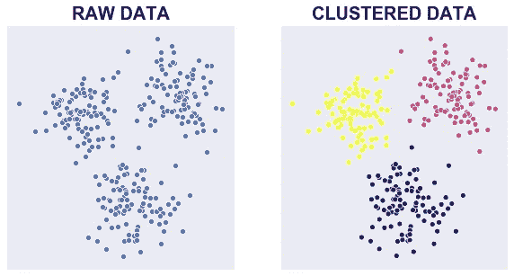

# k 均值聚类

> 原文：<https://medium.com/codex/k-means-clustering-7b08ed4b303e?source=collection_archive---------5----------------------->

Billy Huynh 在 [Unsplash](https://unsplash.com?utm_source=medium&utm_medium=referral) 上拍摄的照片

我们可以应用 k 均值聚类将数据点划分为 k 个不同的组。与数据一起，聚类数“k”是算法的输入。

## 什么是 K-Means 算法？

K-Means 聚类是一种无监督学习算法，它将未标记的数据集分组到不同的簇中。这里 K 定义了在该过程中需要创建的预定义聚类的数量。它是一种迭代算法，将未标记的数据集划分为 k 个不同的聚类，使得每个数据集只属于一个具有相似属性的组。

## 什么是无监督学习？

顾名思义，无监督学习是一种机器学习技术，其中模型不使用训练数据集进行监督。相反，模型本身从给定的数据中发现隐藏的模式和见解。可以把它比作在学习新事物时发生在人脑中的学习。它可以定义为:

无监督学习是一种机器学习，其中模型使用未标记的数据集进行训练，并允许在没有任何监督的情况下对该数据进行操作。

非监督学习不能直接应用于回归或分类问题，因为与监督学习不同，我们有输入数据，但没有相应的输出数据。

无监督学习的目标是找到数据集的底层结构，根据相似性对数据进行分组，并以压缩格式表示数据集。

*   示例:假设给定无监督学习算法一个包含不同类型的猫和狗的图像的输入数据集。该算法从未在给定的数据集上训练过，这意味着它对数据集的特征没有任何概念。无监督学习算法的任务是自己识别图像特征。无监督学习算法将通过根据图像之间的相似性将图像数据集聚类成组来执行这项任务。

无监督学习算法可以进一步分为两类问题:

**聚类**:聚类是一种将对象分组为簇的方法，使得具有最多相似性的对象保留在一个组中，而与另一个组的对象具有较少或没有相似性。聚类分析发现数据对象之间的共性，并根据这些共性的存在与否对它们进行分类。

**关联**:关联规则是一种无监督的学习方法，用于发现大型数据库中变量之间的关系。它确定在数据集中一起出现的项目集。关联规则使营销策略更加有效。比如购买 X 物品(假设一个面包)的人也倾向于购买 Y(黄油/果酱)物品。关联规则的一个典型例子是购物篮分析。

**下面是一些流行的无监督学习的列表**

*   k 均值聚类
*   KNN(k-最近邻)
*   分层聚类
*   异常检测
*   神经网络
*   主成分分析
*   独立成分分析
*   Apriori 算法
*   奇异值分解

## k 均值聚类

“k-means”这个术语是由 James MacQueen 在 1967 年首次使用的，作为他的论文“多元观测值的一些分类和分析方法”的一部分。1957 年，贝尔实验室也将该标准算法作为脉冲编码调制技术的一部分。E. W. Forgy 也于 1965 年发表了该方法，通常也被称为劳埃德-Forgy 法。

k-means 允许我们将数据聚类到不同的组中，这是一种无需任何训练就可以自行发现未标记数据集中的组类别的便捷方法。

这是一种基于质心的算法，其中每个聚类都与一个质心相关联。该算法的主要目标是最小化数据点和它们对应的聚类之间的距离之和。

该算法将未标记的数据集作为输入，将数据集划分为 k 个聚类，并重复该过程，直到没有找到最佳聚类。在这个算法中，k 的值应该是预先确定的。

k-means 聚类算法主要执行两项任务:

*   通过迭代过程确定 K 个中心点或质心的最佳值。
*   将每个数据点分配到其最近的 k 中心。靠近特定 k 中心的那些数据点创建一个聚类。

因此，每个聚类都有一些具有共性的数据点，并且远离其他聚类。

下图解释了 K 均值聚类算法的工作原理:

## K-Means 算法是如何工作的？

K-Means 算法的工作原理在下面的步骤中解释:

**第 0 步:**获取数据集

**第一步:**选择数字 K 决定聚类数。

**第二步:**随机选择 K 个点或质心。(它可以是输入数据集中的其他数据)。

**步骤 3:** 将每个数据点分配给它们最近的质心，这将形成预定义的 K 个聚类。

**步骤 4:** 计算方差，放置每个聚类的新质心。

**步骤 5:** 重复第三步，这意味着将每个数据点重新分配给每个聚类的新的最近质心。

**步骤 6:** 如果发生任何重新分配，则转到步骤 4，否则转到结束。

**第七步**:模型做好了。

## 不知道 K 的值

没有办法知道 K-means 的聚类数。所以你能做的就是从 K=1 开始。然后增加 K 的值(达到某个上限)。通常情况下，**方差**(每个点距离“主人”中心的距离的平方之和)会迅速减小。过了某个点，会慢慢减少。当你看到这样的行为，你知道你已经超过了 K 值。

## 错误的初始猜测

如果你最初的猜测是错误的，你就不能指望算法能很好地工作。

最好的方法是对几次随机的初始猜测运行 K-means。然后，选择方差最小的最终中心。

另一个诀窍是以某种方式选择中心:

1.  将第一个中心放置在数据点上
2.  将第二个中心放在离第一个中心最远的数据点上
3.  将第三个中心放在距离第一个和第二个中心最远的数据点上
4.  诸如此类。

# 哪里可以应用 K-means？

K-means 算法通常适用于维数较少、数值型且连续的数据。想象一个场景，我们想要从随机分布的事物集合中制造相似事物的组；k-means 非常适合这样的场景。

这里是 K-means 的一些有趣的用例，

**1。文档分类**:根据标签、主题和文档内容，将文档分成多个类别。这是一个非常标准的分类问题，k-means 是一个非常适合这个目的的算法。文档的初始处理需要将每个文档表示为一个向量，并使用术语频率来识别常用术语，以帮助对文档进行分类。然后对文档向量进行聚类，以帮助识别文档组中的相似性。

**2。配送商店优化:**通过使用 k-means 的组合来寻找最佳的发射位置数量，并使用遗传算法来解决作为旅行推销员问题的卡车路线，来优化使用卡车无人机交付货物的过程。

**3。确定犯罪地点:**利用城市中特定地点的犯罪相关数据、犯罪类别、犯罪区域以及两者之间的关联，可以对城市或地区内的犯罪易发区提供高质量的洞察。有了与城市中特定地点的犯罪相关的数据，犯罪的类别、犯罪的区域以及两者之间的关联可以提供对城市或地点内犯罪易发区域的高质量洞察。

**4。客户/市场细分:**聚类有助于营销人员改善他们的客户群，致力于目标领域，并根据购买历史、兴趣或活动监控对客户进行细分。这种分类将有助于公司针对特定的客户群开展特定的活动。

**5。梦幻联盟统计数据分析:**分析球员统计数据一直是体育界的一个关键元素，随着竞争的加剧，机器学习在这里发挥着至关重要的作用。作为一个有趣的练习，如果你想创建一个梦幻选秀队，并想根据球员统计数据来识别相似的球员，k-means 可以是一个方便的选择。

**6。保险欺诈检测:**机器学习在欺诈检测中起着至关重要的作用，并在汽车、医疗保健和保险欺诈检测中有许多应用。利用欺诈性索赔的过去历史数据，可以根据其与陈述欺诈模式的聚类的接近程度来隔离新的索赔。由于保险欺诈会给公司带来数百万美元的损失，因此检测欺诈的能力至关重要。

**7。乘车共享数据分析:**公共可用的优步乘车信息数据集提供了大量关于交通、通行时间、高峰乘车地点等有价值的数据。分析这些数据不仅有助于优步，也有助于洞察城市交通模式，帮助我们规划未来的城市。

**8。网络特征分析罪犯:**网络特征分析是从个人和群体中收集数据以确定显著相关性的过程。网络特征分析的想法来自于犯罪特征分析，犯罪特征分析提供了调查部门对犯罪现场的罪犯类型进行分类的信息。

**9。通话记录详细分析:**通话详细记录是电信公司在客户的通话、短信和互联网活动中捕获的一条信息。当与客户人口统计结合使用时，这些信息提供了关于客户需求的更深入的见解。我们可以使用无监督的 k-means 聚类算法对 24 小时的客户活动进行聚类。它用于按小时了解客户群的使用情况。

**10。IT 警报的自动群集:**网络、存储或数据库等大型企业 IT 基础架构技术组件会生成大量警报消息。由于警报消息可能指向操作问题，因此必须对其进行手动筛选，以确定下游流程的优先级。