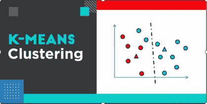
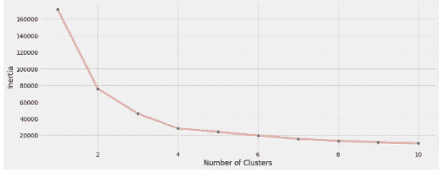

# k-均值聚类解释

> 原文：<https://medium.com/codex/k-means-clustering-explained-4006ca033592?source=collection_archive---------12----------------------->

[理解机器学习中的 K-means 聚类(hackr.io)](https://hackr.io/blog/k-means-clustering)

## **K-表示**

它是一种*无监督* *机器学习*算法，用于将输入数据划分为不同的预定义聚类。k 是定义分组数据时需要考虑的聚类或组的数字。k 是一个超参数，是一个用户定义的值，这个算法不能自己计算。

## **聚类**

它指的是具有类似特征和属性的对象的分组，如一组数据科学家、云工程师、股票专家、研究科学家等。在不同社区的推特上。

# **使用示例直观了解 K-Means 聚类**

让我用网飞/亚马逊 Prime 的例子来解释一下。这些流媒体服务通常使用聚类/分组分析来识别具有相似行为的观众。

例如，他们将收集关于个人的以下数据:

*   感兴趣的流派
*   每天观看的分钟数。
*   每周总观看次数:
*   每月观看的独特节目数量
*   用户的位置
*   观赏时间:晚上、下午、早上

使用这些指标，他们可以执行聚类/分组分析，以确定高使用率和低使用率用户，这样他们就可以知道他们应该在谁身上花费最多的广告费用，并根据观看历史给出建议，以增强用户体验。

这是一个聚类的实际例子，这种类型的情况使用聚类技术，如 K means，对兴趣相似的用户进行分组。

# **实施 K-means 的主要目标:**

实现 k-means 的主要目标包括定义 k 个聚类，使得总的聚类内变化(或误差)最小化。聚类中心是属于该聚类的所有数据点的算术平均值。

这是一个聚类的实际例子，这种类型的情况使用聚类技术，如 K means，对兴趣相似的用户进行分组。

# **聚类的 k 均值算法遵循的 5 个步骤:**

1.  决定我们需要多少个聚类来对数据进行分类。这不是直接预测的，但我们需要用肘法，我将在下面解释，它是用来确定 K 值的。
2.  然后，我们必须基于 K 随机初始化数据集中的 K 个质心。
3.  需要使用欧几里德距离将数据集中的每个点分配给 K 个聚类/组中的一个聚类/组

我们将把该群集中所有点的质心=平均值分配给具有最低欧几里德距离的群。

4.基于随机生成的质心，它根据距离向集群移动，并且它的位置在初始化时被改变。

> 3 和 4 之间的循环正在进行。

5.直到质心移动接近零或可以忽略，该步之前的数据的质心几乎等于该步之后的数据的质心，因此我们停止该算法。

这里有一个来自 GitHub repo[GitHub-danielmuthama/Implementation-of-K-means-Algorithm:Implementation-of-K-means in sk learn](https://github.com/danielmuthama/Implementation-of-K-means-Algorithm)的令人敬畏的可视化，它在一张图片中总结了上述内容。

> **质心和数据点之间距离的平方，应该小于**

所以问题是，我们如何知道我们需要考虑多少个集群？这是通过**肘法**完成的。

# **肘法:**

在肘方法中，我们绘制了 x 轴上的簇数量和 y 轴上的 WCSS(也称为惯性)之间的图形。我们有了一个新词叫做惯性/WCSS，它的意思是距离。

如果我们有 1 个聚类，那么 wcs S1 =**S**um**O**f**S**该单个聚类中的每个点到质心的平方距离

如果我们有两个群集，那么我们将找到朝向质心的距离，我们将把这两个值相加。是 WCSS2，类似 WCSS3，WCSS4……等等。

因此，WCSS1 > WCSS2 > WCSS3 > WCSS4……………..

我们需要绘制 WCSS 对簇数图，并在图上画出它形成一个弯头或斜率变平的点。我们将考虑 K 值作为最终值。

## **以上肘关节曲线的答案:**

在前面的示例中，K = 4 是斜率在惯性与聚类数之间变平的拐点，但在某些情况下，曲线不会形成拐点，因此理想的 K 值是通过广泛的领域知识确定的。

这是 Kaggle 上一个很棒的 K-means 笔记本的链接。看看这个，在实践层面上有更多的理解。

感谢阅读！

请关注以获取更多内容。