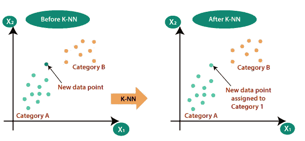
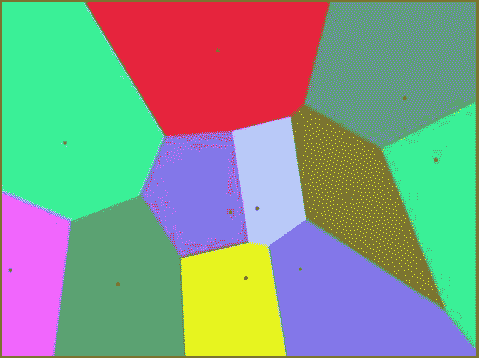
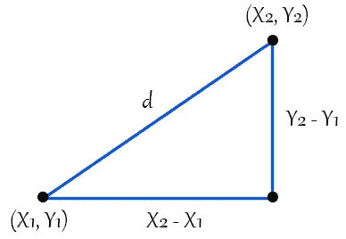
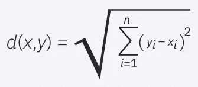
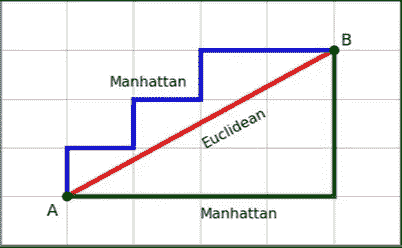
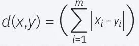
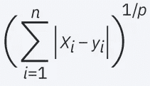
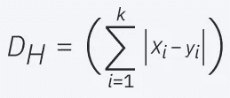
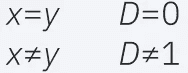
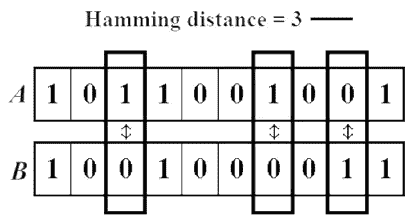

# k-最近邻解释！！

> 原文：<https://medium.com/codex/k-nearest-neighbors-explained-fd83adea44cd?source=collection_archive---------18----------------------->

**KNN 用不同颜色的树作插图**

你和你的邻居是一样的，这是这个算法遵循的哲学。

KNN 表示 K 个最近邻居，其中 K 是一个表示需要考虑的最近邻居数量的**整数**。我将通过一个例子来提供广泛的理解。

**举例:** *假设我们在一个分类问题中取 K = 5，在给定一个人的性别和薪水的情况下，我们需要预测他是否会购买某个特定的产品。*

在这里，我们将选择需要预测的新点周围的 5 个最近邻居(基于点之间的欧几里德距离)，然后如果我们看到 5 个人中有 3 个人购买了该商品，我们将把新点分类到已购买类别中。

在这种情况下，多数人获胜。

**定义** : KNN 是一种受监督的非参数机器学习算法，它要求对特征进行标记，并且是一种基于距离的算法，它使用接近度来对单个数据点的分组进行分类或预测。虽然它可用于回归(N 个最近邻点的平均值)或分类(N 个最近邻点的多数投票)问题，但它通常用作分类算法，并假定可以在彼此附近找到相似的点。

**KNN 算法中的假设是:**

1.  KNN 假设数据是度量空间和距离的概念。
2.  k 应该是奇数，以避免在平等分类的情况下出现平局。
3.  应对数据进行缩放，使所有要素的比例相等，以避免高比例值要素出现偏差。
4.  每个训练数据集都应该被标记。

KNN 被称为**懒学习者**，因为它不会立即从训练集中学习；相反，它存储数据集，并在分类时对数据集执行操作。它也被称为基于实例或基于记忆的学习方法。

**KNN 的应用:**

1.  推荐系统
2.  用于估算数据集中要素缺失值的数据预处理
3.  医疗保健中的糖尿病类型预测、癌症预测和心脏病预测
4.  银行业信用风险分析。
5.  研究基因表达

我在 Kaggle 有一本关于使用 KNN 进行糖尿病分类的笔记本。请仔细阅读，了解 KNN 是如何实施和优化的。

# KNN 钾超参数

K 是一个奇整数**为了避免歧义，K 代表需要考虑的最近邻的数量。**

**要优化 K，请考虑以下情况，这总是会产生准确的结果。**

1.  **K =训练数据集中数据点数量的平方根，或者，**
2.  **采用试差法，取不同的 K 值，绘制误差与 K 值的关系图，选择最佳值。**

> **如果 K=1 倾向于过度拟合，这是由于高方差；它指定最近点的类别，在训练集中表现良好，但在测试中表现不佳。**
> 
> **如果 K = n，并且 n 是数据集中的数据点数，则欠拟合的趋势是由于高偏差。如果数据有一个百分比很高的支配类，假设 85%的数据有一个单独的类，那么如果 K = n，该模型将以 85%的准确度进行预测，因此该模型不会对整个数据进行概括。**
> 
> **所以我们必须找到 K，一个介于 1 和 n 之间的误差最小的最佳值。**

# ****KNN 距离度量超参数****

**KNN 主要将 K 和距离度量作为重要的超参数，其中 K 如上所述。**

> **让我们深入了解距离度量超参数**

**为了确定哪些数据点最接近给定的查询点，需要计算查询点和其他数据点之间的距离。这些距离度量有助于形成决策边界，将查询点划分为不同的区域。您通常会看到用 Voronoi 图可视化的决策边界。**

****

****带有决策边界的 Voronoi 图****

**虽然有几种距离测量方法可供选择，但为了便于理解，我们将在二维空间中介绍以下 4 种:**

> **距离度量必须满足几个条件:**
> 
> **非负性:d(x，y) >= 0**
> 
> **恒等式:d(x，y) = 0 当且仅当 x == y**
> 
> **对称性:d(x，y) = d(y，x)**
> 
> **三角形不等式:d(x，y) + d(y，z) >= d(x，z)**

****欧几里德距离**:这是最常用的距离度量，而且仅限于实值向量。使用下面的公式，它测量要预测的新点和其他点之间的直线距离。**

****

****几何直觉****

****

****欧几里德距离公式****

****曼哈顿距离**:这也是另一种流行的距离度量，测量两点之间的绝对值。它是两点之间的线段在坐标轴上的投影长度之和。简而言之，它是两点的所有维度上的测量值之间的绝对差值之和，说明了如何通过城市街道从一个地址导航到另一个地址。**

> **当我们有高维度的情况时，这个距离优于欧几里德距离。**

****

****曼哈顿距离和欧几里德距离的比较****

****

****曼哈顿距离公式****

****闵可夫斯基距离**:闵可夫斯基距离是曼哈顿距离和欧几里得距离的推广，增加了一个称为顺序的参数 p。当阶数为 1 时，闵可夫斯基距离等于曼哈顿距离，当阶数为 2 时，闵可夫斯基距离等于欧几里德距离。在阶数为无穷大的极限情况下，闵可夫斯基距离等于切比雪夫距离。**

> **闵可夫斯基距离在那些利用这个概念来寻找最佳相关性或分类数据的算法中。这是因为将顺序视为一个或两个是直截了当的，因此根据不同的需要使用曼哈顿距离或欧几里德距离。**

****

****闵可夫斯基距离公式****

****汉明距离**:这种技术通常用于布尔或字符串向量，识别向量不匹配的点。**

**在比较两个等长的二进制字符串时，汉明距离是两个比特不相同的比特位置的数量。汉明距离方法查看整个数据集，并找出何时数据点一对一地相似和不相似。它给出了多少属性不同的结果。当你对数据进行一次性编码时，或者当我们需要找出两个二进制向量之间的距离时，通常会用到这种方法。**

**这可以用下面的公式来表示:**

****

****汉明距离公式****

****

****海明距离条件****

****示例**:假设我们有两个长度相同的字符串“ABCDE”和“AGDDF”，我们想找出它们之间的汉明距离。我们将逐个字母地检查每个字符串，看它们是否相似，比如两个字符串的第一个字母相似，然后第二个不相似，以此类推。**

****A** BC **D** E 和 **A** GD **D** F**

**当我们这样做的时候，我们将会看到字符串中只有两个用**粗体**标记的字母是相似的，三个是不相似的。因此，这里的汉明距离是 3。请注意，两个字符串之间的汉明距离越大，这些字符串就越不相似(反之亦然)。**

****

****布尔字符串中的汉明距离****

# ****加权 KNN****

**你听说过马克·扎克伯格对脸书的否决权吗？**

**他的一票 B 类股相当于其他 A 类股股东的 10 票，扎克伯格控制着脸书 58%的有表决权的股份。**

**所以他在每个决定上都有更大的权力。加权 KNN 的情况也是如此。**

**如果较近的点比较远的点更需要影响预测，我们就使用加权 KNN。**

**scikit-learn 中有一个名为 weights 的超参数，默认情况下设置为“uniform”，它平等地考虑所有数据点。**

**但是，如果我们想认为上面的场景中更近的点比更远的点有更大的影响呢？权重中有一个称为“距离”的选项，这意味着如果新点和数据之间的距离增加，则权重会减少。**

**最简单的权重函数是 1/di，其中 di 是数据集中新点到点的距离。**

> **因此，离点越近，对预测的影响越大。**

**关注我获取更多此类内容！**

**感谢阅读！！**