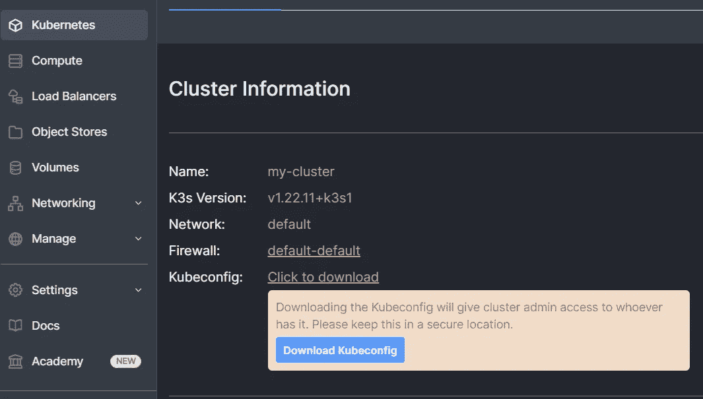
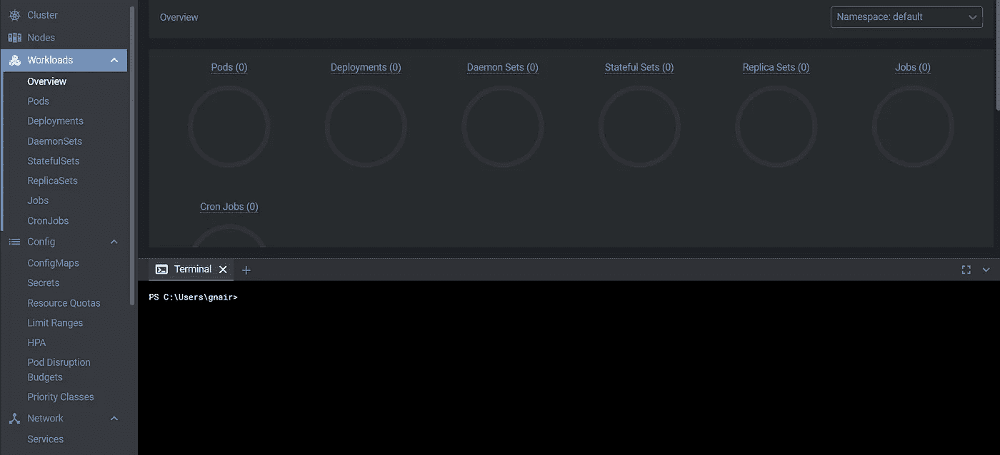
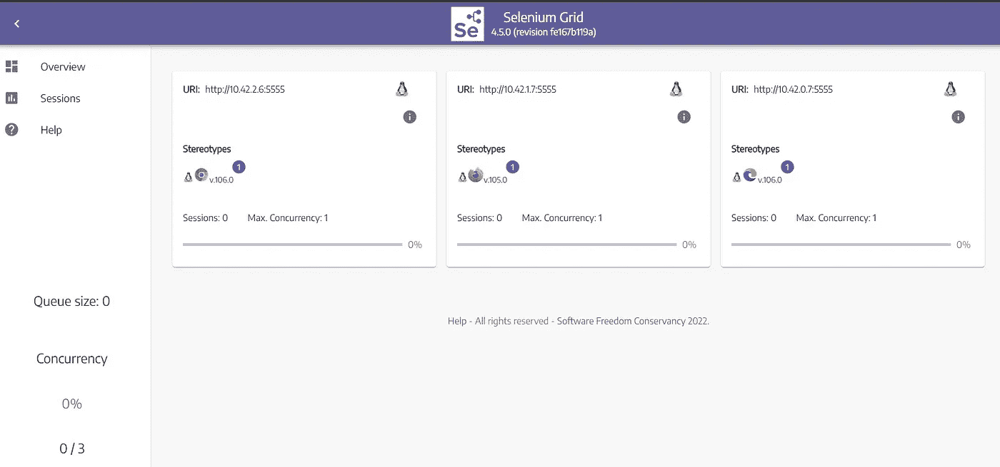

# Civo 和 Lens IDE 入门

> 原文：<https://medium.com/codex/k8s-cluster-creation-in-civo-and-using-lens-ide-23a11d97518f?source=collection_archive---------3----------------------->

在本文中，我们将探索如何在 Civo 中创建和设置一个简单的 Kubernetes 集群，然后从 Lens IDE 管理它。


我们开始吧！！

## 什么是 Civo？

Civo 是第一家仅由 Kubernetes 提供支持的云原生服务提供商，他们承诺在不到 2 分钟的时间内快速创建和启动集群。在引擎盖下，它使用由 Rancher labs 提供的 Kubernetes: k3s 的轻量级版本。它提供了一个非常简单易用的用户界面来创建和管理您的 Kubernetes 集群、价格合理且透明的定价选项，还提供了许多内置的集成选项，包括 Helm、Traefik、Gitlab 等流行的服务，让您在使用 Kubernetes 集群和其他相关组件时更加轻松。

此外，他们非常活跃，通过举办许多活动、有用的会议、讨论等来支持开源和云原生社区。

## 在 Civo 中创建 K8s 集群

首先，进入他们的[注册](https://dashboard.civo.com/login)页面，然后在 Civo 中创建一个帐户，你可能需要一个信用卡/借记卡来完成注册过程，发布后你将获得 250 美元的信用点数，为期 2 个月，以探索和玩 Civo。

*成功注册并登录后，在您的仪表板上，单击左侧窗格中的 Kubernetes 选项。*


*单击“启动我的第一个集群”按钮，这将打开下面的页面，您可以在其中继续创建集群。*


*集群创建相对容易，整个过程只需 2-3 分钟，比在 AWS 或 GKE 中启动集群要快得多。*

> 首先，我们将为您的集群指定一个名称，在我的例子中:my-cluster 和*将保持节点数为 3*


> 接下来，我将使用默认网络和默认防火墙，稍后我将更新防火墙以包括额外的 TCP 端口。

在选择大小时，将使用标准:大，我们将删除集群后动手，所以成本应该不是一个问题。


> 最后，在市场中，我将只选择几个有用的应用程序— Helm 和 Kubernetes dashboard，它们将在管理部分提供。


最后，单击“Launch Cluster”按钮完成设置，完成整个设置并启动和运行我们的集群可能需要大约 2 分钟。


一旦您的集群运行，您只需下载您的 kube 配置文件，我们将使用该文件从 Lens IDE 连接到集群。



# 什么是镜头，如何安装？

[Lens](https://k8slens.dev/) 基本上是一种令人惊叹的开源 IDE，可以用来轻松地交互和管理多个 Kubernetes 集群。

> Lens IDE 是适用于 macOS、Windows 和 Linux 操作系统的独立应用程序。可以从 [Lens IDE 网站](https://k8slens.dev/)免费下载 Windows、macOS、Linux 版。

[](https://github.com/lensapp/lens) [## GitHub - lensapp/lens: Lens -世界运行的方式 Kubernetes

### 这个存储库(“OpenLens”)是 Team Lens 与社区一起开发 Lens IDE 产品的地方。它被支持…

github.com](https://github.com/lensapp/lens) 

要安装镜头，只需前往他们的[安装](https://docs.k8slens.dev/getting-started/install-lens/)页面，并按照提到的步骤，安装相当简单。

> *安装后，你能在你的机器上启动镜头 IDE 吗，它可能会提示你用你可以创建的镜头 ID 登录，然后继续。一旦你成功地登录到你的镜头集成开发环境，前往目录选项在左窗格中可用。*


首先，导航到保存 kubeconfig 文件的文件夹，然后使用任何文本编辑器(如 Notepad++或 VS Code)打开 kubeconfig 文件，并复制这个 Kube 配置文件中的全部内容。

接下来，进入 Lens IDE，悬停在右下角的“+”按钮上，这将显示一些附加选项，选择最后一个选项“从 kubeconfig 添加”,然后将 kubeconfig 详细信息粘贴到提供的文本框中，然后单击按钮“添加集群”


上面的步骤会将您的 Civo 集群添加到集群部分。


接下来，只需单击集群名称，这将启动一个连接，进行身份验证并使您能够与部署在 Civo 中的集群进行交互。


现在，您将导航到集群概述页面。


要检查群集中可用节点的详细信息，请选择节点选项


# 与 K8s 集群交互

要使用 kubectl 命令与我们的集群交互，我们只需使用 Lens IDE 中的终端选项，只需从下面打开它。



Lens IDE 提供的一个令人惊叹的功能是，当处理多个集群时，您不需要打开多个终端窗口，终端窗口上下文将根据左侧窗格中选择的集群自动更改。为此，您需要选择可用选项:“添加到 Hotbar”。


## 在我们的 Civo 集群中安装基本的 Selenium 网格

现在为了演示的目的，我们将看看如何使用 Lens IDE 中的 helm 来安装一个基本的 selenium 网格设置。我们将打开一个终端窗口，运行下面的命令来安装 selenium-grid。

> 添加 docker-selenium helm repo 并更新

```
helm repo add docker-selenium https://www.selenium.dev/docker-seleniumhelm repo update
```

> 安装硒栅

```
helm install selenium-grid docker-selenium/selenium-grid
```


通过 Helm 部署 selenium 网格后，您将在工作负载部分看到如下内容，其中显示了正在运行的 pod、部署对象、副本集等的数量。


概览页面


Pod 详细信息


部署详细信息


副本集

同样，在 Network 部分，您可以查看已创建和正在运行的服务对象的详细信息。如您所见，selenium-hub 服务显示为集群 IP，我想将其更改为负载平衡器类型，为此，请单击 selenium-hub 下的三个垂直圆点选项，然后单击“Edit ”,这将打开。selenium-hub 服务对象的 yml 清单文件。


将类型更新为 LoadBalancer，并使用 Save & Close 保存详细信息


分配外部 IP 可能需要几分钟的时间，使用这个外部 IP 和端口:4444，我们可以访问我们的 selenium 网格，但是首先，我们需要在防火墙规则中添加端口 4444，用于 civo 仪表板页面。


在群集信息部分，选择防火墙链接选项


在防火墙页面上，您可以将 TCP 端口:4444 添加到现有的规则中，在某些情况下，可能已经应用了默认的防火墙规则，因此所有可用的端口都将对公众开放，在这种情况下，您可能不需要从自己的一端进行任何更改。

> 现在，您将能够使用外部 IP 和端口 4444 访问您的网格



接下来，我们将看看是否可以使用 Lens IDE 扩展我们的浏览器实例，在“工作负载->部署”部分，选择任何浏览器部署 chrome 或 firefox，然后单击“选项”,并选择“扩展”。


我将使用+按钮将所需的副本数量增加到 2 个，并单击“缩放”按钮，这将创建一个新的浏览器窗格— firefox，它将在几秒钟内反映在我的网格中，同样，我可以放大或缩小其他浏览器窗格 chrome，并轻松地从 Lens 边缘移动。


同样，在 Cluster 部分，您可以查看整个集群的健康详细信息:CPU 和内存。它有一个内置的 Prometheus 组件，用于监控，也使开发人员或用户能够访问容器日志和外壳，只需点击几下就可以进行调试。


总的来说，Lens 提供了一种令人惊叹的 IDE 体验，只需使用 kube 配置文件的详细信息，就可以轻松地管理部署在任何云服务提供商(无论是 Civo、Azure、AWS 还是 Google Cloud)中的所有 Kubernetes 集群和组件。

这对于希望探索和学习 Kubernetes 生态系统的各种组件的初学者来说非常有益，对于更有经验的人来说也同样有用，因为这不仅提高了他们的生产力，而且极大地帮助了他们的日常活动，包括集群管理、故障排除或监控。

就这样，我将结束这篇文章，希望你发现它是有用的，并感谢阅读！！！